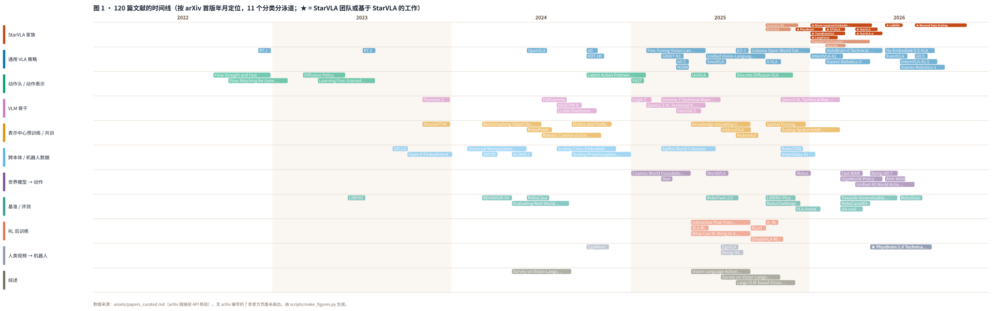
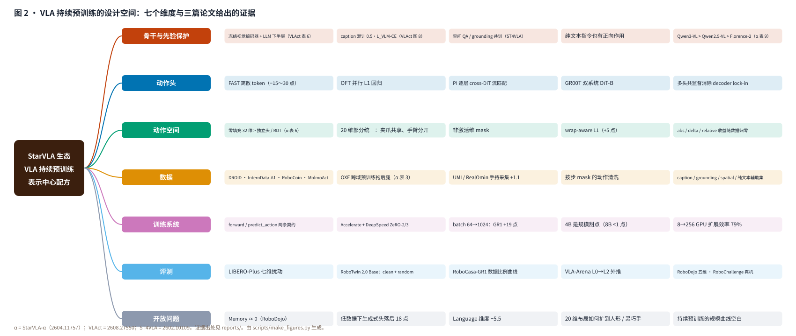

# Awesome StarVLA Resources

[](https://awesome.re)




*图 1 · 120 篇文献的时间线：11 个分类分泳道，按 arXiv 首版年月定位（无 arXiv 编号的 7 条官方页面未画出），★ 为 StarVLA 团队或基于 StarVLA 代码库的工作。2025 下半年到 2026 上半年集中了通用 VLA 策略与世界模型两条线的爆发。*



*图 2 · VLA 持续预训练的设计空间：骨干与先验保护 / 动作头 / 动作空间 / 数据 / 训练系统 / 评测 / 开放问题七个维度，每格是三篇论文给出的一条证据（表号可在 `reports/` 中查到）。两图由 `scripts/make_figures.py` 从 `assets/papers_curated.md` 生成。*

围绕 **StarVLA 代码库生态**与 **VLA（Vision-Language-Action）持续预训练 / 动作头 / 跨本体表示学习**的论文与资源列表 + 系统性调研仓库（2026-09 完成）。核心对象是三篇同一团队、同一骨干（Qwen3-VL-4B）、同一代码库的工作：[StarVLA 技术报告](https://arxiv.org/abs/2604.05014)（基础设施）、[StarVLA-α](https://arxiv.org/abs/2604.11757)（去混杂的对照基线）、[VLAct](https://arxiv.org/abs/2608.27550)（表示中心的持续预训练配方）。与一般 awesome 列表不同，本仓库同时提供：

- **11 份中文深度报告**（`reports/`）：VLAct 精读、StarVLA 代码库逐文件解析（含 VLAct 配方在代码中"已有 / 部分 / 缺失"的对照与 diff 级改动建议）、StarVLA-α 与技术报告解读、动作头综合对比、13 个基准的评测生态、研究路线图（6 类 18 个方向 + 六个月执行计划）、**四种动作头（FAST / OFT / PI / GR00T）的 60 分钟讲稿**（配 20 页讲解幻灯片）、**EventVLA 解读**（StarVLA-OFT 上的稀疏视觉证据记忆，正面回应 Memory 短板）、**改进方案 v2**（4 个研究问题、10 个工作包、分级 R0–R9 实验矩阵与 21,000 GPU 小时预算、4 个决策门、设计评审修订记录）
- **7 篇论文英文原版 + 保版式中文翻译 PDF**（`papers/`，翻译由 [super_translate](https://github.com/asimfish/super_translate) 生成）：StarVLA 三篇、四个动作头的源论文中的 FAST、OpenVLA-OFT、GR00T N1，以及 EventVLA（七篇均为 CC BY 4.0；π0 为 arXiv 非独占许可，仓库只放链接）
- **EventVLA 代码与 RoboTwin-MeM 基准**（`code/EventVLA/`，git 子模块）
- **29 页 Beamer 幻灯片**（`report/awesome_starvla_slides.pdf`，XeLaTeX 源码同目录）+ **18 页原生可编辑 PPTX**（`report/awesome_starvla_slides.pptx`，由 [ppt-master](https://github.com/hugohe3/ppt-master) Quick Generate 生成，全部为原生形状与表格）+ **44 页合订全文报告**（`report/awesome_starvla_full_report.pdf`，10 份报告 + 两张总览图）
- **120 篇文献编目**（第 4 节，113 条 arXiv 链接经 arXiv API 逐条核验标题，其余 7 条为无 arXiv 的官方技术博客 / 模型卡 / 数据集页）
- **VLAct 缺失组件的 StarVLA 扩展代码**（`code/vlact_ext/`，约 1,600 行）：多头共监督框架 `QwenMultiHead`、wrap-aware L1、20 维部分统一动作布局 transform、正则 / 区间冻结规则，附 61 个 CPU 单元测试与完整的 VLAct 预训练示例 yaml；不改 StarVLA 任何已有文件即可拷入使用
- **改进方案的研究包**（`code/starvla_lab/`，约 4,800 行，110 个 CPU 测试）：骨干可复用性探针与表征漂移诊断、分层学习率衰减与漂移驱动的冻结 / 辅助数据调度、未来特征预测头与关键帧头（`QwenMultiHeadLab`）、数据比例子采样与两类辅助头的离线数据准备、把这些接进 StarVLA 训练循环的入口 `train_starvla_lab.py`、"只换骨干"基准协议与开销测量，以及分级的 R0–R9 实验矩阵与全量 GPU 预算（`experiments/`）

一句话结论：**VLM 骨干是 VLA 的一阶设计变量，预训练不是双刃剑，配方决定符号**——朴素动作拟合会把机器人预训练变成负资产（OXE 预训练让 RoboCasa-GR1 24×10 从 9.8 掉到 1.2），保护 VLM 先验 + 多头共监督 + 部分统一动作空间把同样的数据源变成净收益（20% 数据超过全量 GR00T-N1.6）；下一步最值钱的是表征诊断工具、"只换骨干"的基准协议，以及所有人都接近零的 Memory 维度。

StarVLA 团队或直接基于 StarVLA 代码库构建的工作以 ⭐ 标记。

*Maintained by [asimfish](https://github.com/asimfish). 欢迎 PR 与 issue，规范见 [CONTRIBUTING.md](CONTRIBUTING.md)。*

## [Content](#content)

<table>
<tr><td colspan="2"><a href="#1-start-here">1. Start Here</a></td></tr>
<tr><td colspan="2"><a href="#2-core-readings">2. Core Readings</a></td></tr>
<tr><td colspan="2"><a href="#3-reports">3. Reports（中文深度报告）</a></td></tr>
<tr><td colspan="2"><a href="#4-papers">4. Papers</a></td></tr>
<tr>
	<td>&emsp;<a href="#starvla-family">4.1 StarVLA Family</a></td>
	<td>&emsp;<a href="#generalist-vla-policies">4.2 Generalist VLA Policies</a></td>
</tr>
<tr>
	<td>&emsp;<a href="#action-heads--action-representation">4.3 Action Heads &amp; Action Representation</a></td>
	<td>&emsp;<a href="#vlm-backbones-for-vla">4.4 VLM Backbones for VLA</a></td>
</tr>
<tr>
	<td>&emsp;<a href="#representation-centric-pre-training--co-training">4.5 Representation-Centric Pre-training &amp; Co-training</a></td>
	<td>&emsp;<a href="#cross-embodiment--robot-data">4.6 Cross-Embodiment &amp; Robot Data</a></td>
</tr>
<tr>
	<td>&emsp;<a href="#world-models-for-action">4.7 World Models for Action</a></td>
	<td>&emsp;<a href="#benchmarks--evaluation">4.8 Benchmarks &amp; Evaluation</a></td>
</tr>
<tr>
	<td>&emsp;<a href="#rl-post-training-for-vla">4.9 RL Post-training for VLA</a></td>
	<td>&emsp;<a href="#human-video--robot">4.10 Human Video → Robot</a></td>
</tr>
<tr>
	<td>&emsp;<a href="#surveys">4.11 Surveys</a></td>
	<td></td>
</tr>
<tr><td colspan="2"><a href="#5-starvla-codebase-at-a-glance">5. StarVLA Codebase at a Glance</a></td></tr>
<tr>
	<td>&emsp;<a href="#51-vlact-extension-for-starvla-codevlact_ext">5.1 VLAct Extension for StarVLA（code/vlact_ext）</a></td>
	<td>&emsp;<a href="#52-improvement-lab-codestarvla_lab">5.2 Improvement Lab（code/starvla_lab）</a></td>
</tr>
<tr>
	<td>&emsp;<a href="#53-跑通与-starvla-的真实集成cpu无需权重">5.3 跑通与 StarVLA 的真实集成（CPU，无需权重）</a></td>
	<td>&emsp;<a href="#54-gpu-实测三头共监督的训练开销wp6">5.4 GPU 实测：三头共监督的训练开销（WP6）</a></td>
</tr>
<tr><td colspan="2"><a href="#6-benchmarks-cheat-sheet">6. Benchmarks Cheat Sheet</a></td></tr>
<tr><td colspan="2"><a href="#7-research-roadmap">7. Research Roadmap</a></td></tr>
<tr><td colspan="2"><a href="#8-repository-layout">8. Repository Layout</a></td></tr>
<tr><td colspan="2"><a href="#9-translation--build-pipeline">9. Translation &amp; Build Pipeline</a></td></tr>
<tr><td colspan="2"><a href="#10-license--credits">10. License &amp; Credits</a></td></tr>
</table>

## [1. Start Here](#content)

| 时间预算 | 路线 |
|---|---|
| 15 分钟 | [`report/awesome_starvla_slides.pdf`](report/awesome_starvla_slides.pdf)（29 页 Beamer，含 4 页备份）或 [`report/awesome_starvla_slides.pptx`](report/awesome_starvla_slides.pptx)（18 页精简版，PowerPoint 可编辑） |
| 通读 | [`report/awesome_starvla_full_report.pdf`](report/awesome_starvla_full_report.pdf)（62 页 A4，10 份报告合订 + 图 1 时间线 / 图 2 设计空间）· [HTML 版](report/awesome_starvla_full_report.html) |
| 1 小时 | [01 · VLAct 精读](reports/01_vlact_deep_dive.md) → [05 · 动作头与动作表示](reports/05_action_heads_and_representation.md) → [07 · 研究路线图](reports/07_research_roadmap.md) |
| 动手做改进 | [10 · 改进方案](reports/10_improvement_plan.md)（研究问题 → 工作包 → 实验矩阵 → 决策门） → [`code/starvla_lab/README.md`](code/starvla_lab/README.md)（怎么接进 StarVLA） → [`experiments/README.md`](experiments/README.md)（运行清单与结果台账）；动 EventVLA 之前先读 [11 · EventVLA 代码审计](reports/11_eventvla_code_audit.md)（论文 vs 代码差异、复现坑、改进落点） |
| 搞懂四个动作头 | [08 · 讲稿：FAST / OFT / PI / GR00T](reports/08_action_heads_lecture.md)（60 分钟组会讲稿，含直觉、公式、训练/推理、StarVLA 实现、选型问答）+ [讲解幻灯片](report/action_heads_lecture_slides.pdf)（20 页）+ 四篇源论文中译（`papers/zh/`） |
| 准备上手代码 | [02 · StarVLA 代码库解析](reports/02_starvla_codebase_analysis.md)（第 9 章是 VLAct 配方在代码中的落点，第 11 章是最短上手命令序列） → [06 · 基准生态](reports/06_benchmarks_landscape.md)（第 5 章是基准选择建议） → [`code/vlact_ext/README.md`](code/vlact_ext/README.md)（怎么把多头 / wrap loss / 统一布局拷进 StarVLA） → [§5.3](#53-跑通与-starvla-的真实集成cpu无需权重) 用 `scripts/setup_cpu_env.sh` + `scripts/smoke_starvla_integration.py` 在笔记本上把真实 StarVLA 头跑一遍（不需要 GPU 和权重） |
| 系统研读 | 按 04 → 03 → 01 → 02 → 05 → 06 → 07 的顺序读 `reports/`，配 `papers/zh/` 中文 PDF 对照原文 |

## [2. Core Readings](#content)

三篇论文与一个代码库，是本仓库全部报告的一手材料。

1. ⭐ **StarVLA: A Lego-like Codebase for Vision-Language-Action Model Developing.** arXiv, 2026\. [paper](https://arxiv.org/abs/2604.05014), [code](https://github.com/starVLA/starVLA), [PDF](papers/en/2604.05014_StarVLA_codebase.pdf), [PDF-zh](papers/zh/2604.05014_StarVLA_codebase_zh.pdf), [解读](reports/04_starvla_codebase_report.md)
_StarVLA Community & Von Neumann Institute, HKUST_ — 骨干–动作头两条契约；FAST / OFT / π / GR00T 四头 × VLM / 世界模型两类骨干；LIBERO 30K 步（9.5 epoch）达 96.6，OpenVLA-OFT 用 175K 步（223 epoch）才多 0.5；8→256 GPU 扩展效率 79%。
2. ⭐ **StarVLA-α: Reducing Complexity in Vision-Language-Action Systems.** ECCV, 2026\. [paper](https://arxiv.org/abs/2604.11757), [PDF](papers/en/2604.11757_StarVLA_alpha.pdf), [PDF-zh](papers/zh/2604.11757_StarVLA_alpha_zh.pdf), [解读](reports/03_starvla_alpha.md)
_Jinhui Ye, Ning Gao, Senqiao Yang, et al., Yilun Chen, Shu Liu, Jiaya Jia_ — Qwen3-VL-4B + MLP 头 + 最少数据工程的对照基线：LIBERO 98.8、GR1 53.8；三个"常识"的重新检验——连续头 ≫ 离散头且三种连续头相当、朴素动作预训练是双刃剑（OXE 把 GR1 24×10 从 9.8 打到 1.2）、数据工程收益随数据量归零；generalist 联训 + 大 batch（64→1024 使 GR1 40.0→59.2）。
3. ⭐ **Beyond Data Scaling: Representation-Centric Continued Pre-training for Vision-Language-Action Models (VLAct).** arXiv, 2026\. [paper](https://arxiv.org/abs/2608.27550), [project](https://starvla.github.io/VLAct), [PDF](papers/en/2608.27550_VLAct.pdf), [PDF-zh](papers/zh/2608.27550_VLAct_zh.pdf), [解读](reports/01_vlact_deep_dive.md)
_Senqiao Yang, Chengyao Wang, Yuxin Chen, et al., Hengshuang Zhao, Bei Yu, Jiaya Jia_ — 冻视觉编码器 + LLM 下半层与 caption 混训保护先验；OFT + PI + GR00T 三头共监督消除 decoder lock-in（单头预训练让 PI 微调 60.5→55.1，加一头翻正到 63.1）；20 维部分统一动作空间 + wrap-aware loss（+5 点）。只换骨干权重：LIBERO-Plus 82.6、VLA-Arena 54.8、RoboTwin 2.0 92.5、GR1 20% 数据 49.5 > 全量 GR00T-N1.6 47.6；开源数据 + 16 GPU。
4. ⭐ **StarVLA 代码库（GitHub）.** [starVLA/starVLA](https://github.com/starVLA/starVLA)，MIT，[代码解析](reports/02_starvla_codebase_analysis.md)
— 261 个 Python 文件 / 57.6k 行；28 个注册框架（VLM4A 20、WM4A 6、VM4A 2）；11 个动作头文件；13 个仿真基准 + 5 个真机示例；7 个测试文件、无 CI。

基于 StarVLA 的后续工作（本仓库以子模块收录代码）：

9. ⭐ **EventVLA: Event-Driven Visual Evidence Memory for Long-Horizon Vision-Language-Action Policies.** arXiv, 2026\. [paper](https://arxiv.org/abs/2606.20092), [code](code/EventVLA)（[官方](https://github.com/InternRobotics/EventVLA)）, [PDF](papers/en/2606.20092_EventVLA.pdf), [PDF-zh](papers/zh/2606.20092_EventVLA_zh.pdf), [解读](reports/09_eventvla.md)
— 在 StarVLA `QwenOFT` 上加"初始帧 + 最近 K 帧"规则锚点与一个并联的关键帧证据记忆头（KEM），从动作头同一份隐状态预测未来 H 步的关键帧概率，命中即把原图写入有界 FIFO；提出 RoboTwin-MeM（8 个双臂任务，需记忆的关键帧数 n=1–5 可控）。RoboTwin-MeM 上 QwenOFT 3.8 → 75.2，RMBench 67.8，真机 ARX 双臂 60–90；常规 RoboTwin 2.0 不掉反升。

四种动作头的源论文（配 [08 · 讲稿](reports/08_action_heads_lecture.md) 与 [讲解幻灯片](report/action_heads_lecture_slides.pdf) 阅读）：

10. **FAST: Efficient Action Tokenization for Vision-Language-Action Models.** arXiv, 2025\. [paper](https://arxiv.org/abs/2501.09747), [PDF](papers/en/2501.09747_FAST.pdf), [PDF-zh](papers/zh/2501.09747_FAST_zh.pdf)
_Karl Pertsch et al._（Physical Intelligence）— 分位数归一化 → 逐维 DCT → 缩放取整 → 低频优先展平 → BPE（词表 1024），1 秒动作块约 30 个 token/臂；朴素分箱在高频下每个 token 的边际信息趋零；训练 GPU 小时比 diffusion 版 π0 少约 5×，推理为自回归解码。
11. **Fine-Tuning Vision-Language-Action Models: Optimizing Speed and Success (OpenVLA-OFT).** arXiv, 2025\. [paper](https://arxiv.org/abs/2502.19645), [PDF](papers/en/2502.19645_OpenVLA_OFT.pdf), [PDF-zh](papers/zh/2502.19645_OpenVLA_OFT_zh.pdf)
_Moo Jin Kim, Chelsea Finn, Percy Liang_（Stanford）— 空动作嵌入 + 双向注意力实现并行解码，动作块使吞吐 ×K，MLP 直出连续动作 + L1 回归；LIBERO 76.5 → 97.1，吞吐 26×（ALOHA 25 步块 43×）；FiLM 解决多视角下忽略语言。
12. **π0: A Vision-Language-Action Flow Model for General Robot Control.** arXiv, 2024\. [paper](https://arxiv.org/abs/2410.24164)（arXiv 非独占许可，PDF 不随仓库分发）
_Kevin Black et al._（Physical Intelligence）— PaliGemma 3B + 从零初始化的约 3 亿参数动作专家（独立权重、MoE 式路由），flow matching 目标 $\|v_\theta - (A-\epsilon)\|^2$，τ 从偏向噪声端的 Beta 分布采样，推理 10 步欧拉；H=50、最高 50 Hz；约 1 万小时自有数据 + OXE，7 种本体 68 任务。
13. **GR00T N1: An Open Foundation Model for Generalist Humanoid Robots.** arXiv, 2025\. [paper](https://arxiv.org/abs/2503.14734), [PDF](papers/en/2503.14734_GR00T_N1.pdf), [PDF-zh](papers/zh/2503.14734_GR00T_N1_zh.pdf)
_Johan Bjorck et al._（NVIDIA）— 双系统：Eagle-2 VLM（第 12 层特征，≈10 Hz）作 System 2，adaLN DiT（交替 self / cross-attention，≈120 Hz，块长 16，4 步去噪）作 System 1；本体特定 MLP 编解码状态与动作；数据金字塔 + VQ-VAE 潜动作把无标签视频纳入训练；2.2B 参数。

## [3. Reports](#content)

| # | 报告 | 内容 | 行数 |
|---|---|---|---|
| 01 | [VLAct 精读](reports/01_vlact_deep_dive.md) | 问题设定、pilot study 与 decoder lock-in、三组件 + 微调协议、主结果与消融汇总、与 StarVLA-α 的对话、批判性评价（8 条局限）、可复现性 | ~170 |
| 02 | [StarVLA 代码库解析](reports/02_starvla_codebase_analysis.md) | 目录与设计哲学、配置系统、数据管线、模型层（四头实现细节）、训练、部署、25 个 examples、agent skill、**VLAct 六项配方在代码中的状态与 diff 级改动建议**、代码质量问题（已核实的 5 处 bug 与文档漂移）、上手路径 | ~660 |
| 03 | [StarVLA-α 解读](reports/03_starvla_alpha.md) | 最简基线设计、主结果、三个常识的重新检验（表 2/3/4）、generalist 评测范式、真机、局限 | ~110 |
| 04 | [StarVLA 技术报告解读](reports/04_starvla_codebase_report.md) | 两条契约、四种实例、三种训练模式、server–client 评测、LIBERO 基线（含步数 / epoch）、ST4VLA 共训案例、计算效率、"广义 VLA 视角" | ~140 |
| 05 | [动作头与动作表示](reports/05_action_heads_and_representation.md) | 四种头的形式化、三篇论文全部对照数字、动作空间设计证据、选型指南 | ~120 |
| 06 | [基准生态](reports/06_benchmarks_landscape.md) | 13 个仿真基准 + 5 个真机流程逐个拆解（协议、数字、入口脚本、已知问题）、评测公平性、真机协议、**面向持续预训练研究的基准选择建议**、没有好基准的维度 | ~310 |
| 07 | [研究路线图](reports/07_research_roadmap.md) | 三篇论文留下的地图、6 类 18 个方向（问题 / 证据 / 做法 / 代码落点 / 评测 / 风险）、优先级矩阵、六个月执行计划、风险与对策 | ~180 |
| 10 | [改进方案 v2](reports/10_improvement_plan.md) | 四个研究问题与预注册的假设、十个工作包（含数据准备与训练集成）与验收标准、分级 R0–R9 实验矩阵与全量 GPU 预算、六个月里程碑与四个决策门、已知偏差与解释约束、设计评审的 13 条修订记录 | ~165 |
| 11 | [EventVLA 代码审计](reports/11_eventvla_code_audit.md) | 逐文件核对 `code/EventVLA`：输入序列（12 张锚点图 + ≤4 张记忆图、组标签）、MLP-L1 头与关键帧头、raised-cosine 软标签 + pos_weight BCE、训练单事件 / 推理 NMS + 冷却 + 单 pending、有状态的 teacher→student 训练循环；关键帧标签是脚本 oracle 而非 Qwen3-VL；评测协议（100 集、unseen、LargeView、缺失的步数上限、首 chunk 随机 replan、只在前 3 次 commit 后 replan）；**论文 vs 代码 17 项对照表**、上游 16 个 issue 的复现坑、P0–P2 十条改进落点 | ~170 |
| 09 | [EventVLA 解读](reports/09_eventvla.md) | 非马尔可夫操作任务、规则视觉锚点 + 关键帧证据记忆头（与动作头并联、从同一隐状态预测未来 H 步的关键帧概率、原图写入有界 FIFO）、RoboTwin-MeM 基准（n=1–5 可控）、RMBench 67.8 / RoboTwin-MeM 3.8→75.2 / 真机 60–90、局限与可直接做的叠加实验 | ~100 |
| 08 | [讲稿：四种动作头](reports/08_action_heads_lecture.md) | FAST（DCT + BPE 时间序列压缩）、OFT（并行解码 + L1 回归）、PI（flow matching 动作专家）、GR00T（双系统 DiT）各一节：要解决的问题、核心机制、训练与推理、论文结果、StarVLA 实现；横向对比、选型问答、阅读顺序、公式速查 | ~300 |

## [4. Papers](#content)

条目格式参考 [Thinklab-SJTU/awesome-ml4co](https://github.com/Thinklab-SJTU/awesome-ml4co)：**标题.** 会议 / arXiv, 年份. 链接；斜体作者；一句中文摘要（含数字与结论）及与 StarVLA / VLAct 的关系。完整列表另存于 [`assets/papers_curated.md`](assets/papers_curated.md)。

### [StarVLA Family](#content)

1. ⭐ **StarVLA: A Lego-like Codebase for Vision-Language-Action Model Developing.** arXiv, 2026. [paper](https://arxiv.org/abs/2604.05014), [code](https://github.com/starVLA/starVLA), [project](https://starvla.github.io)

    *StarVLA Community (Jinhui Ye, Ning Gao, Yilun Chen, et al., Shu Liu, Jiaya Jia)*

    > 提出「骨干–动作头」可独立替换的模块化 VLA 代码库，同一套训练/评测栈支持 FAST、OFT、π（flow matching）、GR00T 四种动作头，以及 Qwen3-VL 与 Cosmos-Predict2 两类骨干，并统一接入 LIBERO、SimplerEnv、RoboTwin 2.0、RoboCasa-GR1、BEHAVIOR-1K 五个基准；极简单基准配方即可匹配或超越先前方法。VLAct 全部实验基于该代码库训练。

2. ⭐ **StarVLA-α: Reducing Complexity in Vision-Language-Action Systems.** ECCV, 2026. [paper](https://arxiv.org/abs/2604.11757), [code](https://github.com/starVLA/starVLA), [project](https://starvla.github.io)

    *Jinhui Ye, Ning Gao, Senqiao Yang, et al., Jiaya Jia*

    > 以「Qwen3-VL + MLP 动作头 + 原始动作、最少数据工程」构成极简基线，在 LIBERO / SimplerEnv / RoboTwin / RoboCasa 统一多基准训练下保持强竞争力，单个通用模型在真机 RoboChallenge（ARX5，11 任务）上成功率 33.6 vs π0.5 的 12.7、进度分 54.5 vs 27.6（论文表 7），说明强 VLM 骨干 + 最小设计已足够。VLAct 在 RoboDojo 上相对该基线平均分 +4.26、成功率 +4.36。

3. ⭐ **Beyond Data Scaling: Representation-Centric Continued Pre-training for Vision-Language-Action Models (VLAct).** arXiv, 2026. [paper](https://arxiv.org/abs/2608.27550), [code](https://github.com/starVLA/VLAct), [project](https://starvla.github.io/VLAct)

    *Senqiao Yang, Chengyao Wang, Yuxin Chen, et al., Jiaya Jia*

    > 以 Qwen3-VL-4B 为骨干，在 DROID / InternData-A1 / RoboCOIN / MolmoAct 等全开源数据上做表示中心的持续预训练：冻结视觉编码器与 LLM 下半层 + caption 混合保护 VLM 先验，OFT/PI/GR00T 三头共监督避免单头过拟合，部分统一的跨本体动作空间 + 周期关节 wrap-aware 损失。仅 16 GPU，LIBERO-Plus 82.6%、VLA-Arena 54.8%、RoboTwin 2.0 92.5%，RoboCasa-GR1 上用 20% 数据即超全量 GR00T-N1.6（49.5% vs 47.6%），RoboDojo 成功率排名第 6 且超过所有 WAM 条目。本仓库核心论文。

4. ⭐ **ST4VLA: Spatially Guided Training for Vision-Language-Action Models.** arXiv, 2026. [paper](https://arxiv.org/abs/2602.10109), [project](https://internrobotics.github.io/internvla-m1.github.io/)

    *Jinhui Ye, Fangjing Wang, Ning Gao, et al., Jiangmiao Pang*

    > StarVLA 核心作者与 InternRobotics 合作的双系统 VLA：先用点/框/轨迹预测做空间接地预训练，再用空间提示引导动作后训练；SimplerEnv Google Robot 66.1→84.6、WidowX 54.7→73.2，达 SOTA，并对未见物体、改写指令和长时程扰动更鲁棒。StarVLA 报告中将其列为多模态共训练保留推理能力的代表工作。

5. ⭐ **A Brain-inspired Embodied Intelligence for Fluid and Fast Reflexive Robotics Control (NeuroVLA).** arXiv, 2026. [paper](https://arxiv.org/abs/2601.14628), [code](https://github.com/guoweiyu/NeuroVLA)

    *Weiyu Guo, He Zhang, Pengteng Li, et al., Hui Xiong*

    > 仿照皮层–小脑–脊髓分工：高层 VLM 规划目标、自适应小脑模块用高频传感反馈稳定运动、脉冲神经网络脊髓层快速生成动作；首个部署到真机的神经形态 VLA，消除机械臂抖动、神经形态处理器仅 0.4 W，安全反射 <20 ms。基于 StarVLA 环境与训练器实现（StarVLA 官方列出的生态项目）。

6. ⭐ **PhysBrain: Human Egocentric Data as a Bridge from Vision Language Models to Physical Intelligence.** arXiv, 2025. [paper](https://arxiv.org/abs/2512.16793), [code](https://github.com/Phys-Brain/PhysBrain-VLA), [project](https://zgc-embodyai.github.io/PhysBrain)

    *Xiaopeng Lin, Shijie Lian, Bin Yu, et al., Kai Chen*

    > 提出 Egocentric2Embodiment 流水线，把第一视角视频系统转换为多层级、带证据接地的 VQA 监督，构建 E2E-3M 数据集；PhysBrain-8B 在 EgoPlan 上比 Qwen3-VL-8B 高 +3.1/+6.4，作为 System 2 的 PhysVLA 在 SimplerEnv 达 67.4%（接近 RoboBrain2.5 的 67.6% 且无需海量跨本体数据），真机 Franka 20/30 vs 16/30。基于 StarVLA 训练与评测。

7. ⭐ **TwinBrainVLA: Unleashing the Potential of Generalist VLMs for Embodied Tasks via Asymmetric Mixture-of-Transformers.** arXiv, 2026. [paper](https://arxiv.org/abs/2601.14133), [code](https://github.com/ZGC-EmbodyAI/TwinBrainVLA)

    *Bin Yu, Shijie Lian, Xiaopeng Lin, et al., Kai Chen*

    > 冻结的「左脑」通用 VLM 保留语义知识，可训练的「右脑」专家 VLM 融合本体感知，二者通过非对称 MoT（右脑逐层单向查询左脑 K/V、梯度不回传）耦合并驱动 flow-matching 动作专家，在 SimplerEnv 与 RoboCasa 上超越基线且不发生灾难性遗忘。与 VLAct「保护 VLM 表示」目标一致，采取的是结构冻结而非层冻结路线；基于 StarVLA。

8. ⭐ **LangForce: Bayesian Decomposition of Vision Language Action Models via Latent Action Queries.** ICML, 2026. [paper](https://arxiv.org/abs/2601.15197), [code](https://github.com/ZGC-EmbodyAI/LangForce)

    *Shijie Lian, Bin Yu, Xiaopeng Lin, et al., Kai Chen*

    > 指出目标驱动采集的数据让指令可由图像预测，导致「信息坍缩」而 VLA 退化为纯视觉策略；向词表加入 64 个 latent action query，用同一权重的双分支估计视觉先验 p(a|v) 与语言后验 π(a|v,ℓ)，最大化条件 PMI。在 StarVLA 的 Qwen3-VL-4B-GR00T 上 SimplerEnv OOD 从 55.2% 提到 66.5%（+11.3%），已合入 StarVLA 主仓库。

9. ⭐ **LaWAM: Latent World Action Models for Efficient Dynamics-Aware Robot Policies.** arXiv, 2026. [paper](https://arxiv.org/abs/2606.15768), [code](https://github.com/RLinf/LaWAM)

    *Jialei Chen, Kai Wang, Kang Chen, et al., Chao Yu*

    > 在冻结视觉基础模型（DINOv3）特征空间训练潜动作模型，并复用其前向解码器作为 230M 参数的潜世界模型 LaWM 预测未来特征作为「潜视觉子目标」来条件化动作生成；LIBERO 98.6%、RoboTwin 91.22%，单 chunk 推理 187 ms，比像素级 WAM 快至 24×，并采用 knowledge insulation。RLinf 团队基于 StarVLA 代码库实现。

10. **ABot-M0: VLA Foundation Model for Robotic Manipulation with Action Manifold Learning.** arXiv, 2026. [paper](https://arxiv.org/abs/2602.11236), [code](https://github.com/amap-cvlab/ABot-Manipulation)

    *Yandan Yang, Shuang Zeng, Tong Lin, et al., Mu Xu*

    > 从 6 个公开数据集清洗出 600 万轨迹 / 9,500 小时的 UniACT 数据集做统一预训练，提出「动作流形假设」并用 DiT 直接预测干净连续动作（AML），配合可插拔 3D 模块（VGGT 等）双流感知；LIBERO-Plus 80.5%。StarVLA 支持直接加载其 Qwen3-VL-4B 预训练权重；VLAct 以 82.6% 超过它 2.1 个点且训练资源远少。

11. **InternVLA-M1: A Spatially Guided Vision-Language-Action Framework for Generalist Robot Policy.** arXiv, 2025. [paper](https://arxiv.org/abs/2510.13778), [code](https://github.com/InternRobotics/InternVLA-M1), [project](https://internrobotics.github.io/internvla-m1.github.io/)

    *Xinyi Chen, Yilun Chen, Yanwei Fu, et al., Yangkun Zhu*

    > 两阶段「空间引导训练」：先在 230 万空间推理数据上做接地预训练决定「在哪做」，再用即插即用空间提示做动作后训练决定「怎么做」；相对无空间引导版本 SimplerEnv Google Robot +14.6%、WidowX +17%、LIBERO +4.3%，并用仿真引擎采集 24.4 万抓放 episode。StarVLA 代码库的前身，其 Qwen-VL + 动作头结构直接演化为 StarVLA 抽象。

12. **A Pragmatic VLA Foundation Model (LingBot-VLA).** arXiv, 2026. [paper](https://arxiv.org/abs/2601.18692), [code](https://github.com/robbyant/lingbot-vla)

    *Wei Wu, Fan Lu, Yunnan Wang, et al., Kecheng Zheng*

    > 用约 2 万小时、9 种双臂配置的真机数据训练，在 4 个平台各 100 任务 × 130 条后训练 episode 的系统评测中明显领先；自研代码库 8 GPU 吞吐 261 samples/s，比现有 VLA 代码库快 1.5–2.8×；RoboTwin 2.0 数据扩展设定 88.6 / 86.7。StarVLA 效率报告和 VLAct 均以其为对比基线（VLAct-OFT 92.5 / 90.8）。

13. **RLinf-VLA: A Unified and Efficient Framework for Reinforcement Learning of Vision-Language-Action Models.** arXiv, 2025. [paper](https://arxiv.org/abs/2510.06710), [code](https://github.com/RLinf/RLinf), [project](https://rlinf.readthedocs.io/en/latest/rst_source/examples/embodied/starvla.html)

    *Hongzhi Zang, Mingjie Wei, Si Xu, et al., Yu Wang*

    > 以统一接口整合多种 VLA 架构、RL 算法与异构仿真器，混合细粒度流水线分配在 ManiSkill 上带来 1.61–1.88× 训练加速；RL 后模型在 130 个 LIBERO 任务达 98.11%、25 个 ManiSkill 任务 97.66%、6 个 RoboTwin 任务平均 84.63%。2026 年 4 月 RLinf 团队将其接入 StarVLA（StarVLA × RLinf 教程），为 StarVLA 模型提供 RL 后训练。

### [Generalist VLA Policies](#content)

1. **RT-1: Robotics Transformer for Real-World Control at Scale.** RSS, 2023. [paper](https://arxiv.org/abs/2212.06817), [code](https://github.com/google-research/robotics_transformer)

    *Anthony Brohan, Noah Brown, Justice Carbajal, et al., Brianna Zitkovich*

    > 用 13 台机器人 17 个月采集的 13 万条 episode 训练 Transformer 策略，把图像与指令映射为离散化动作 token，在 700 余条指令上取得 97% 已见任务成功率，并可吸收仿真与异构机器人数据；「离散动作 token + Transformer」范式的起点。

2. **RT-2: Vision-Language-Action Models Transfer Web Knowledge to Robotic Control.** CoRL, 2023. [paper](https://arxiv.org/abs/2307.15818), [project](https://robotics-transformer2.github.io)

    *Anthony Brohan, Noah Brown, Justice Carbajal, et al., Brianna Zitkovich*

    > 把机器人动作直接表示为文本 token，与网络级视觉-语言数据在 PaLI-X / PaLM-E（最大 55B）上共训练，首次提出 VLA 概念；网络知识带来符号理解、推理等涌现能力，未见物体/背景/环境上的泛化成功率约为 RT-1 的两倍。

3. **OpenVLA: An Open-Source Vision-Language-Action Model.** CoRL, 2024. [paper](https://arxiv.org/abs/2406.09246), [code](https://github.com/openvla/openvla), [project](https://openvla.github.io)

    *Moo Jin Kim, Karl Pertsch, Siddharth Karamcheti, et al., Chelsea Finn*

    > 基于 Prismatic-7B（Llama 2 + DINOv2/SigLIP 双视觉编码器）在 97 万条 OXE 轨迹上训练的开源 7B VLA，29 个任务上比 55B 的 RT-2-X 高 16.5 个百分点，并支持 LoRA 与量化微调；后续 OpenVLA-OFT、ECoT、RIPT-VLA 等大量工作的底座。

4. **Fine-Tuning Vision-Language-Action Models: Optimizing Speed and Success (OpenVLA-OFT).** RSS, 2025. [paper](https://arxiv.org/abs/2502.19645), [PDF](papers/en/2502.19645_OpenVLA_OFT.pdf), [PDF-zh](papers/zh/2502.19645_OpenVLA_OFT_zh.pdf), [讲稿](reports/08_action_heads_lecture.md), [code](https://github.com/moojink/openvla-oft), [project](https://openvla-oft.github.io)

    *Moo Jin Kim, Chelsea Finn, Percy Liang*

    > 系统比较微调设计后提出 OFT 配方：并行解码 + 动作分块 + 连续动作 L1 回归 + FiLM 语言注入，把 OpenVLA 在 LIBERO 四套件的平均成功率从 76.5% 提到 97.1%，动作生成吞吐提升 26×，并在 ALOHA 双臂真机验证。StarVLA-OFT 与 VLAct 默认下游头均是这一「并行回归」头。

5. **π0: A Vision-Language-Action Flow Model for General Robot Control.** RSS, 2025. [paper](https://arxiv.org/abs/2410.24164), [讲稿](reports/08_action_heads_lecture.md), [code](https://github.com/Physical-Intelligence/openpi), [project](https://www.physicalintelligence.company/blog/pi0)

    *Kevin Black, Noah Brown, Danny Driess, et al., Ury Zhilinsky*

    > 在 PaliGemma 3B 之上接 300M 参数的 flow-matching 动作专家，用超 1 万小时、7 种机器人配置的自有 + 开源数据预训练，完成叠衣、装箱等灵巧长时程任务；StarVLA-π 动作头与 VLAct 的 PI 头均源自其设计，VLAct 在 RoboTwin 2.0 Base 设定上 80.5% vs π0 46.4%。

6. **π0.5: a Vision-Language-Action Model with Open-World Generalization.** arXiv, 2025. [paper](https://arxiv.org/abs/2504.16054), [code](https://github.com/Physical-Intelligence/openpi), [project](https://www.physicalintelligence.company/blog/pi05)

    *Physical Intelligence, Kevin Black, Noah Brown, et al., Ury Zhilinsky*

    > 用多机器人、多环境、网页多模态、子任务预测等异构数据共训练，先以离散 token 预训练再以 flow matching 微调，使移动操作机器人能在完全未见的家庭中完成清洁等长时程任务。VLAct 在 VLA-Arena 上比 π0.5 高 10.5 分，RoboCasa-GR1 上 54.0% vs 37.0%，是全文最主要的对比基线之一。

7. **GR00T N1: An Open Foundation Model for Generalist Humanoid Robots.** arXiv, 2025. [paper](https://arxiv.org/abs/2503.14734), [PDF](papers/en/2503.14734_GR00T_N1.pdf), [PDF-zh](papers/zh/2503.14734_GR00T_N1_zh.pdf), [讲稿](reports/08_action_heads_lecture.md), [code](https://github.com/NVIDIA/Isaac-GR00T), [project](https://developer.nvidia.com/isaac/gr00t)

    *NVIDIA (Johan Bjorck, Fernando Castañeda, Nikita Cherniadev, et al., Yuke Zhu)*

    > 双系统架构：Eagle-2 VLM 作 System 2 理解场景，DiT flow-matching 作 System 1 生成动作，2B 参数端到端训练；用「人类视频–合成数据–真机数据」金字塔预训练，在 GR-1 人形上验证。StarVLA-GR00T 动作头与 VLAct 的 GR00T 头即其 DiT 交叉注意力设计。

8. **GR00T N1.5: An Improved Open Foundation Model for Generalist Humanoid Robots.** NVIDIA GEAR 技术博客, 2025（无 arXiv）. [project](https://research.nvidia.com/labs/gear/gr00t-n1_5/), [code](https://github.com/NVIDIA/Isaac-GR00T), [model](https://huggingface.co/nvidia/GR00T-N1.5-3B)

    *NVIDIA GEAR Team*

    > 在 N1 基础上冻结升级为 Eagle 2.5 的 VLM、加入 FLARE 隐式世界建模损失（系数 0.2）与 DreamGen 合成神经轨迹，1K H100 训练 25 万步；DreamGen 基准从 13.1% 提到 38.3%，语言跟随显著改善。StarVLA 的 RoboCasa-GR1 基准即沿用其 GR-1 桌面任务设定。

9. **GR00T N1.6: An Improved Open Foundation Model for Generalist Humanoid Robots.** NVIDIA GEAR 技术博客, 2025-12（无 arXiv）. [project](https://research.nvidia.com/labs/gear/gr00t-n1_6/), [code](https://github.com/NVIDIA/Isaac-GR00T), [model](https://huggingface.co/nvidia/GR00T-N1.6-3B)

    *NVIDIA GEAR Team*

    > 改用内部 Cosmos-2B VLM、DiT 加深到 32 层、去掉 VLM 后适配器改为解冻顶层 4 层、预测状态相对动作块，并联合 flow matching 与世界建模目标训练 30 万步；在 YAM、Genie-1、Unitree G1 真机上优于 N1.5。VLAct 在 RoboCasa-GR1 上以 20% 数据（49.5%）即超过其全量 47.6%。

10. **InternVLA-A1: Unifying Understanding, Generation and Action for Robotic Manipulation.** arXiv, 2026. [paper](https://arxiv.org/abs/2601.02456), [code](https://github.com/InternRobotics/InternVLA-A1), [project](https://internrobotics.github.io/internvla-a1.github.io/)

    *Junhao Cai, Zetao Cai, Jiafei Cao, et al., Yuchen Zhu*

    > 统一 Mixture-of-Transformers 协调场景理解、视觉预见生成与动作执行三个专家，基于 InternVL3 / Qwen3-VL 实例化 2B、3B 版本，在真机 + 合成 + 人类视频共 6.92 亿帧上预训练；相对 π0.5 静态任务 +4.4%、RoboTwin 2.0 +2.6%、动态任务 +26.7%。RoboTwin 2.0 数据扩展设定 89.4 / 89.6，VLAct-OFT 92.5 / 90.8。

11. **InternVLA-A1.5: Unifying Understanding, Latent Foresight, and Action for Compositional Generalization.** arXiv, 2026. [paper](https://arxiv.org/abs/2607.04988)

    *Haoxiang Ma, Junhao Cai, Xiaoxu Xu, et al., Weinan Zhang*

    > 保留原生 VLM 骨干继续做 VQA 与子任务预测，用少量可学习 foresight token 在冻结视频生成模型监督下把未来压缩为潜编码（推理时丢弃视频分支），在 120 万 episode + 300 万多模态样本上预训练；六个仿真基准综合最佳，RoboDojo 平均分 11.15（VLAct 10.66）。同样强调「保留预训练语义」以获得组合泛化。

12. **X-VLA: Soft-Prompted Transformer as Scalable Cross-Embodiment Vision-Language-Action Model.** arXiv, 2025. [paper](https://arxiv.org/abs/2510.10274), [code](https://github.com/2toinf/X-VLA), [project](https://thu-air-dream.github.io/X-VLA/)

    *Jinliang Zheng, Jianxiong Li, Zhihao Wang, et al., Xianyuan Zhan*

    > 为每个数据源/本体引入一组可学习软提示嵌入，以极少额外参数吸收跨本体异构性，纯标准 Transformer 编码器 + flow matching；0.9B 模型在 6 个仿真与 3 台真机上同时 SOTA。与 VLAct「部分统一动作空间」是处理跨本体差异的两条不同路线；RoboTwin 2.0 上 72.8 / 72.8。

13. **HoloBrain-0 Technical Report.** arXiv, 2026. [paper](https://arxiv.org/abs/2602.12062), [code](https://github.com/HorizonRobotics/RoboOrchard)

    *Xuewu Lin, Tianwei Lin, Yun Du, et al., Zhizhong Su*

    > 在 VLA 中显式注入多视角相机参数与 URDF 运动学等本体先验以增强 3D 空间推理，「预训练–后训练」范式在 RoboTwin 2.0、LIBERO、GenieSim 达 SOTA，0.2B 小模型可与大模型竞争并支持端侧部署；开源 RoboOrchard 全栈基础设施。RoboTwin 2.0 数据扩展设定 91.9 / 92.3，是 VLAct 该表中最强的已发表系统之一。

14. **Xiaomi-Robotics-0: An Open-Sourced Vision-Language-Action Model with Real-Time Execution.** arXiv, 2026. [paper](https://arxiv.org/abs/2602.12684), [code](https://github.com/XiaomiRobotics/Xiaomi-Robotics-0), [project](https://xiaomi-robotics-0.github.io)

    *Rui Cai, Jun Guo, Xinze He, et al., Quanyun Zhou*

    > 先在大规模跨本体轨迹 + 视觉-语言数据上预训练以避免遗忘 VLM 视觉语义，再针对异步执行做后训练，并在部署时对齐相邻动作块时间步以实现连续平滑的实时控制；仿真基准 SOTA，消费级 GPU 上即可完成精细双臂任务。RoboDojo 平均分 6.93（VLAct 10.66）。

15. **Xiaomi-Robotics-1: Scaling Vision-Language-Action Models with over 100K Hours of Real-World Trajectories.** arXiv, 2026. [paper](https://arxiv.org/abs/2607.15330), [project](https://robotics.xiaomi.com/xiaomi-robotics-1.html)

    *Xiaomi Robotics Team (Jun Guo, Piaopiao Jin, et al., Quanyun Zhou)*

    > 用 UMI 设备采集的 10 万+ 小时真机轨迹预训练，并以可扩展的自动标注流水线为片段生成描述场景状态变化的语言；模型随数据与规模持续提升，RoboCasa365 达 57.4%（前 SOTA 46.6%），RoboDojo 平均分 20.07 排名第 3。代表「数据规模」路线，与 VLAct 的「表示中心」路线形成对照。

16. **Galaxea Open-World Dataset and G0 Dual-System VLA Model.** arXiv, 2025. [paper](https://arxiv.org/abs/2509.00576), [code](https://github.com/OpenGalaxea/G0), [project](https://opengalaxea.github.io/G0/)

    *Tao Jiang, Tianyuan Yuan, Yicheng Liu, et al., Hang Zhao*

    > 发布在真实居家/办公环境用同一本体采集并带子任务级语言标注的 Galaxea 开放世界数据集，提出 VLM 规划 + VLA 执行的双系统 G0，采用跨本体预训练→单本体预训练→任务后训练三阶段课程；实验表明单本体预训练阶段对性能最关键。RoboDojo 平均分 5.82。

17. **G0.5: One Autoregressive Stream for Robot Reasoning and Action.** arXiv, 2026. [paper](https://arxiv.org/abs/2608.11739)

    *Yicheng Liu, Zibin Dong, Baijun Ye, et al., Hang Zhao*

    > 放弃「VLM + 独立 flow 动作专家」范式，单个自回归解码器在同一目标下交错输出推理与动作 token，依靠可学习跨本体动作 tokenizer、原生 CoT 流与多秒视觉记忆；LIBERO 98.9%、RoboTwin 2.0 93.3%、SimplerEnv-Bridge 87.3%，BEHAVIOR Challenge 31.4%（π0.5 26.3%），RoboDojo 平均分 20.23 排名第 2。

18. **DM0.5: An Open-World Foundation Model for General-Purpose Embodied Intelligence.** Dexmal 技术博客, 2026-07（无 arXiv）. [project](https://www.dexmal.com/blog/dm0.5/index_en.html), [code](https://github.com/dexmal/opendm), [model](https://huggingface.co/Dexmal/DM05)

    *Dexmal Team*

    > 以 Gemma3-4B VLM 为骨干、680M 动作专家生成连续动作，上下文抽象层把约 60 秒视觉历史压缩为记忆 token，训练中加入 11 种自回归具身推理任务并用动态动作匹配提升平滑性；RoboDojo 平均分 24.90 / 成功率 19.34% 位列第 1，LIBERO 平均 99.0。VLAct 参考文献中引用的工业系统。

19. **Hy-Embodied-0.5-VLA: From Vision-Language-Action Models to a Real-World Robot Learning Stack.** arXiv, 2026. [paper](https://arxiv.org/abs/2606.14409), [code](https://github.com/Tencent-Hunyuan/Hy-Embodied-0.5-VLA)

    *He Zhang, Lingzhu Xiang, Haitao Lin, et al., Zhengyou Zhang*

    > 腾讯 Robotics X 覆盖数据采集、模型设计、继续预训练 + SFT、RL 后训练与真机部署的端到端机器人学习栈报告；RoboDojo 平均分 13.07（成功率 8.80%），是 Xiaomi-Robotics-1 之前的榜首，VLAct（10.66）列于其后。

20. **Unified Vision-Language-Action Model (UniVLA, BAAI).** arXiv, 2025. [paper](https://arxiv.org/abs/2506.19850), [code](https://github.com/baaivision/UniVLA)

    *Yuqi Wang, Xinghang Li, Wenxuan Wang, et al., Zhaoxiang Zhang*

    > 原生多模态自回归模型，把视觉、语言、动作统一为离散 token 序列，后训练阶段加入世界建模从视频中学习因果动态；LIBERO 平均 95.5%（π0-FAST 85.5%），CALVIN、SimplerEnv-Bridge 亦 SOTA。LIBERO-Plus 上仅 42.9%，VLAct 表 1 中作为对比基线。

21. **NORA: A Small Open-Sourced Generalist Vision Language Action Model for Embodied Tasks.** arXiv, 2025. [paper](https://arxiv.org/abs/2504.19854), [code](https://github.com/declare-lab/nora), [project](https://declare-lab.github.io/nora)

    *Chia-Yu Hung, Qi Sun, Pengfei Hong, et al., Soujanya Poria*

    > 以 Qwen2.5-VL-3B 为骨干、FAST+ tokenizer 输出动作，在 97 万条真机演示上训练的 3B 小模型，在减少计算开销的同时优于更大的 VLA。LIBERO-Plus 上 39.0%（VLAct 82.6%），对相机视角扰动几乎完全失效（2.2%）。

22. **SmolVLA: A Vision-Language-Action Model for Affordable and Efficient Robotics.** arXiv, 2025. [paper](https://arxiv.org/abs/2506.01844), [code](https://github.com/huggingface/lerobot), [project](https://huggingface.co/blog/smolvla)

    *Mustafa Shukor, Dana Aubakirova, Francesco Capuano, et al., Remi Cadene*

    > 约 450M 参数、可单 GPU 训练并在消费级 GPU 甚至 CPU 上推理的社区驱动 VLA，用 LeRobot 社区采集的数据训练，并提出解耦感知/预测与执行的异步推理栈；性能可比 10× 大的模型。

23. **RDT-1B: a Diffusion Foundation Model for Bimanual Manipulation.** ICLR, 2025. [paper](https://arxiv.org/abs/2410.07864), [code](https://github.com/thu-ml/RoboticsDiffusionTransformer), [project](https://rdt-robotics.github.io/rdt-robotics/)

    *Songming Liu, Lingxuan Wu, Bangguo Li, et al., Jun Zhu*

    > 1.2B 参数的扩散 Transformer，提出物理可解释的统一动作空间以吸收 46 个数据集、100 万+ episode 的异构机器人数据，再在 6 千+ 条 ALOHA 双臂轨迹上微调，零样本泛化到未见物体与场景。其「统一动作空间」是 VLAct 部分统一跨本体动作布局的先例之一。

24. ⭐ **EventVLA: Event-Driven Visual Evidence Memory for Long-Horizon Vision-Language-Action Policies.** arXiv, 2026. [paper](https://arxiv.org/abs/2606.20092), [PDF](papers/en/2606.20092_EventVLA.pdf), [PDF-zh](papers/zh/2606.20092_EventVLA_zh.pdf), [解读](reports/09_eventvla.md), [code](code/EventVLA), [code](https://github.com/InternRobotics/EventVLA)

    *Ganlin Yang, Zhangzheng Tu, Yuqiang Yang, et al., Tai Wang*

    > 提出稀疏视觉证据记忆：视觉锚点保留初始/短期上下文，KEM 模块从 VLA 潜嵌入预测未来关键帧概率以自主保存任务关键事件，并发布非马尔可夫诊断基准 RoboTwin-MeM；17 个需记忆的仿真任务 + 4 个真机双臂任务平均成功率比 SOTA 记忆增强 VLA 高 40%。RoboDojo 平均分 4.97。

25. **EO-1: An Open Unified Embodied Foundation Model for General Robot Control.** arXiv, 2025. [paper](https://arxiv.org/abs/2508.21112), [code](https://github.com/EO-Robotics/EO1), [project](https://eo-robotics.ai/eo-1)

    *Delin Qu, Haoming Song, Qizhi Chen, et al., Xuelong Li*

    > 单一架构无差别处理图像、文本、视频与动作，在 150 万样本的交错视觉-文本-动作数据集 EO-Data1.5M 上通过自回归解码与 flow-matching 去噪协同训练，实现多模态具身推理与多本体长时程灵巧操作的统一。

### [Action Heads & Action Representation](#content)

1. **FAST: Efficient Action Tokenization for Vision-Language-Action Models.** RSS, 2025. [paper](https://arxiv.org/abs/2501.09747), [PDF](papers/en/2501.09747_FAST.pdf), [PDF-zh](papers/zh/2501.09747_FAST_zh.pdf), [讲稿](reports/08_action_heads_lecture.md), [code](https://github.com/Physical-Intelligence/openpi), [project](https://www.physicalintelligence.company/research/fast)

    *Karl Pertsch, Kyle Stachowicz, Brian Ichter, et al., Sergey Levine*

    > 对动作块做离散余弦变换再 BPE 压缩，得到紧凑的频域动作 token，使自回归 VLA 能学习高频灵巧动作，训练比逐维分箱快约 5 倍，并发布通用 tokenizer FAST+。StarVLA-FAST 头即此方案；VLAct 预实验显示 FAST 离散监督可迁移到连续头，但保留 FAST 头会因离散化丢失细粒度幅值信息（LIBERO-Plus 45.2% vs 61.4%）。

2. **Flow Matching for Generative Modeling.** ICLR, 2023. [paper](https://arxiv.org/abs/2210.02747), [code](https://github.com/facebookresearch/flow_matching)

    *Yaron Lipman, Ricky T. Q. Chen, Heli Ben-Hamu, Maximilian Nickel, Matt Le*

    > 提出 simulation-free 地回归条件概率路径向量场来训练连续归一化流，最优传输路径比扩散路径更直、采样更快且质量更高；π0 / GR00T / StarVLA-π 等连续动作头的理论基础。

3. **Flow Straight and Fast: Learning to Generate and Transfer Data with Rectified Flow.** ICLR, 2023. [paper](https://arxiv.org/abs/2209.03003), [code](https://github.com/gnobitab/RectifiedFlow)

    *Xingchao Liu, Chengyue Gong, Qiang Liu*

    > 学习沿两分布样本间直线传输的 ODE，并用 reflow 反复拉直轨迹以实现极少步甚至一步生成；π0 采用的线性高斯概率路径与其等价，是 VLA 动作专家可用少步去噪实时控制的原因。

4. **Diffusion Policy: Visuomotor Policy Learning via Action Diffusion.** RSS, 2023. [paper](https://arxiv.org/abs/2303.04137), [code](https://github.com/real-stanford/diffusion_policy), [project](https://diffusion-policy.cs.columbia.edu)

    *Cheng Chi, Zhenjia Xu, Siyuan Feng, et al., Shuran Song*

    > 把视觉运动策略表示为对动作序列的条件去噪过程，天然建模多模态动作分布并支持高维动作块，在 4 个基准 12 个任务上平均提升 46.9%；GR00T 系 DiT 头与 ABot-M0 等「扩散式连续头」的源头。

5. **Learning Fine-Grained Bimanual Manipulation with Low-Cost Hardware (ACT / ALOHA).** RSS, 2023. [paper](https://arxiv.org/abs/2304.13705), [code](https://github.com/tonyzhaozh/act), [project](https://tonyzhaozh.github.io/aloha/)

    *Tony Z. Zhao, Vikash Kumar, Sergey Levine, Chelsea Finn*

    > 提出 Action Chunking with Transformers：一次预测 k 步动作块并做时间集成以抑制复合误差，配合 CVAE 处理演示多模态，用 2 万美元的 ALOHA 双臂和约 50 条演示即达 80–90% 成功率；动作分块自此成为 OFT、π0、VLAct 等的标准输出形式。

6. **Discrete Diffusion VLA: Bringing Discrete Diffusion to Action Decoding in Vision-Language-Action Policies.** arXiv, 2025. [paper](https://arxiv.org/abs/2508.20072), [code](https://github.com/Liang-ZX/DiscreteDiffusionVLA)

    *Zhixuan Liang, Yizhuo Li, Tianshuo Yang, et al., Ping Luo*

    > 将动作块离散化后在统一 Transformer 骨干内用离散扩散建模，先解高置信度维度、再对不确定预测二次重掩码，兼得并行解码与渐进修正；LIBERO 96.4%、SimplerEnv-Fractal 71.2%，LIBERO-Goal OOD 上语言退化仅 0.8%（并行解码 8.0%），说明该头更好地保留了预训练视觉-语言能力。

7. **Latent Action Pretraining from Videos (LAPA).** ICLR, 2025. [paper](https://arxiv.org/abs/2410.11758), [code](https://github.com/LatentActionPretraining/LAPA), [project](https://latentactionpretraining.github.io)

    *Seonghyeon Ye, Joel Jang, Byeongguk Jeon, et al., Minjoon Seo*

    > 用 VQ-VAE 从无动作标注的视频帧对中学习离散潜动作，让 VLM 预测潜动作完成预训练，再用少量真机数据映射到真实动作；仅用人类视频预训练也能在真机任务上比用 OXE 训练的 OpenVLA 高 6.22%，预训练效率提升 30 倍以上。

8. **UniVLA: Learning to Act Anywhere with Task-centric Latent Actions.** RSS, 2025. [paper](https://arxiv.org/abs/2505.06111), [code](https://github.com/OpenDriveLab/UniVLA)

    *Qingwen Bu, Yanting Yang, Jisong Cai, et al., Hongyang Li*

    > 在 DINO 特征空间、以语言为条件学习「任务中心」潜动作以剔除无关动态，从跨本体视频（含人类视频）学习通用策略后用轻量解码器适配各机器人；以不到 OpenVLA 1/20 的预训练算力和 1/10 的下游数据在操作与导航多个基准上取得 SOTA。

### [VLM Backbones for VLA](#content)

1. **Qwen2.5-VL Technical Report.** arXiv, 2025. [paper](https://arxiv.org/abs/2502.13923), [code](https://github.com/QwenLM/Qwen2.5-VL)

    *Shuai Bai, Keqin Chen, Xuejing Liu, et al., Junyang Lin*

    > 引入原生动态分辨率、窗口注意力 ViT 与绝对时间对齐的 MRoPE，提供 3B / 7B / 72B 三档，在文档解析、定位与长视频理解上大幅提升；StarVLA 早期骨干（Qwen2.5-VL-3B-Action 扩展 FAST 词表）与 NORA 的底座。

2. **Qwen3-VL Technical Report.** arXiv, 2025. [paper](https://arxiv.org/abs/2511.21631), [code](https://github.com/QwenLM/Qwen3-VL)

    *Shuai Bai, Yuxuan Cai, Ruizhe Chen, et al., Ke Zhu*

    > 覆盖 2B 到 235B（含 MoE）的开源 VLM 系列，采用交错 MRoPE、DeepStack 多层视觉特征注入与文本–时间戳对齐，原生 256K 上下文；VLAct、StarVLA-α、LangForce、ABot-M0 等均以 Qwen3-VL-4B 为骨干，VLAct 的浅层冻结即作用于其 LLM 下半层。

3. **Qwen3.5: Towards Native Multimodal Agents.** Qwen 官方博客, 2026-02（无 arXiv）. [project](https://qwen.ai/blog?id=qwen3.5), [code](https://github.com/QwenLM/Qwen3.5), [model](https://huggingface.co/collections/Qwen/qwen35)

    *Qwen Team*

    > 早融合训练的原生多模态系列，Gated DeltaNet 线性注意力 + 稀疏 MoE 混合架构、262K 上下文，2026-03 补齐 0.8B / 2B / 4B / 9B 稠密小模型（Apache 2.0），视觉基准全面超越 Qwen3-VL；StarVLA 于 2026-03-03 率先支持其作为 VLA 骨干。

4. **PaliGemma: A versatile 3B VLM for transfer.** arXiv, 2024. [paper](https://arxiv.org/abs/2407.07726), [code](https://github.com/google-research/big_vision)

    *Lucas Beyer, Andreas Steiner, André Susano Pinto, et al., Xiaohua Zhai*

    > SigLIP-So400m 视觉编码器 + Gemma-2B 语言模型组成的 3B 开源 VLM，以「可迁移的基座」为目标在近 40 个任务上微调后表现强劲；π0 / π0.5 / FAST 的骨干，也是 StarVLA 报告对比的 OpenPI 体系底座。

5. **Eagle 2: Building Post-Training Data Strategies from Scratch for Frontier Vision-Language Models.** arXiv, 2025. [paper](https://arxiv.org/abs/2501.14818), [code](https://github.com/NVlabs/EAGLE)

    *Zhiqi Li, Guo Chen, Shilong Liu, et al., Zhiding Yu*

    > 系统公开 1B–9B 前沿 VLM 的后训练数据策略（数据收集、过滤、混合与课程），Eagle2-9B 在多项基准上达到同规模开源最佳；GR00T N1 采用 Eagle-2 作为 System 2，N1.5 升级为 Eagle 2.5。

6. **InternVL3: Exploring Advanced Training and Test-Time Recipes for Open-Source Multimodal Models.** arXiv, 2025. [paper](https://arxiv.org/abs/2504.10479), [code](https://github.com/OpenGVLab/InternVL)

    *Jinguo Zhu, Weiyun Wang, Zhe Chen, et al., Wenhai Wang*

    > 采用原生多模态预训练（文本与多模态数据联合训练而非后期适配）、可变视觉位置编码 V2PE 与混合偏好优化，78B 版本 MMMU 达 72.2；InternVLA-A1 与 SenseNova-SI 的骨干之一。

7. **Florence-2: Advancing a Unified Representation for a Variety of Vision Tasks.** CVPR, 2024. [paper](https://arxiv.org/abs/2311.06242), [model](https://huggingface.co/microsoft/Florence-2-large)

    *Bin Xiao, Haiping Wu, Weijian Xu, et al., Lu Yuan*

    > 用统一的序列到序列提示接口处理描述、检测、分割等多种视觉任务，在含 54 亿标注的 FLD-5B 上训练出 0.23B / 0.77B 两档小模型；StarVLA 自 2025-11 支持其作为资源受限场景（单张 A100）的小型骨干。

8. **Gemma 3 Technical Report.** arXiv, 2025. [paper](https://arxiv.org/abs/2503.19786), [code](https://github.com/google-deepmind/gemma)

    *Gemma Team (Aishwarya Kamath, Johan Ferret, et al.)*

    > 1B–27B 开源多模态模型家族，采用 SigLIP 视觉编码器、局部/全局注意力交错以支持 128K 上下文，并显著提升数学、对话与多语言能力；DM0.5 以 Gemma3-4B 为 VLM 骨干。

9. **MiniCPM-V: A GPT-4V Level MLLM on Your Phone.** arXiv, 2024. [paper](https://arxiv.org/abs/2408.01800), [code](https://github.com/OpenBMB/MiniCPM-V)

    *Yuan Yao, Tianyu Yu, Ao Zhang, et al., Maosong Sun*

    > 通过 LLaVA-UHD 自适应切片支持高分辨率、RLAIF-V 降低幻觉，8B 的 MiniCPM-Llama3-V 2.5 在 OpenCompass 多基准上超过 GPT-4V-1106，并可在手机端部署；面向边缘侧 VLA 的轻量骨干候选。

10. **LLaVA-OneVision: Easy Visual Task Transfer.** arXiv, 2024. [paper](https://arxiv.org/abs/2408.03326), [code](https://github.com/LLaVA-VL/LLaVA-NeXT), [project](https://llava-vl.github.io/blog/2024-08-05-llava-onevision/)

    *Bo Li, Yuanhan Zhang, Dong Guo, et al., Chunyuan Li*

    > 首个在单图、多图、视频三种场景同时刷新开源 SOTA 的单模型，并展示跨场景任务迁移能力；VLAct 把其开源训练数据（含 LLaVA-ReCap 重描述）作为 caption 混合训练的图像描述来源之一。

### [Representation-Centric Pre-training & Co-training](#content)

1. **Knowledge Insulating Vision-Language-Action Models: Train Fast, Run Fast, Generalize Better.** arXiv, 2025. [paper](https://arxiv.org/abs/2505.23705), [project](https://pi.website/research/knowledge_insulation)

    *Danny Driess, Jost Tobias Springenberg, Brian Ichter, et al., Sergey Levine*

    > 证明在 VLM 上直接接入新初始化的扩散/flow 动作专家会明显拖慢训练并破坏 VLM 知识迁移；提出「知识隔离」：动作专家梯度不回传骨干，骨干同时用离散动作 token 与网页 VL 数据共训练，训练更快、泛化更好。与 VLAct「浅层冻结 + caption 混合」保护 VLM 先验的动机相同，LaWAM 亦采用该技术。

2. **InstructVLA: Vision-Language-Action Instruction Tuning from Understanding to Manipulation.** arXiv, 2025. [paper](https://arxiv.org/abs/2507.17520), [code](https://github.com/InternRobotics/InstructVLA)

    *Shuai Yang, Hao Li, Bin Wang, et al., Jiangmiao Pang*

    > 提出 VLA 指令微调 VLA-IT：以 MoE 适配在标准 VLM 语料和 65 万条自建 VLA-IT 数据上联合优化具身推理与动作生成，避免遗忘 VLM 能力；SimplerEnv 域内比 SpatialVLA 高 33%，自建 80 任务的 SimplerEnv-Instruct 上比微调 OpenVLA 高 96%，并表现出推理时扩展。

3. **Robotic Control via Embodied Chain-of-Thought Reasoning (ECoT).** CoRL, 2024. [paper](https://arxiv.org/abs/2407.08693), [code](https://github.com/MichalZawalski/embodied-CoT), [project](https://embodied-cot.github.io)

    *Michał Zawalski, William Chen, Karl Pertsch, et al., Sergey Levine*

    > 让 VLA 在输出动作前先生成子任务、物体边界框、夹爪位置等「具身思维链」，并用自动流水线合成推理标注；在 OpenVLA 上使 Bridge 挑战性泛化任务的绝对成功率提高 28%，且推理链可被人类修正。以语言形式注入空间/规划知识的代表。

4. **Spatial Forcing: Implicit Spatial Representation Alignment for Vision-language-action Model.** arXiv, 2025. [paper](https://arxiv.org/abs/2510.12276), [code](https://github.com/spatial-forcing/spatial-forcing), [project](https://spatial-forcing.github.io)

    *Fuhao Li, Wenxuan Song, Han Zhao, et al., Haoang Li*

    > 不依赖深度/点云输入，而是把 VLA 中间层视觉嵌入与预训练 3D 基础模型的几何表示对齐，隐式迫使模型学到空间理解；同时超过 2D 与 3D 输入的 VLA，训练加速至 3.8×。RoboDojo 平均分 12.38 排名第 5，是「用辅助表示对齐注入空间知识」路线的代表，与 VLAct 用 Spatial-QA 数据的做法互补。

5. **MolmoAct: Action Reasoning Models that can Reason in Space.** arXiv, 2025. [paper](https://arxiv.org/abs/2508.07917), [code](https://github.com/allenai/MolmoAct), [project](https://allenai.org/blog/molmoact)

    *Jason Lee, Jiafei Duan, Haoquan Fang, et al., Ranjay Krishna*

    > 三阶段动作推理：深度感知 token → 可编辑的 2D 轨迹 trace → 低层动作，MolmoAct-7B-D 在 SimplerEnv Visual Matching 零样本 70.5%、LIBERO 86.6%，并发布 1 万余条高质量轨迹的 MolmoAct Dataset（中训练提升 5.5%）。该数据集是 VLAct 持续预训练的四个机器人数据源之一。

6. **RoboPoint: A Vision-Language Model for Spatial Affordance Prediction for Robotics.** CoRL, 2024. [paper](https://arxiv.org/abs/2406.10721), [code](https://github.com/wentaoyuan/RoboPoint), [project](https://robo-point.github.io)

    *Wentao Yuan, Jiafei Duan, Valts Blukis, et al., Dieter Fox*

    > 用程序化合成的空间关系指令数据微调 VLM，使其直接输出满足指令的图像点坐标（affordance），空间 affordance 预测准确率比 GPT-4o 高 21.8%；VLAct 将其作为 Point-QA 辅助共训练数据，因其监督目标与机器人空间 affordance 直接相关。

7. **Scaling Spatial Intelligence with Multimodal Foundation Models (SenseNova-SI).** arXiv, 2025. [paper](https://arxiv.org/abs/2511.13719), [code](https://github.com/OpenSenseNova/SenseNova-SI)

    *Zhongang Cai, Ruisi Wang, Chenyang Gu, et al., Lei Yang*

    > 按空间能力分类学系统构建 800 万样本的 SenseNova-SI-8M，在 Qwen3-VL / InternVL3 / Bagel 上训练，VSI-Bench 68.8%、MMSI 43.3%、MindCube 85.7% 且保持通用能力（MMBench-En 84.9%），并分析数据扩展与语言捷径风险。VLAct 使用其 SenseNova-SI-800K 子集作为 Spatial-QA 共训练数据。

8. **ShareGPT4V: Improving Large Multi-Modal Models with Better Captions.** ECCV, 2024. [paper](https://arxiv.org/abs/2311.12793), [code](https://github.com/ShareGPT4Omni/ShareGPT4V), [project](https://sharegpt4v.github.io)

    *Lin Chen, Jinsong Li, Xiaoyi Dong, et al., Dahua Lin*

    > 用 GPT-4V 生成 10 万条强调物体属性、空间关系与世界知识的高质量长描述，再以训练出的 Share-Captioner 扩展到 120 万条，显著提升 LLaVA 等模型；VLAct 消融发现 caption 数据是保护 VLM 表示最强的锚点，ShareGPT4V 即其主要 caption 混合源之一。

9. **LLaVA-NeXT: What Else Influences Visual Instruction Tuning Beyond Data? (LLaVA-ReCap).** LLaVA 博客, 2024（无 arXiv）. [project](https://llava-vl.github.io/blog/2024-05-25-llava-next-ablations/), [dataset](https://huggingface.co/datasets/lmms-lab/LLaVA-ReCap-CC3M)

    *Bo Li, Hao Zhang, Kaichen Zhang, et al., Chunyuan Li*

    > 用 LLaVA-NeXT-34B 为 CC3M / CC12M / COCO 等网页图像重新生成详细描述（ReCap）替代短而嘈杂的 alt-text，并系统消融训练配方；VLAct 把 LLaVA-ReCap-CC3M 作为覆盖面最广的 caption 混合数据，用于在机器人预训练中锚定骨干的视觉-语言表示。

10. **Molmo and PixMo: Open Weights and Open Data for State-of-the-Art Vision-Language Models.** CVPR, 2025. [paper](https://arxiv.org/abs/2409.17146), [code](https://github.com/allenai/molmo), [dataset](https://huggingface.co/datasets/allenai/pixmo-points)

    *Matt Deitke, Christopher Clark, Sangho Lee, et al., Aniruddha Kembhavi*

    > 完全不依赖专有 VLM 蒸馏，构建含语音采集的详细描述与「指点」（pointing）标注的 PixMo 数据集，Molmo-72B 超过 Claude 3.5 Sonnet 与 Gemini 1.5 Pro；VLAct 用 PixMo-Points 作为 Point-QA 数据以强化局部视觉接地。

11. **Modeling Context in Referring Expressions (RefCOCO / RefCOCO+).** ECCV, 2016. [paper](https://arxiv.org/abs/1608.00272), [code](https://github.com/lichengunc/refer)

    *Licheng Yu, Patrick Poirson, Shan Yang, Alexander C. Berg, Tamara L. Berg*

    > 基于 COCO 图像通过双人游戏收集 RefCOCO（约 14.2 万条）与禁用位置词的 RefCOCO+（约 14.1 万条）指代表达数据集，并建模同类物体间的视觉上下文；VLAct 将其转为 BBox-QA 对话（坐标归一化到 0–1000）作为接地类共训练数据。

12. **Benchmarking Object Detectors with COCO: A New Path Forward (COCO-ReM).** ECCV, 2024. [paper](https://arxiv.org/abs/2403.18819), [code](https://github.com/kdexd/coco-rem), [project](https://cocorem.xyz)

    *Shweta Singh, Aayan Yadav, Jitesh Jain, et al., Karan Desai*

    > 系统修正 COCO 中不精确的掩码/框、漏标与不一致标注，得到 COCO-ReM 重制版并发现检测器排名随之变化；VLAct 将其转为「给定类别返回全部框」的 BBox-QA 任务（每样本最多 10 个框）以强化局部接地。

13. **Nemotron-SFT-Instruction-Following-Chat-v2.** NVIDIA Hugging Face 数据集, 2026（无 arXiv）. [dataset](https://huggingface.co/datasets/nvidia/Nemotron-SFT-Instruction-Following-Chat-v2)

    *NVIDIA*

    > 纯文本的开放域对话与指令跟随 SFT 数据，不含任何视觉接地或机器人控制信号；VLAct 将其作为「域外对照」辅助源：若纯语言监督也能提升下游 VLA 性能，则说明辅助共训练的收益来自维持基础模型工作状态、丰富特征更新，而非任务相关迁移。

### [Cross-Embodiment & Robot Data](#content)

1. **Open X-Embodiment: Robotic Learning Datasets and RT-X Models.** ICRA, 2024. [paper](https://arxiv.org/abs/2310.08864), [code](https://github.com/google-deepmind/open_x_embodiment), [project](https://robotics-transformer-x.github.io)

    *Open X-Embodiment Collaboration (Abby O'Neill, Abdul Rehman, et al.)*

    > 21 家机构汇集 22 种机器人、100 万+ 轨迹、527 项技能的统一格式数据集，训练的 RT-1-X 在小数据领域比原方法平均高 50%，RT-2-X 涌现技能约提升 3 倍；OpenVLA、Octo、π0 等几乎所有跨本体 VLA 预训练的公共起点。

2. **DROID: A Large-Scale In-The-Wild Robot Manipulation Dataset.** RSS, 2024. [paper](https://arxiv.org/abs/2403.12945), [code](https://github.com/droid-dataset/droid), [project](https://droid-dataset.github.io)

    *Alexander Khazatsky, Karl Pertsch, Suraj Nair, et al., Chelsea Finn*

    > 13 家机构用统一 Franka 平台在 564 个真实场景采集 7.6 万条轨迹 / 350 小时、86 个任务的野外数据，场景与任务多样性带来更强泛化；VLAct 单臂 Franka 持续预训练的核心开源数据源，也是 GR00T N1.6 微调示例数据。

3. **RoboCOIN: An Open-Sourced Bimanual Robotic Data Collection for Integrated Manipulation.** arXiv, 2025. [paper](https://arxiv.org/abs/2511.17441), [code](https://github.com/FlagOpen/RoboCOIN)

    *Shihan Wu, Xuecheng Liu, Shaoxuan Xie, et al., Guocai Yao*

    > 覆盖 15 种双臂平台、16 类环境、421 个任务的 18 万+ 条双臂演示，配套从轨迹级概念到帧级运动学的层次化能力金字塔标注与 RTML 数据处理流水线 CoRobot；VLAct 双臂 AgileX 持续预训练的主要开源数据源。

4. **InternData-A1: Pioneering High-Fidelity Synthetic Data for Pre-training Generalist Policy.** arXiv, 2025. [paper](https://arxiv.org/abs/2511.16651), [dataset](https://huggingface.co/datasets/InternRobotics/InternData-A1)

    *Yang Tian, Yuyin Yang, Yiman Xie, et al., Jiangmiao Pang*

    > 63 万+ 轨迹 / 7,433 小时、覆盖 4 种本体、18 项技能、70 个任务、227 个场景的合成数据集，首次证明仅用合成数据预训练 π0 架构即可在 49 个仿真与 5 个真机任务上匹配官方 π0 并零样本 sim-to-real；VLAct 预训练数据源之一。

5. **Universal Manipulation Interface: In-The-Wild Robot Teaching Without In-The-Wild Robots (UMI).** RSS, 2024. [paper](https://arxiv.org/abs/2402.10329), [code](https://github.com/real-stanford/universal_manipulation_interface), [project](https://umi-gripper.github.io)

    *Cheng Chi, Zhenjia Xu, Chuer Pan, et al., Shuran Song*

    > 手持夹爪 + GoPro 鱼眼相机 + 视觉惯性 SLAM 的便携采集框架，无需机器人即可在野外收集可直接迁移的演示，并通过延迟匹配与相对轨迹表示实现零样本跨机器人部署；Xiaomi-Robotics-1 的 10 万小时数据即用 UMI 采集，VLAct 附录 G 亦尝试加入 UMI 异构数据。

6. **10Kh-RealOmin-OpenData.** GenRobot Hugging Face 数据集, 2026（无 arXiv）. [dataset](https://huggingface.co/datasets/genrobot2025/10Kh-RealOmin-OpenData), [code](https://github.com/genrobot-ai/das-datakit), [project](https://www.genrobot.ai/data/open-dataset)

    *GenRobot*

    > 用 DAS 手持夹爪（鱼眼相机 + 6 轴 IMU + 触觉阵列）在 1 万+ 真实家庭场景由 3,000+ 采集员收集的 13,000+ 小时、500 万+ clip 的双手操作数据，MCAP 格式并带 VIO 末端轨迹；VLAct 引用的最大规模开放采集数据之一。

7. **AgiBot World Colosseo: A Large-scale Manipulation Platform for Scalable and Intelligent Embodied Systems.** arXiv, 2025. [paper](https://arxiv.org/abs/2503.06669), [code](https://github.com/OpenDriveLab/AgiBot-World), [project](https://agibot-world.com)

    *AgiBot-World-Contributors (Qingwen Bu, Jisong Cai, et al., Jianchao Zhu)*

    > 100 多台同构机器人在 5 大场景采集 100 万+ 轨迹、217 个任务的大规模平台，并提出基于潜动作的 ViLLA 框架训练 GO-1，比先前方法提升约 30%；StarVLA 支持其数据格式，是 ABot-M0 UniACT 等聚合数据集的来源之一。

8. **Scaling Cross-Embodied Learning: One Policy for Manipulation, Navigation, Locomotion and Aviation (CrossFormer).** CoRL, 2024. [paper](https://arxiv.org/abs/2408.11812), [code](https://github.com/rail-berkeley/crossformer), [project](https://crossformer-model.github.io)

    *Ria Doshi, Homer Walke, Oier Mees, Sudeep Dasari, Sergey Levine*

    > 单个 Transformer 策略在 20 种本体、90 万条轨迹上训练，同时控制单臂、双臂、轮式、四足与无人机，无需人工对齐观测/动作空间且不输专用策略；VLAct 相关工作中「跨异构平台迁移」的代表。

9. **Scaling Proprioceptive-Visual Learning with Heterogeneous Pre-trained Transformers (HPT).** NeurIPS, 2024. [paper](https://arxiv.org/abs/2409.20537), [code](https://github.com/liruiw/HPT), [project](https://liruiw.github.io/hpt/)

    *Lirui Wang, Xinlei Chen, Jialiang Zhao, Kaiming He*

    > 本体特定的 stem 把不同传感器/动作空间映射到共享 token，共享 trunk 在 52 个数据集上预训练至 1B 参数，展示预训练随数据与模型规模扩展，下游未见任务提升超 20%；「本体特定投影 + 共享主干」是 VLAct 部分统一动作空间所对照的另一种设计。

10. **GELLO: A General, Low-Cost, and Intuitive Teleoperation Framework for Robot Manipulators.** IROS, 2024. [paper](https://arxiv.org/abs/2309.13037), [code](https://github.com/wuphilipp/gello_software), [project](https://wuphilipp.github.io/gello_site/)

    *Philipp Wu, Yide Shentu, Zhongke Yi, Xingyu Lin, Pieter Abbeel*

    > 成本低于 300 美元、与目标机械臂运动学同构的 3D 打印遥操作主臂，用户研究显示比 VR 与 3D 鼠标更直观高效；被 DROID 之后的大量学术数据采集项目采用，是 VLAct 相关工作中列举的遥操作数据来源之一。

11. **ALOHA 2: An Enhanced Low-Cost Hardware for Bimanual Teleoperation.** arXiv, 2024. [paper](https://arxiv.org/abs/2405.02292), [project](https://aloha-2.github.io)

    *ALOHA 2 Team (Jorge Aldaco, Travis Armstrong, et al., Tony Z. Zhao)*

    > 在 ALOHA 基础上改进夹爪、重力补偿与相机以提升双臂遥操作的耐用性与人机工效，并发布 MuJoCo 仿真模型；大量双臂数据集与 RoboTwin 等双臂基准所依赖的硬件范式。

### [World Models for Action](#content)

1. **Cosmos World Foundation Model Platform for Physical AI.** arXiv, 2025. [paper](https://arxiv.org/abs/2501.03575), [code](https://github.com/nvidia-cosmos/cosmos-predict2), [project](https://www.nvidia.com/en-us/ai/cosmos/)

    *NVIDIA (Niket Agarwal, Arslan Ali, Maciej Bala, et al.)*

    > 面向 Physical AI 的世界基础模型平台：视频数据处理流水线、Cosmos 视频分词器以及扩散式/自回归式两类可微调的预训练视频世界模型。StarVLA WM4A 把 Cosmos-Predict2-2B 的 DiT 作为可替换 VL 骨干：LIBERO 上 StarVLA-OFT 换用该骨干达 95.8%（Qwen3-VL-4B 骨干 96.6%），四种动作头平均 ≥95.2%，成为「世界模型骨干 vs VLM 骨干」受控对比的载体。

2. **Wan: Open and Advanced Large-Scale Video Generative Models.** arXiv, 2025. [paper](https://arxiv.org/abs/2503.20314), [code](https://github.com/Wan-Video/Wan2.2), [project](https://wan.video)

    *Team Wan (Ang Wang, Baole Ai, Bin Wen, et al.)*

    > 开源 1.3B 与 14B 视频生成模型，基于 Wan-VAE 与扩散 Transformer，在文生视频/图生视频上达开源 SOTA；后续 Wan2.2 引入 MoE 扩散架构。StarVLA WM4A 支持以 Wan2.2 的视频 DiT 作为动作预测骨干，与 Cosmos-Predict2 并列为世界模型骨干选项。

3. **Motus: A Unified Latent Action World Model.** arXiv, 2025. [paper](https://arxiv.org/abs/2512.13030), [code](https://github.com/thu-ml/Motus)

    *Hongzhe Bi, Hengkai Tan, Shenghao Xie, et al., Jun Zhu*

    > Mixture-of-Transformer 整合理解、视频生成、动作三个专家，UniDiffuser 式调度器可在世界模型 / VLA / 逆动力学 / 视频生成间切换，用光流学习像素级「delta 动作」实现大规模动作预训练；仿真上比 X-VLA +15%、π0.5 +45%。RoboTwin 2.0 88.7 / 87.0（VLAct-OFT 92.5 / 90.8）。

4. **Fast-WAM: Do World Action Models Need Test-time Future Imagination?** arXiv, 2026. [paper](https://arxiv.org/abs/2603.16666), [project](https://yuantianyuan01.github.io/FastWAM/)

    *Tianyuan Yuan, Zibin Dong, Yicheng Liu, Hang Zhao*

    > 解耦「训练期视频共训练」与「测试期未来想象」：Fast-WAM 保留视频共训练但推理时不生成未来帧，性能与 imagine-then-execute 变体相当，而去掉视频共训练则明显下降；190 ms 实时推理、快 4 倍以上，RoboTwin 2.0 达 91.9 / 91.8。结论支持 StarVLA「世界模型主要作为表示学习信号」的广义 VLA 视角。

5. **Unified 4D World Action Modeling from Video Priors with Asynchronous Denoising (X-WAM).** arXiv, 2026. [paper](https://arxiv.org/abs/2604.26694)

    *Jun Guo, Qiwei Li, Peiyan Li, et al., Huaping Liu*

    > 在预训练视频扩散模型上复制末端若干 DiT 块作为深度分支，预测多视角 RGB-D 视频实现 4D 世界合成，并用异步噪声采样让动作少步快速解码、视频全步高保真生成；5,800 小时预训练后 RoboCasa 79.2%、RoboTwin 2.0 90.7%。RoboDojo 上 WAM 条目中最强（7.69 分 / 3.83%），VLAct 以 10.66 / 7.60% 超过它。

6. **AHA-WAM: Asynchronous Horizon-Adaptive World-Action Modeling with Observation-Guided Context Routing.** arXiv, 2026. [paper](https://arxiv.org/abs/2606.09811)

    *Jisong Cai, Long Ling, Shiwei Chu, et al., Yao Mu*

    > 双 DiT 异步架构：视频 DiT 作低频世界规划器维护滚动 KV 记忆并暴露逐层潜上下文，动作 DiT 高频闭环执行短动作块并通过逐层联合注意力查询该上下文；无机器人数据预训练即在 RoboTwin 达 92.80%、4 个真机任务 78.3%，24.17 Hz 闭环控制、比 Fast-WAM 快 4.59×。RoboDojo 平均分 4.82。

7. **GigaWorld-Policy: An Efficient Action-Centered World-Action Model.** arXiv, 2026. [paper](https://arxiv.org/abs/2603.17240), [code](https://github.com/GigaAI-research/GigaWorld-Policy)

    *Angen Ye, Boyuan Wang, Chaojun Ni, et al., Zheng Zhu*

    > 以动作为中心的 WAM：先由当前观测预测动作序列，再以动作为条件生成未来视频，因果设计使视频 token 不影响动作 token，从而推理时视频生成可选；真机上比 Motus 快 9 倍且成功率 +7%，RoboTwin 2.0 比 π0.5 提升 95%。RoboDojo 平均分 6.20（VLAct 10.66）。

8. **WorldVLA: Towards Autoregressive Action World Model.** arXiv, 2025. [paper](https://arxiv.org/abs/2506.21539), [code](https://github.com/alibaba-damo-academy/WorldVLA)

    *Jun Cen, Chaohui Yu, Hangjie Yuan, et al., Hao Chen*

    > 在单一自回归框架内统一动作与图像的理解与生成，世界模型分支预测未来图像以学习物理规律、动作分支据此改进动作生成，并提出屏蔽先前动作的注意力掩码缓解动作块自回归生成的误差传播。LIBERO-Plus 上仅 25.0%，被 VLAct 列为鲁棒性对比基线。

9. **Being-H0.7: A Latent World-Action Model from Egocentric Videos.** arXiv, 2026. [paper](https://arxiv.org/abs/2605.00078), [code](https://github.com/BeingBeyond/Being-H0), [project](https://beingbeyond.github.io/Being-H0)

    *Hao Luo, Wanpeng Zhang, Yicheng Feng, et al., Zongqing Lu*

    > 在感知与动作之间插入可学习潜查询作为紧凑推理接口，训练时用「未来信息」后验分支（以未来观测嵌入替换查询）与可部署的先验分支在潜空间对齐，推理时不做任何视频 rollout；六个仿真基准与真机任务 SOTA 或相当。RoboTwin 2.0 数据扩展 90.2 / 89.6，VLAct-OFT 92.5 / 90.8。

### [Benchmarks & Evaluation](#content)

1. **LIBERO: Benchmarking Knowledge Transfer for Lifelong Robot Learning.** NeurIPS, 2023. [paper](https://arxiv.org/abs/2306.03310), [code](https://github.com/Lifelong-Robot-Learning/LIBERO), [project](https://libero-project.github.io)

    *Bo Liu, Yifeng Zhu, Chongkai Gao, et al., Peter Stone*

    > 基于 robosuite 的 130 个语言条件操作任务，按 Spatial / Object / Goal / 100（含 LIBERO-10）四个套件研究终身学习中的知识迁移，是 VLA 领域最常用（也已趋于饱和）的仿真基准；StarVLA-OFT 平均 96.6（专家模型 98.8），StarVLA 单基准配方即可复现。

2. **LIBERO-Plus: In-depth Robustness Analysis of Vision-Language-Action Models.** arXiv, 2025. [paper](https://arxiv.org/abs/2510.13626), [code](https://github.com/sylvestf/LIBERO-plus), [project](https://sylvestf.github.io/LIBERO-plus/)

    *Senyu Fei, Siyin Wang, Junhao Shi, et al., Xipeng Qiu*

    > 在 LIBERO 上施加相机视角、机器人初始状态、语言、光照、背景、噪声、布局 7 维受控扰动生成 10,030 个任务，发现 SOTA 模型在相机/初始状态扰动下从 95% 跌到 30% 以下且基本忽略语言指令。VLAct 的主基准：82.6% 为最佳，比同骨干 Qwen3VL-OFT 高 7.6，比 ABot-M0 高 2.1。

3. **VLA-Arena: An Open-Source Framework for Benchmarking Vision-Language-Action Models.** arXiv, 2025. [paper](https://arxiv.org/abs/2512.22539), [code](https://github.com/PKU-Alignment/VLA-Arena), [project](https://vla-arena.github.io)

    *Borong Zhang, Jiahao Li, Jiachen Shen, et al., Yaodong Yang*

    > 沿任务结构（Safety / Distractor / Extrapolation / Long Horizon 四维 11 套件 170 任务，L0–L2 难度，仅允许在 L0 微调）、语言扰动 W0–W4、视觉扰动 V0–V4 三个正交轴量化 VLA 能力边界，揭示记忆代替泛化、忽视安全约束等问题。VLAct 达 54.8%，四个维度全部最佳，比 π0.5 高 10.5 分、比 Qwen3-VL-OFT 高 21.4 分。

4. **RoboTwin 2.0: A Scalable Data Generator and Benchmark with Strong Domain Randomization for Robust Bimanual Robotic Manipulation.** arXiv, 2025. [paper](https://arxiv.org/abs/2506.18088), [code](https://github.com/RoboTwin-Platform/RoboTwin), [project](https://robotwin-platform.github.io)

    *Tianxing Chen, Zanxin Chen, Baijun Chen, et al., Yao Mu*

    > 50 个双臂任务、5 种本体、731 个物体的可扩展数据生成器与基准，提供 Clean 与强域随机化（杂物、光照、背景、桌高、语言）两种评测；StarVLA 的核心双臂基准，VLAct-OFT 在 Base（50 条干净轨迹/任务）设定达 80.5 / 41.5，数据扩展设定 92.5 / 90.8。

5. **Towards Generalizable Robotic Manipulation in Dynamic Environments (DOMINO).** arXiv, 2026. [paper](https://arxiv.org/abs/2603.15620), [code](https://github.com/H-EmbodVis/DOMINO)

    *Heng Fang, Shangru Li, Shuhan Wang, et al., Xiang Bai*

    > 面向移动目标与时变场景的动态操作数据集与基准：35 个层次化任务、11 万+ 专家轨迹与多维评测套件，并提出融合历史光流与「世界查询」的 PUMA 架构（成功率 +6.3%），发现动态数据训练可迁移到静态任务。StarVLA 2026-04 集成，VLAct 用其评测双臂 AgileX 的时空推理能力。

6. **RoboDojo: A Unified Sim-and-Real Benchmark for Comprehensive Evaluation of Generalist Robot Manipulation Policies.** arXiv, 2026. [paper](https://arxiv.org/abs/2607.04434), [code](https://github.com/RoboDojo-Benchmark/RoboDojo), [project](http://robodojo-benchmark.com/)

    *Tianxing Chen, Yue Chen, Zixuan Li, et al., Masayoshi Tomizuka*

    > 42 个 Isaac Sim 仿真任务（泛化、记忆、精度、长时程、开放词汇五维）+ 18 个真机任务，配套可远程云访问的 RoboDojo-RealEval 与统一策略接口 XPolicyLab，已集成 30 个策略并建立公开榜单。2026-08-24 榜单 35 个策略中 VLAct 成功率第 6、平均分第 8，且超过全部 WAM 条目；StarVLA 2026-08 通过 XPolicyLab 接入。

7. **RoboCasa: Large-Scale Simulation of Everyday Tasks for Generalist Robots.** RSS, 2024. [paper](https://arxiv.org/abs/2406.02523), [code](https://github.com/robocasa/robocasa), [project](https://robocasa.ai)

    *Soroush Nasiriany, Abhiram Maddukuri, Lance Zhang, et al., Yuke Zhu*

    > 120 个厨房场景、2,500+ 生成式 3D 物体、100 个任务（25 原子 + 75 组合）的大规模家居仿真，并用 MimicGen 合成演示展示数据规模效应；StarVLA 集成的 RoboCasa-GR1 为 GR00T N1 在其中定义的 GR-1 人形桌面任务，StarVLA-OFT 48.8%（无预训练），VLAct 54.0%。

8. **RoboCasa365: A Large-Scale Simulation Framework for Training and Benchmarking Generalist Robots.** arXiv, 2026. [paper](https://arxiv.org/abs/2603.04356), [code](https://github.com/robocasa/robocasa), [project](https://robocasa.ai)

    *Soroush Nasiriany, Sepehr Nasiriany, Abhiram Maddukuri, Yuke Zhu*

    > 在 RoboCasa 上扩展为 365 个日常任务、2,500 个厨房环境，提供 612 小时人类演示 + 1,615 小时 MimicGen 合成数据（共 2,000+ 小时），支持多任务、基础模型预训练与终身学习三种评测设定；Xiaomi-Robotics-1 达 57.4%（前 SOTA 46.6%），StarVLA 已提供 Robocasa_365 示例。

9. **Evaluating Real-World Robot Manipulation Policies in Simulation (SimplerEnv).** CoRL, 2024. [paper](https://arxiv.org/abs/2405.05941), [code](https://github.com/simpler-env/SimplerEnv), [project](https://simpler-env.github.io)

    *Xuanlin Li, Kyle Hsu, Jiayuan Gu, et al., Ted Xiao*

    > 通过视觉匹配与变体聚合两种设定，为 Google Robot 与 WidowX（Bridge）构建与真机成功率高度相关（MMRV、Pearson r）的仿真评测；StarVLA 与 LangForce、PhysBrain、ST4VLA 的主要泛化基准，StarVLA-GR00T WidowX 达 71.4%。

10. **BEHAVIOR-1K: A Human-Centered, Embodied AI Benchmark with 1,000 Everyday Activities and Realistic Simulation.** CoRL, 2022. [paper](https://arxiv.org/abs/2403.09227), [code](https://github.com/StanfordVL/BEHAVIOR-1K), [project](https://behavior.stanford.edu)

    *Chengshu Li, Ruohan Zhang, Josiah Wong, et al., Li Fei-Fei*

    > 基于人类需求调研定义的 1,000 项日常活动，在 OmniGibson 中以 50 个场景、5,000+ 带物理属性的物体实现，含流体、可变形物体与状态变化；StarVLA 集成的五大基准之一，G0.5 在 2025 BEHAVIOR Challenge 50 个长时程任务上以通用策略取得 31.4%。

11. **CALVIN: A Benchmark for Language-Conditioned Policy Learning for Long-Horizon Robot Manipulation Tasks.** RA-L, 2022. [paper](https://arxiv.org/abs/2112.03227), [code](https://github.com/mees/calvin), [project](http://calvin.cs.uni-freiburg.de)

    *Oier Mees, Lukas Hermann, Erick Rosete-Beas, Wolfram Burgard*

    > 4 个环境（A–D）、34 个任务，以连续完成 5 个语言子任务的链式成功率评测长时程语言条件策略，并提供 24 小时无标注游玩数据；StarVLA 已由 UNT 团队完成 CALVIN 流水线与实验。

12. **Meta-World: A Benchmark and Evaluation for Multi-Task and Meta Reinforcement Learning.** CoRL, 2019. [paper](https://arxiv.org/abs/1910.10897), [code](https://github.com/Farama-Foundation/Metaworld), [project](https://meta-world.github.io)

    *Tianhe Yu, Deirdre Quillen, Zhanpeng He, et al., Sergey Levine*

    > 50 个 Sawyer 桌面操作任务（ML1/ML10/ML45/MT10/MT50 协议）组成的多任务与元强化学习标准基准，共享观测/动作空间以便研究任务间迁移；VLA 时代常被用作 RL 后训练与多任务策略的对照环境。

13. **Beyond the Nav-Graph: Vision-and-Language Navigation in Continuous Environments (VLN-CE).** ECCV, 2020. [paper](https://arxiv.org/abs/2004.02857), [code](https://github.com/jacobkrantz/VLN-CE), [project](https://jacobkrantz.github.io/vlnce/)

    *Jacob Krantz, Erik Wijmans, Arjun Majumdar, Dhruv Batra, Stefan Lee*

    > 把 R2R 视觉语言导航从离散导航图迁移到 Habitat/Matterport3D 连续 3D 环境，智能体需用前进 0.25 m、转向 15° 等低层动作执行指令，难度显著高于图上导航；VLA 向导航任务延伸时的标准评测。

14. **vla-eval: A Unified Evaluation Harness for Vision-Language-Action Models.** arXiv, 2026. [paper](https://arxiv.org/abs/2603.13966), [code](https://github.com/allenai/vla-evaluation-harness), [project](https://allenai.github.io/vla-evaluation-harness/leaderboard)

    *Suhwan Choi, Yunsung Lee, Yubeen Park, et al., Youngjae Yu*

    > 用 WebSocket + msgpack 协议把模型推理与基准执行解耦、以 Docker 隔离 14 个仿真基准的依赖，模型只需实现一个 predict()；episode 分片 + 批推理带来 47× 吞吐（2,000 个 LIBERO episode 约 18 分钟），并汇总 17 个基准 657 条结果的排行榜。StarVLA 官方致谢并推荐用于大规模评测加速。

15. **RoboChallenge: Large-scale Real-robot Evaluation of Embodied Policies.** arXiv, 2025. [paper](https://arxiv.org/abs/2510.17950), [project](https://robochallenge.ai), [dataset](https://huggingface.co/datasets/RoboChallenge/Table30)

    *Adina Yakefu, Bin Xie, Chongyang Xu, et al., Ziwei Yan*

    > 云端真机在线评测系统，首个基准 Table30 含 ARX5 / UR5 / Franka / ALOHA 四种本体的 30 个桌面任务，用户本地微调后远程提交策略统一评测并公开轨迹视频。StarVLA-α 通用模型在其上 30.0% vs π0.5 17.7%；DM0.5、StarVLA 均提供 Table30 v2 示例。

### [RL Post-training for VLA](#content)

1. **RLinf: Flexible and Efficient Large-scale Reinforcement Learning via Macro-to-Micro Flow Transformation.** arXiv, 2025. [paper](https://arxiv.org/abs/2509.15965), [code](https://github.com/RLinf/RLinf), [project](https://rlinf.readthedocs.io)

    *Chao Yu, Yuanqing Wang, Zhen Guo, et al., Yu Wang*

    > 提出「宏到微流变换」（M2Flow）的 RL 系统范式，自动把高层易组合的 RL 工作流在时间与空间维度拆解并重组为优化执行流，配合上下文切换、弹性流水线与剖析引导调度，在推理 RL 与具身 RL 上比 SOTA 系统提升 1.07–2.43× 端到端吞吐。StarVLA × RLinf 教程使 StarVLA 模型可直接接入其 RL 后训练。

2. **Interactive Post-Training for Vision-Language-Action Models (RIPT-VLA).** arXiv, 2025. [paper](https://arxiv.org/abs/2505.17016), [code](https://github.com/Ariostgx/ript-vla)

    *Shuhan Tan, Kairan Dou, Yue Zhao, Philipp Krähenbühl*

    > 仅用稀疏二值成功奖励做交互式后训练，采用动态 rollout 采样与 leave-one-out 优势估计的稳定策略优化；把 OpenVLA-OFT 提到 LIBERO 97.5%，仅 1 条演示即可让 SFT 后 4% 的模型在 15 轮内达 97%。LIBERO-Plus 上 68.4%（OpenVLA-OFT 69.6%），说明 RL 后训练并未解决扰动鲁棒性，VLAct 表 1 对比基线。

3. **SimpleVLA-RL: Scaling VLA Training via Reinforcement Learning.** arXiv, 2025. [paper](https://arxiv.org/abs/2509.09674), [code](https://github.com/PRIME-RL/SimpleVLA-RL)

    *Haozhan Li, Yuxin Zuo, Jiale Yu, et al., Ning Ding*

    > 基于 veRL 构建 VLA 专用 RL 框架（轨迹采样、多环境渲染并行、损失优化），用简单成功奖励训练 OpenVLA-OFT，在 LIBERO 达 SOTA、RoboTwin 1.0/2.0 超过 π0，真机上明显优于 SFT，并发现 RL 使策略出现训练数据中未见的「pushcut」新行为模式。

4. **VLA-RL: Towards Masterful and General Robotic Manipulation with Scalable Reinforcement Learning.** arXiv, 2025. [paper](https://arxiv.org/abs/2505.18719), [code](https://github.com/GuanxingLu/vlarl)

    *Guanxing Lu, Wenkai Guo, Chubin Zhang, et al., Ziwei Wang*

    > 把自回归 VLA 的操作轨迹建模为多模态多轮对话进行轨迹级在线 RL，用微调的 VLM 作机器人过程奖励模型缓解稀疏奖励，并给出课程选择、向量化环境、批量解码等工程配方；OpenVLA-7B 在 LIBERO 40 个任务上比最强微调基线高 4.5%，达到 π0-FAST 水平，并观察到测试时优化的扩展趋势。

5. **π_RL: Online RL Fine-tuning for Flow-based Vision-Language-Action Models.** arXiv, 2025. [paper](https://arxiv.org/abs/2510.25889), [code](https://github.com/RLinf/RLinf)

    *Kang Chen, Zhihao Liu, Tonghe Zhang, et al., Chao Yu*

    > 解决 flow-matching VLA 动作对数似然不可解的问题：Flow-Noise 把去噪过程建模为带可学习噪声网络的离散时间 MDP 以精确计算似然，Flow-SDE 通过 ODE→SDE 转换构建两层 MDP 高效探索；LIBERO 上把少样本 SFT 的 π0 / π0.5 从 57.6% / 77.1% 提到 97.6% / 98.3%，ManiSkill 4,352 个任务上 π0 从 41.6% 提到 85.7%。RLinf 团队工作，与 StarVLA-π 头兼容。

6. **What Can RL Bring to VLA Generalization? An Empirical Study.** arXiv, 2025. [paper](https://arxiv.org/abs/2505.19789), [code](https://github.com/gen-robot/RL4VLA), [project](https://rlvla.github.io)

    *Jijia Liu, Feng Gao, Bingwen Wei, et al., Yu Wang*

    > 构建覆盖视觉、语义、执行三类分布偏移的 VLA 泛化基准，系统比较 RL 与 SFT：PPO 在语义理解与执行鲁棒性上显著优于 SFT、视觉鲁棒性相当，且 PPO 比 DPO、GRPO 等源自 LLM 的算法更适合 VLA，并给出高效 PPO 训练配方。

### [Human Video → Robot](#content)

1. **EgoVLA: Learning Vision-Language-Action Models from Egocentric Human Videos.** arXiv, 2025. [paper](https://arxiv.org/abs/2507.12440), [project](https://rchalyang.github.io/EgoVLA/)

    *Ruihan Yang, Qinxi Yu, Yecheng Wu, et al., Xiaolong Wang*

    > 在第一视角人类视频上训练 VLA 预测人手腕与手部动作，再经逆运动学与重定向映射为机器人动作，仅用少量真机演示微调；提出 Ego Humanoid Manipulation Benchmark 双臂仿真基准，验证人类数据带来的显著提升。

2. ⭐ **PhysBrain 1.0 Technical Report.** arXiv, 2026. [paper](https://arxiv.org/abs/2605.15298), [code](https://github.com/Phys-Brain/PhysBrain-VLA), [project](https://phys-brain.github.io/)

    *Shijie Lian, Bin Yu, Xiaopeng Lin, et al., Kai Chen*

    > 用数据引擎把约 3,000 小时人类第一视角视频（Ego4D 等）转为场景元素、空间动态、动作执行与深度关系的结构化物理常识 QA 训练 PhysBrain VLM，再以「能力保持 + 语言敏感」的适配迁移到 VLA；在 ERQA、PhysBench 与 SimplerEnv-WidowX、LIBERO、RoboCasa 上达 SOTA，SimplerEnv 域外尤强。以 TwinBrainVLA 为架构、LangForce 为策略，基于 StarVLA 构建。

3. **Being-H0: Vision-Language-Action Pretraining from Large-Scale Human Videos.** arXiv, 2025. [paper](https://arxiv.org/abs/2507.15597), [code](https://github.com/BeingBeyond/Being-H0), [project](https://beingbeyond.github.io/Being-H0)

    *Hao Luo, Yicheng Feng, Wanpeng Zhang, et al., Zongqing Lu*

    > 把人手视作「基础操作器」，提出物理指令微调：大规模人类视频 VLA 预训练 + 3D 物理空间对齐 + 机器人后训练，并用毫米级重建精度的部件级手部运动 tokenizer 建模手轨迹，整合动捕、VR 与 RGB 视频为百万级运动指令数据；随模型与数据规模稳定提升并转化为真机操作收益。Being-H0.7 的前身。

4. **EgoMimic: Scaling Imitation Learning via Egocentric Video.** ICRA, 2025. [paper](https://arxiv.org/abs/2410.24221), [code](https://github.com/SimarKareer/EgoMimic), [project](https://egomimic.github.io)

    *Simar Kareer, Dhruv Patel, Ryan Punamiya, et al., Danfei Xu*

    > 用 Project Aria 眼镜采集人类第一视角具身数据，配合最小化运动学差距的低成本双臂系统与跨域对齐技术，把人类与机器人数据当作同一来源联合训练策略；在多个长时程单/双臂任务上显著优于仅用机器人数据，且性能随人类数据量扩展。

5. **Ego4D: Around the World in 3,000 Hours of Egocentric Video.** CVPR, 2022. [paper](https://arxiv.org/abs/2110.07058), [project](https://ego4d-data.org)

    *Kristen Grauman, Andrew Westbury, Eugene Byrne, et al., Jitendra Malik*

    > 9 个国家 74 个地点 931 名参与者采集的 3,670 小时日常第一视角视频，附带音频、3D 网格、注视与多相机同步数据及五类基准任务；PhysBrain 数据引擎与 LAPA、Being-H0 等人类视频预训练的主要原始数据源。

6. **Scaling Egocentric Vision: The EPIC-KITCHENS Dataset.** ECCV, 2018. [paper](https://arxiv.org/abs/1804.02748), [project](https://epic-kitchens.github.io)

    *Dima Damen, Hazel Doughty, Giovanni Maria Farinella, et al., Michael Wray*

    > 32 个厨房中 55 小时无脚本的第一视角烹饪视频，含 39.6 千个动作片段与 45.4 万个物体框（EPIC-KITCHENS-100 后扩展至 100 小时），是手–物交互理解的标准数据集；VLAct 相关工作中列举的互联网级人类视频源之一。

### [Surveys](#content)

1. **A Survey on Vision-Language-Action Models for Embodied AI.** arXiv, 2024. [paper](https://arxiv.org/abs/2405.14093), [code](https://github.com/yueen-ma/Awesome-VLA)

    *Yueen Ma, Zixing Song, Yuzheng Zhuang, et al., Irwin King*

    > 首篇 VLA 综述，按「VLA 组件（预训练视觉表示、动力学学习、世界模型）—低层控制策略—高层任务规划器」三条线梳理，并汇总数据集、仿真器与基准资源，附持续更新的 Awesome-VLA 列表。

2. **Vision-Language-Action (VLA) Models: Concepts, Progress, Applications and Challenges.** arXiv, 2025. [paper](https://arxiv.org/abs/2505.04769), [code](https://github.com/Applied-AI-Research-Lab/Vision-Language-Action-Models-Concepts-Progress-Applications-and-Challenges)

    *Ranjan Sapkota, Yang Cao, Konstantinos I. Roumeliotis, Manoj Karkee*

    > 覆盖近三年 80 余个 VLA 模型，从概念基础、架构与训练效率、实时推理加速、应用领域（自动驾驶、医疗与工业机器人、农业、人形）到挑战与路线图五个主题系统综述。

3. **A Survey on Vision-Language-Action Models: An Action Tokenization Perspective.** arXiv, 2025. [paper](https://arxiv.org/abs/2507.01925), [code](https://github.com/Psi-Robot/Awesome-VLA-Papers)

    *Yifan Zhong, Fengshuo Bai, Shaofei Cai, et al., Yaodong Yang*

    > 提出以「动作 token」统一理解 VLA：把动作 token 分为语言描述、代码、affordance、轨迹、目标状态、潜表示、原始动作、推理八类并逐类分析优劣。与 VLAct 关注的「离散 vs 连续、单头 vs 多头」动作表示问题直接相关。

4. **Large VLM-based Vision-Language-Action Models for Robotic Manipulation: A Survey.** arXiv, 2025. [paper](https://arxiv.org/abs/2508.13073), [code](https://github.com/JiuTian-VL/Large-VLM-based-VLA-for-Robotic-Manipulation)

    *Rui Shao, Wei Li, Lingsen Zhang, et al., Liqiang Nie*

    > 面向大 VLM 驱动的操作 VLA 的分类学综述：区分单系统/双系统的整体式模型与解耦规划执行的层次式模型，并系统整理与 RL、免训练优化、人类视频学习、世界模型的结合以及记忆、4D 感知、高效适配等方向。

## [5. StarVLA Codebase at a Glance](#content)

数字来自本地快照（分支 `starVLA_dev`，HEAD `d81fc66`，2026-09-04）的实际统计，细节与行号引用见 [02 · 代码库解析](reports/02_starvla_codebase_analysis.md)。

| 层 | 关键文件 | 一句话 |
|---|---|---|
| 框架 | `starVLA/model/framework/{VLM4A,WM4A,VM4A}/*.py` | 28 个注册框架；`build_framework(cfg)` 查 `FRAMEWORK_REGISTRY`；每个文件末尾带 `__main__` smoke test |
| 契约 | `starVLA/model/framework/base_framework.py` | `forward(examples) → {"action_loss"}`；`predict_action(examples) → {"normalized_actions"}`；两者都直接吃原始样本 dict |
| 动作头 | `starVLA/model/modules/action_model/` | 11 个文件：MLP（OFT，masked L1）、FAST（2048 个 action token 占用词表区间）、Layerwise-FM（PI，36 层 cross-DiT，4 步 Euler）、FM DiT-B（GR00T，16 层，状态前置） |
| VLM 接口 | `starVLA/model/modules/vlm/` | `get_vlm_model` 分派 9 个分支：Qwen2.5-VL / Qwen3-VL / Qwen3.5 / Gemma-4 / Molmo2 / MiniCPM-V / Florence-2 / Cosmos-Reason2 / VILA |
| 数据 | `starVLA/dataloader/` | GR00T LeRobot 管线移植（v2.0/v3.0，q99 / mean_std / min_max 归一化，`DATASET_NAMED_MIXTURES` 加权混合）；VLM LLaVA-json；UMI 适配 |
| 训练 | `starVLA/training/` | `train_starvla.py`（SFT）、`train_starvla_cotrain.py`（VLA + VLM 双 loader 双 backward，`loss_scale.vlm`）、`train_starvlm.py`、`train_starvln.py`；`freeze_modules` 精确点路径；分模块 lr；只存 state_dict |
| 部署 | `deployment/model_server/` | WebSocket / ZMQ 策略服务器；基准侧 12 个 `model2*_interface.py` 适配器 |
| 生态 | `examples/` | 13 仿真基准 / 5 真机 / 6 模型扩展 / 1 UMI 人类数据 |

**VLAct 六项配方在代码中的状态**：(b) caption 共训与 (f) 丢头重训 **已有**；(a) 浅层冻结与 (d) 20 维部分统一布局 **部分**（冻结需列 18 条精确路径，mask 只有 OFT 头消费）；(c) 多头共监督与 (e) wrap-aware loss **缺失**。复现 VLAct 的工程量集中在一个新框架 `QwenMultiHead` 与一个动作空间 transform——两者都已在下面的扩展包里实现。

### [5.1 VLAct Extension for StarVLA（code/vlact_ext）](#content)

把上面"部分 / 缺失"的四项实现为一个**不修改 StarVLA 源码**即可拷入的扩展包（详见 [`code/vlact_ext/README.md`](code/vlact_ext/README.md)）：

| 配方 | 文件 | 实现 |
|---|---|---|
| (a) 浅层冻结 | `freeze_rules.py` | `re:<regex>`、`path.layers[lo:hi]`、`llm_layers_below:N` 三种语法，展开成 StarVLA 原生可解析的精确路径；`install_into_starvla()` 一行 monkeypatch 让 yaml 直接用新语法 |
| (c) 多头共监督 | `multihead_framework.py` | `Qwen_MultiHead(baseframework)`，注册名 `QwenMultiHead`：一次骨干前向，OFT + GR00T + PI 三头各算 loss，`action_loss = Σ w_h·L_h`，每头可开关 / 加权，`predict_action(head=...)` 路由；复用 StarVLA 现有头的构造函数 |
| (d) 20 维统一布局 | `unified_action_layout.py` | dict 驱动的 `robot_tag → 槽位` 映射（加新本体只改 dict），`to_unified` / `from_unified`，样本级 transform 附加 `action_mask` / `periodic_mask`，含 DataConfig `make_dataset` 钩子 |
| (e) wrap-aware L1 | `wrap_aware_loss.py` | `wrap_to_pi`、残差 wrap、`masked_wrap_aware_l1`（torch / numpy）；对 PI / GR00T 作用于单步样本估计 `x1_hat = x_t + (1−t)·v̂` |
| (b)(f) | `configs/vlact_pretrain_example.yaml` | 完整的 VLAct 持续预训练配置：冻结列表、`loss_scale.vlm: 0.5`、`data_mix`、三头开关与权重、动作布局、下游丢头重训写法 |

```bash
python3 -m pytest code/vlact_ext/tests -q     # 60 passed, 1 skipped（系统 python3.9 即可：CPU，mock 骨干，约 30 s）
```

### [5.2 Improvement Lab（code/starvla_lab）](#content)

[10 · 改进方案](reports/10_improvement_plan.md) 阶段 A 的研究包（约 4,800 行，110 个 CPU 测试；详见 [`code/starvla_lab/README.md`](code/starvla_lab/README.md)）：

| 子包 | 工作包 | 内容 |
|---|---|---|
| `probes/` | WP1 诊断 | 跨头线性 / MLP 探针、线性 CKA、`DriftTracker` 逐层漂移、`ProbeRunner` 按步触发写 JSONL——不跑下游微调就度量骨干可复用性 |
| `schedules/` | WP2 / WP4 | `layerwise_lr_decay_groups`（复用 `vlact_ext` 冻结规则）、`DriftDrivenLLRD`、`AuxDataScheduler`（fixed / linear / drift）——把硬冻结与固定 caption 权重变成可由漂移驱动的策略 |
| `heads/` | WP3 | `FutureFeaturePredictionHead`、`KeyframeHead`（软标签 BCE、NMS / 冷却写入、课程）、`QwenMultiHeadLab`——把"头多样性即正则化"推到非动作头 |
| `data/` | WP3b / F1 | 按轨迹的确定性子采样（数据比例曲线，挂到 StarVLA 的数据集工厂）、未来帧特征缓存、启发式 / 可插拔关键帧标注 |
| `train/` | WP9 | `trainer.lab.*` 配置、LLRD 优化器构建、每步钩子（调度写回 / 头 dropout / 探针驱动），入口 `train_starvla_lab.py` 镜像 StarVLA 单双 loader 主流程 |
| `bench/` | WP5 / WP6 | "只换骨干"协议（真实评测命令模板、分级 seeds、GPU 小时合计）、开销测量与头 dropout（已接进 `QwenMultiHead.active_heads`） |
| `configs/` + `experiments/` | §3 | `protocol_f1.yaml`、`matrix_R0_R9.yaml` → `scripts/build_run_matrix.py` → `experiments/run_matrix*.csv`（主矩阵 92 次 + 跨头 16 次）与 `budget.md`（预训练 7,300 + 下游 13,800 ≈ 21,000 GPU 小时） |

```bash
python3 -m pytest code/starvla_lab/tests -q          # 110 passed（系统 python3.9 即可）
python3 scripts/build_run_matrix.py --print-commands 2
```

### [5.3 跑通与 StarVLA 的真实集成（CPU，无需权重）](#content)

StarVLA 要求 Python ≥ 3.10（源码用了 `str | None` 注解），所以真实集成要单独建环境；`starVLA_code/` 是 [starVLA/starVLA](https://github.com/starVLA/starVLA) 的 checkout，放在本仓库旁边：

```bash
bash scripts/setup_cpu_env.sh                          # 一次：uv 建 .venv-starvla（py3.12）+ CPU torch + StarVLA 可编辑安装
PYTHONPATH=code:../starVLA_code .venv-starvla/bin/python -m pytest code/vlact_ext/tests code/starvla_lab/tests -q   # 169 passed, 2 skipped
PYTHONPATH=code:../starVLA_code .venv-starvla/bin/python scripts/smoke_starvla_integration.py                       # 约 15 s
```

`smoke_starvla_integration.py` 用 StarVLA **真实的三个头工厂**（`L1RegressionActionHead` / `FlowmatchingActionHead` / `LayerwiseFlowmatchingActionHead`，缩到 CPU 尺寸）和一个随机初始化、但模块树与 Qwen3-VL 完全一致的迷你骨干，依次验证：`QwenMultiHead` 三头前向 / 反传 / 逐头 `predict_action`；`flow_matching_loss` 与两个原头 `forward` 在同一随机种子下逐位相等（atol 1e-6）；`llm_layers_below:1` 冻结规则 + LLRD 参数组（冻结层不进优化器、层越深 lr 越大）；头 dropout 每步轮换；探针每 2 步写 JSONL 并驱动 LLRD；辅助数据调度把 `loss_scale.vlm` 写回配置。

### [5.4 GPU 实测：三头共监督的训练开销（WP6）](#content)

第一组 GPU 数字（2026-09-05，1×A100-80GB，Qwen3-VL-4B-Instruct 真实权重，VLAct 冻结，batch 8，前向+反向）：

| 配置 | s/step | 峰值显存 | 时间 vs OFT 单头 |
|---|---:|---:|---:|
| OFT 单头（≈ QwenOFT） | 1.27 | 15.4 GB | 1.00× |
| PI 单头（≈ QwenPI_v3，538M 参数的头） | 1.64 | 22.0 GB | 1.29× |
| 三头 OFT + GR00T + PI（VLAct (c)） | 1.95 | 27.2 GB | 1.54× |
| 三头 + 头 dropout（每步一个头） | 1.54 | 25.0 GB | 1.21× |

三头共监督的代价是单头的约 1.5 倍、而不是 3 倍（骨干前向共享，头相对骨干小），头 dropout 再省 1/5；屏蔽 OFT 查询位不增加成本。设置、逐项数字、推理延迟与两个复现坑（显存统计的顺序伪影、bf16 骨干 × fp32 头）见 [`experiments/results/wp6_overhead/README.md`](experiments/results/wp6_overhead/README.md)；脚本 `scripts/gpu_overhead_bench.py` + `scripts/cluster/{sync_to_node,setup_gpu_env,run_overhead_bench}.sh` 可在任一有 Qwen3-VL-4B 权重的单卡机器上复现（`--device cpu` 配迷你随机 checkpoint 可先在笔记本上走通流程）。

**仍需 GPU**：真实 LeRobot 数据上的完整训练循环与 `make_dataset` 钩子、DeepSpeed 分片后的每卡显存、任何训练效果数字。这些是[路线图](reports/07_research_roadmap.md)第 1 个月"复现 VLAct"的起点。

## [6. Benchmarks Cheat Sheet](#content)

面向"VLA 持续预训练 / 表示学习"研究的选择（依据见 [06 · 基准生态](reports/06_benchmarks_landscape.md) 第 5 章）：

| 优先级 | 基准 | 考察 | 要点 |
|---|---|---|---|
| 1 | LIBERO-plus | 零样本鲁棒性（Camera / Robot / Language / Light / Background / Noise / Layout） | 训练集固定为标准 LIBERO，提升只能来自骨干；10,030 实例 |
| 2 | RoboTwin 2.0 **Base** | 少样本（50 clean/任务）+ clean→random | clean 与 random 必须同时报；Data Scaling 只作补充曲线 |
| 3 | RoboCasa-GR1 数据比例曲线 | 未见人形本体的样本效率 | 10% / 20% / 50% / 100%，基线也要跑同样比例点 |
| 4 | VLA-Arena | L0→L1/L2 结构外推 + 安全代价 | 官方 30 episodes/任务，StarVLA 默认 10 |
| 5 | RoboDojo | 第三方裁判 + Generalization / Precision / Long-Horizon / Memory / Open 五维 | 适合最终报告；Memory 维度几乎人人接近零 |
| 不建议 | LIBERO 标准版、SimplerEnv、MetaWorld、CALVIN D→D、BEHAVIOR-1K | | 饱和（95–98）、方差大、或评测成本极高 |

报告协议：固定下游预算并写明 checkpoint 规则；≥3 seeds；区分见过 / held-out 本体（VLAct 只有 GR1 与 ARX X5 是真 held-out）；附表示层诊断（跨头迁移矩阵）。

## [7. Research Roadmap](#content)

完整版见 [07 · 研究路线图](reports/07_research_roadmap.md)。六类 18 个方向：

| 类别 | 方向 | 出发点 |
|---|---|---|
| A 表征诊断 | A1 骨干可复用性探针套件；A2 自动化"哪层该冻" | decoder lock-in 只能间接观察；冻结只有 3 档消融 |
| B 预训练目标 | B1 头多样性推广（FAST / 未来帧 / 空间 QA 头）；B2 辅助数据调度；B3 潜动作 vs 多头；B4 世界模型辅助头 | 三头同头 +1.6～4.3；全混合被稀释；"广义 VLA 视角" |
| C 动作空间 | C1 可学习的部分统一布局；C2 几何一致参数化（SO(3)）；C3 零样本本体迁移 | 20 维手工表；wrap loss +5；GR1 20% 才 49.5 |
| D 能力短板 | D1 记忆与长程；D2 语言泛化；D3 低数据下生成式头落后 | Memory 0.66；Language −5.5；Random 下 OFT 41.5 vs GR00T 22.9 |
| E 系统 scaling | E1 规模曲线；E2 三头开销与降本；E3 数据 × 配方 Pareto | 只有 4B；开销未量化 |
| F 评测方法 | F1 骨干基准协议；F2 generalist × 持续预训练；F3 真机统计功效 | "只换骨干"未标准化；两条线未合并；n=10 |

先做（高影响、低成本）：A1 诊断套件、F1 骨干基准脚本、E2 三头开销测量。六个月计划以 16 GPU 为前提，每月一个交付物，最后一个月整合最优组合、全基准评测并向 StarVLA 提 PR。

## [8. Repository Layout](#content)

```
awesome_starvla/
├── README.md                       # 本文件：论文列表 + 导读
├── CONTRIBUTING.md                 # 条目格式、核验要求、报告写作规范
├── LICENSE                         # CC BY 4.0（报告、README、幻灯片）
├── papers/
│   ├── en/                         # 七篇论文英文原版 PDF（arXiv，均 CC BY 4.0）
│   └── zh/                         # 保版式中文翻译 PDF + 翻译缓存 + QA 报告
├── reports/                        # 11 份中文深度报告（01–11）
├── report/
│   ├── awesome_starvla_slides.tex  # Beamer 源码（XeLaTeX + ctex，16:9）
│   ├── awesome_starvla_slides.pdf  # 29 页
│   ├── awesome_starvla_slides.pptx # 18 页原生 PPTX（ppt-master 生成）
│   ├── action_heads_lecture_slides.tex / .pdf   # 四种动作头讲解幻灯片（20 页，配 reports/08）
│   ├── pptx_src/                   # PPTX 的 SVG 源页 + 质量报告 + 导出报告
│   ├── awesome_starvla_full_report.html / .pdf   # 44 页合订全文报告
├── code/
│   ├── vlact_ext/                  # VLAct 缺失组件的 StarVLA 扩展（多头框架、wrap loss、统一布局、冻结规则）+ 61 个测试
│   ├── starvla_lab/                # 改进方案研究包：probes / schedules / heads / data / train / bench / configs + 110 个测试
│   └── EventVLA/                   # git 子模块：EventVLA 模型 + RoboTwin-MeM 基准（基于 StarVLA-OFT）
├── experiments/
│   ├── README.md                   # 运行清单与结果 JSON 约定
│   ├── run_matrix*.csv             # 主矩阵（92 次）与跨头矩阵（各 8 次）
│   ├── budget.md                   # 全量 GPU 小时预算（脚本生成）
│   └── results/                    # 每次运行一个 JSON，summarize_results 聚合
├── assets/
│   ├── papers_curated.md           # 120 条文献编目（README 第 4 节的源）
│   ├── starvla_code_facts.md       # 代码库硬事实卡片（数字、路径、接口签名）
│   ├── fig1_timeline.svg           # 图 1：120 篇文献时间线（由 make_figures.py 生成）
│   ├── fig2_taxonomy.svg           # 图 2：设计空间分类树
│   └── readme_head.md / readme_tail.md   # README 的非论文部分（build_readme.py 的输入）
└── scripts/
    ├── build_slides.sh             # 编译幻灯片
    ├── build_readme.py             # 从 head/tail 与 papers_curated.md 拼装 README
    ├── build_full_report.py        # 合订全文报告（pandoc + Chrome headless）
    ├── build_run_matrix.py         # 从 starvla_lab/configs 生成 experiments/run_matrix.csv
    ├── make_figures.py             # 生成图 1 / 图 2
    └── translate_papers.sh         # super_translate 翻译流程
```

## [9. Translation & Build Pipeline](#content)

- **翻译**：[super_translate](https://github.com/asimfish/super_translate) `paper-translate` skill，DeepSeek 后端，`--preserve-graphics-text`（图表内文字与公式原样保留），译后 `inspect` 视觉 QA。三篇的 QA 报告随 PDF 存放在 `papers/zh/*.inspect.json`。已知瑕疵：VLAct 中文版 p29 公式内指示函数文字保留英文、p30 一行字号偏小；StarVLA-α 中文版 p16 附录目录 9 条保留英文（带 hyperref 引用被判为保护区）；StarVLA 报告中文版 p15 一处字号偏小；GR00T N1 中文版 p22 / p25 五处图表内保留文字的渲染墨迹密度与原文略有差异（非漏译）；FAST、OpenVLA-OFT、EventVLA 中文版 QA 零问题。正文均已翻译。
- **合订报告与图**：`python3 scripts/make_figures.py && python3 scripts/build_full_report.py --pdf`（需要 pandoc 与 Google Chrome；公式由 MathJax 渲染，报告源文件统一用 `$...$` / `$$...$$` 定界以兼容 GitHub）。
- **PPTX**：用 [ppt-master](https://github.com/hugohe3/ppt-master) v6.2 的 Quick Generate 档从 Beamer 内容重排为 18 页，SVG 源页在 `report/pptx_src/`，可用其 `svg_to_pptx.py --quick-generate --native-charts-and-tables` 重新导出。字体为 Microsoft YaHei / Arial，文本框 `wrap=none`；用 LibreOffice 预览时缺少 YaHei 会出现假性折行，PowerPoint 中正常（已按真实字体度量核对：无任何一行超出页面右边距）。
- **幻灯片**：`bash scripts/build_slides.sh`，需要 XeLaTeX 与 Fandol 字体（MiKTeX / TeX Live 均可）。遵循 [beamer-skill](https://github.com/Noi1r/beamer-skill) 规范：16:9、10pt、无 overlay、每页 ≤2 个彩色框、参考文献页 + 备份页。
- **写作**：报告与 README 按 [anti-defensive-writing](https://github.com/Kiterlin/anti-defensive-writing) 与 [shuorenhua](https://github.com/MrGeDiao/shuorenhua) 的规则写：直接陈述、不做防御性免责、不用"值得注意的是 / 综上所述"类套话、术语保留英文、数字必须有出处。
- **文献核验**：每条 arXiv 链接用 `curl "http://export.arxiv.org/api/query?id_list=<ID>"` 取回标题逐条比对；GitHub / 项目页链接经 HTTP 200 检查（2026-09-04）。

## [10. License & Credits](#content)

- 本仓库的报告、README、幻灯片与编目文字以 [CC BY 4.0](LICENSE) 发布；`scripts/` 下的脚本以 MIT 发布。
- `papers/en/` 七篇论文均由作者以 CC BY 4.0 授权发布于 arXiv（[2604.05014](https://arxiv.org/abs/2604.05014)、[2604.11757](https://arxiv.org/abs/2604.11757)、[2608.27550](https://arxiv.org/abs/2608.27550)、[2501.09747](https://arxiv.org/abs/2501.09747)、[2502.19645](https://arxiv.org/abs/2502.19645)、[2503.14734](https://arxiv.org/abs/2503.14734)、[2606.20092](https://arxiv.org/abs/2606.20092)）；`papers/zh/` 是它们的翻译衍生作品，同样遵循 CC BY 4.0 并保留原作者署名。版权归原作者所有。π0（[2410.24164](https://arxiv.org/abs/2410.24164)）为 arXiv 非独占许可，本仓库不分发其 PDF 或译文，只提供链接。
- StarVLA 代码库本身以 MIT 发布于 [starVLA/starVLA](https://github.com/starVLA/starVLA)，本仓库只分析、不分发其代码。
- 报告中的所有数字均注明来源（论文表号 / 页码、代码文件与行号、官方网址）。如发现错误，请开 issue。
- 引用本仓库：

```bibtex
@misc{awesome_starvla2026,
  title  = {Awesome StarVLA Resources: Papers, Code Analysis and Roadmap for Representation-Centric VLA Continued Pre-training},
  author = {asimfish},
  year   = {2026},
  url    = {https://github.com/asimfish/awesome_starvla}
}
```
