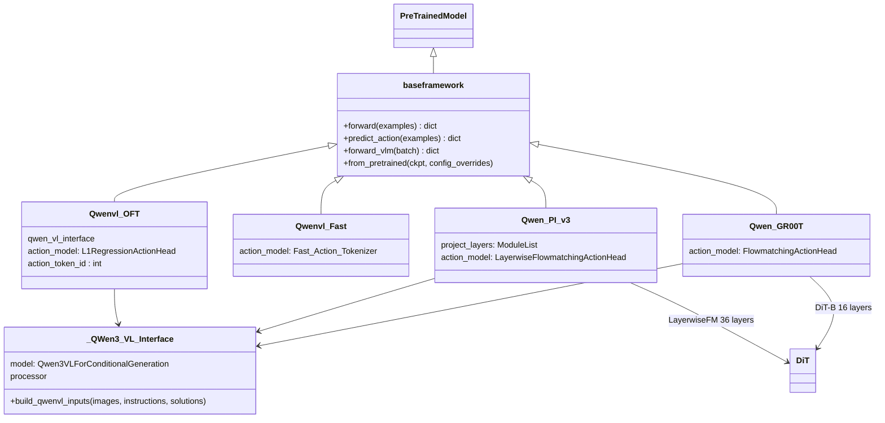

# StarVLA 代码库深度分析报告

> 分析对象：`/Users/liyufeng/Desktop/research/starVLA_code`（GitHub starVLA/starVLA，MIT，分支 `starVLA_dev`，HEAD `d81fc66`，2026-09-04）。
> 参考：技术报告 arXiv 2604.05014（StarVLA）、arXiv 2608.27550（VLAct）。所有结论来自逐文件阅读，行号以本地快照为准。

## 一句话结论与关键数字

**StarVLA 是一个"VLM 骨干 + 可插拔动作头"的 VLA 组装框架：模型层抽象清晰（`forward()` / `predict_action()` 双接口 + 注册表），数据层完整移植了 GR00T 的 LeRobot 管线，训练层是三份复制粘贴的 Accelerate/DeepSpeed 显式循环；VLAct 配方六项中，冻结（部分）、caption 共训（已有）、丢头重训（已有）可直接配置，多头共监督与 wrap-aware loss 完全缺失，统一 20 维动作布局只有零散的 mask 基础设施。**

| 指标 | 数值（实测） |
|---|---|
| Python 文件 / 总行数 | 261 个 / 57,625 行（`starVLA/` 139 个 25.7k+8.7k+3.4k 行；`examples/` 98 个 16.8k 行；`deployment/` 15 个；`tests/` 7 个） |
| 已注册框架类 | 28 个（VLM4A 20、WM4A 6、VM4A 2），31 个注册键（含别名 `QwenFM`、`Pi0`、`Pi05`） |
| 动作头实现文件 | 11 个（`starVLA/model/modules/action_model/*.py`，不含 `__init__`） |
| VLM 接口文件 | 10 个，`get_vlm_model` 按模型名分派 9 个分支 |
| 示例目录 | 25 个（simBenchmarks 13、realRobots 5、modelExtensions 6、human2robots 1）；12 个 `model2*_interface.py`；16 个外部 `data_registry` |
| 训练入口 | 4 个脚本（`train_starvla.py` 528 行、`train_starvla_cotrain.py` 514 行、`train_starvlm.py` 375 行、`train_starvln.py` 252 行） |
| 测试 | 7 个文件、41 个测试函数、1,067 行；无 CI workflow |
| Git | 131 次提交（浅历史，起于 2026-02-21）、40 位作者 |

---

## 1. 目录总览与设计哲学

### 1.1 顶层结构

| 目录 | 关键文件 | 职责 |
|---|---|---|
| `starVLA/model/framework/` | `base_framework.py`、`share_tools.py`、`VLM4A/*.py`、`WM4A/*.py`、`VM4A/*.py` | 框架层：把骨干 + 动作头组装成一个 `baseframework` 子类；每个文件即一个"论文架构图" |
| `starVLA/model/modules/` | `vlm/`、`world_model/`、`action_model/`、`dino_model/`、`projector/` | 可复用模块：VLM 接口包装、世界模型包装、动作头、DINO、QFormer |
| `starVLA/model/tools.py` | `Registry`、`FRAMEWORK_REGISTRY`、`FrameworkTools` | 注册表、反归一化工具、可训练模块发现 |
| `starVLA/dataloader/` | `lerobot_datasets.py`、`gr00t_lerobot/`、`vlm_datasets.py`、`umi_datasets.py`、`qwenvl_llavajson/` | 数据层：LeRobot 机器人数据、LLaVA-json VLM 数据、UMI 适配器 |
| `starVLA/training/` | `train_starvla*.py`、`trainer_utils/` | 训练循环、冻结/分组学习率/权重加载工具、配置访问追踪 |
| `starVLA/config/` | `deepseeds/*.yaml`、`training/*.yaml` | Accelerate+DeepSpeed 启动配置；5 份历史训练 yaml |
| `deployment/` | `model_server/`、`docker/`、`upload/` | WebSocket / ZMQ 策略服务器、Docker 镜像、HF 上传脚本 |
| `examples/` | `simBenchmarks/`、`realRobots/`、`modelExtensions/`、`human2robots/` | 每个基准/机器人一个目录：`train_files/`（yaml、sh、`data_registry/`、`modality.json`）+ `eval_files/`（`model2*_interface.py`、`run_policy_server.sh`） |
| `docs/` | `starVLA_guideline.md`、`faq.md`、`WM4A.md`、`VM4A.md`、`agent_skills/` | 上手指南、FAQ、两条非 VLM 骨干路线、agent skill 模板 |
| `tests/` | 7 个 `unittest` 文件 | 配置覆盖、ZMQ 服务、MiniCPM、图像预处理、单进程安全 |

### 1.2 设计哲学（代码中的落点）

1. **top-down 分解、高内聚低耦合**：`build_framework(cfg)`（`starVLA/model/framework/base_framework.py:L85-119`）是模型的唯一构建入口，按 `cfg.framework.name` 查 `FRAMEWORK_REGISTRY`；`_auto_import_framework_modules`（L60-82）用 `pkgutil` 扫描 `framework/` 下所有子包并 import，触发 `@FRAMEWORK_REGISTRY.register("...")` 装饰器（`starVLA/model/tools.py:L136-164`）。新增框架只需新增一个文件，无需改任何 import 列表。
2. **`forward()` / `predict_action()` 双接口**：`baseframework`（`base_framework.py:L126-321`）继承 `transformers.PreTrainedModel`，只软约束两个方法：`forward(examples: List[dict]) -> {"action_loss": Tensor}`（L151-166）和 `predict_action(examples) -> {"normalized_actions": np.ndarray[B,T,D]}`（L168-180）。两者都直接吃"原始样本 dict"（PIL 图像、字符串指令、numpy 动作），模型内部自己做 tokenize / processor，训练与部署输入形态一致。
3. **dataloader 返回模型无关的原始 dict**：`LeRobotSingleDataset._pack_sample`（`starVLA/dataloader/gr00t_lerobot/datasets.py:L1379-1436`）产出 `{"action": np.ndarray[T,D], "image": List[PIL], "lang": str, "robot_tag": str, "state"?: np.ndarray[1,S]}`；`collate_fn` 就是 `return batch`（`lerobot_datasets.py:L21-22`）。例外见 §3.6：VLM 数据在 dataloader 内已 tokenize。
4. **`**/bar/` 忽略目录**：`.gitignore:L176,L186` 含 `bar` 与 `**/bar`；`pyproject.toml` 的 `exclude` 也含 `**bar**`。约定用户把私有脚本放在任何 `bar/` 子目录下。`lerobot_datasets.py:L124` 的 smoke test 默认路径就指向 `.../train_files/bar/starvla_cotrain_libero.yaml`。
5. **单文件 smoke test**：每个框架文件末尾带 `if __name__ == "__main__":`（如 `QwenOFT.py:L353-408`）：加载 yaml、构造模型、造假样本跑一次 `forward` 与 `predict_action`。VLM 接口（`QWen3.py:L174-199`）、dataloader（`lerobot_datasets.py:L119-162`）同样可单独运行。
6. **Config-as-API**：每个框架定义一个 `*DefaultConfig` dataclass（如 `QwenOFTDefaultConfig`，`QwenOFT.py:L65-101`），用 `merge_framework_config`（`share_tools.py:L186-258`）与 yaml 的 `framework:` 子树合并，yaml 优先、多余键保留。

### 1.3 类关系



---

## 2. 配置系统

### 2.1 全局 config 对象的构建链

```
OmegaConf.load(--config_yaml)                          train_starvla.py:L508
  → normalize_dotlist_args(clipargs)                   trainer_tools.py:L31-54
  → OmegaConf.merge(cfg, OmegaConf.from_dotlist(...))  train_starvla.py:L509-511
  → apply_config_compat(cfg)                           share_tools.py:L418-524
  → wrap_config(cfg) -> AccessTrackedConfig            config_tracker.py:L476-478
  → build_framework(cfg) 内 merge_framework_config(DefaultConfig, cfg)   share_tools.py:L186-258
```

- **点路径覆盖**：`argparse.parse_known_args()` 只认 `--config_yaml`，其余参数交给 `normalize_dotlist_args`：`['--framework.qwenvl.base_vlm', 'X']` → `'framework.qwenvl.base_vlm=X'`；孤立的 `--flag` → `'flag=true'`（`trainer_tools.py:L43-51`）。随后 `OmegaConf.from_dotlist` 解析并 merge，因此任何未在 yaml 中出现的新键都会被"加进"全局 config（README 所说 "只添加到 config，行为由框架决定"）。
- **版本兼容层**：`apply_config_compat`（`share_tools.py:L418-524`）把 `action_horizon` 与旧键 `future_action_window_size` 互补（`action_horizon = future + 1`，L472-487），自动填 `diffusion_model_cfg.output_dim`、`cross_attention_dim`、`action_hidden_dim`、`past_action_window_size=0`，并盖章 `version_id: "0.21"`。
- **访问追踪**：`AccessTrackedConfig`（`config_tracker.py:L7-473`）用 `__getattr__` 记录被读取过的键；`save_accessed_config`（L434-447）只把访问过的叶子写到 `<run_dir>/config.yaml`，完整合并结果另存 `config.full.yaml`（`train_starvla.py:L215-227`）。`from_pretrained` 读取的是精简版 `config.yaml`（`share_tools.read_mode_config`，L357-399）。
- **框架默认值合并**：`merge_framework_config` 把 dataclass 默认值转 OmegaConf，与 yaml 的 `framework` 子树 merge（yaml 赢），并处理 `AccessTrackedConfig` 的子节点缓存失效（L232-248）。
- **推理期覆盖**：`baseframework.from_pretrained(ckpt, config_overrides=[...])`（`base_framework.py:L254-321`）与 `server_policy.py --config_override key=value` 走 `merge_config_overrides`（L27-57），可在不改 checkpoint 的前提下改配置（`tests/test_config_overrides.py` 覆盖此路径）。

### 2.2 `starVLA/config/` 内容

| 文件 | 内容 |
|---|---|
| `deepseeds/deepspeed_zero2.yaml` | Accelerate 配置：`distributed_type: DEEPSPEED`，`num_processes: 8`，指向 `ds_config.yaml` |
| `deepseeds/ds_config.yaml` | 实为 JSON：ZeRO stage 2、bf16、`gradient_accumulation_steps: 1`、`gradient_clipping: 1.0`、`train_micro_batch_size_per_gpu: auto` |
| `deepseeds/deepspeed_zero3.yaml` + `zero3.yaml` | ZeRO stage 3，`stage3_gather_16bit_weights_on_model_save: true`，无 `num_processes` |
| `deepseeds/zero2.yaml` | 另一份不带外部 json 的 ZeRO-2 Accelerate 配置（`mixed_precision: bf16`） |
| `training/starvla_cotrain_libero.yaml` | QwenGR00T + Qwen2.5-VL-3B，历史版本 |
| `training/starvla_cotrain_oxe.yaml` | QwenPI + OXE（bridge_rt_1） |
| `training/starvla_train_adapter.yaml` | QwenAdapter（VLA-Adapter 头） |
| `training/starvla_train_discrete_diffusion{,_real}.yaml` | QwenDiscreteDiffusion，RoboTwin 14D / FastUMI 10D |

实际使用的训练 yaml 都在 `examples/*/train_files/`（31 个），`starVLA/config/training/` 更像历史遗留；`pyproject.toml` 还把 `starVLA.config` 排除在 package 之外。

---

## 3. 数据管线

### 3.1 数据流

```mermaid
flowchart LR
    subgraph Registry
        A[examples/**/train_files/data_registry/data_config.py] -->|discover_and_merge| B[ROBOT_TYPE_CONFIG_MAP / DATASET_NAMED_MIXTURES]
    end
    B --> C[get_vla_dataset data_mix]
    C --> D[LeRobotSingleDataset x N]
    D --> E[LeRobotMixtureDataset]
    E -->|__getitem__| F["{image: List[PIL], lang, action[T,D], state[1,S], robot_tag}"]
    F --> G[DataLoader collate=identity]
    G --> H[framework.forward examples]
    H --> I[VLM interface build_qwenvl_inputs]
    I --> J[hidden_states]
    J --> K[action head loss]
    E -->|save_dataset_statistics| L[run_dir/dataset_statistics.json]
    L --> M[PolicyNormProcessor.unapply_actions at serving]
```



### 3.2 `lerobot_datasets.py` 与 `gr00t_lerobot/`

- `get_vla_dataset(data_cfg)`（`lerobot_datasets.py:L77-115`）：从 `DATASET_NAMED_MIXTURES[data_mix]` 读 `[(dataset_dir, weight, robot_type)]`，去重后为每个条目调 `make_LeRobotSingleDataset`（L24-75），再包成 `LeRobotMixtureDataset`。`robot_type` 查 `ROBOT_TYPE_CONFIG_MAP` 得到 DataConfig（含 `modality_config()`、`transform()`、`embodiment_tag`）。DataConfig 可选实现 `make_dataset(...)` 工厂钩子替换数据集类（L55-65）。
- **注册表自动发现**：`gr00t_lerobot/registry.py:L89-102` 用 `examples/**/train_files/data_registry` glob 找到 16 个目录，`discover_and_merge`（L116-144）逐个 import 并 `update` 三个全局 dict。基础注册在 `data_config.py:L1082-1096`（10 个 robot_type）与 `mixtures.py`。
- **单样本 schema**（`datasets.py:L1379-1436`）：
  - `image`: `List[PIL.Image]`，按 `video_keys` 顺序，每路取 `delta_indices=[0]` 那一帧并 `resize(image_size)`（默认 224×224，可由 `data_cfg.image_size` 改）；
  - `lang`: `str`，来自 `language_keys[0]`；
  - `action`: `np.concatenate([data[k] for k in action_keys], axis=1).astype(float16)`，形状 `[len(action_indices), D]`；
  - `state`: 仅当 `data_cfg.include_state` 为真时加入，形状 `[1, S]`；
  - `robot_tag`: embodiment tag 字符串。
- **action chunk 与 horizon**：chunk 长度由 DataConfig 的 `action_indices = list(range(N))` 决定（LIBERO 为 `range(8)`，`examples/simBenchmarks/LIBERO/train_files/data_registry/data_config.py:L39`）；越界步用 `retrieve_data_and_pad`（`datasets.py:L1544-1590`）按 `first_last` / `zero` 策略填充。模型侧再取最后 `action_horizon` 步：`actions[:, -self.action_horizon:, :]`（`QwenOFT.py:L219`），因此 yaml 的 `action_horizon` 必须 ≤ `len(action_indices)`。`data_cfg.drop_incomplete_action_chunks`（`datasets.py:L2228-2260`）可只采样完整 chunk 的起点。
- **动作模式**：`data_cfg.action_mode ∈ {abs, delta, rel}`（`_apply_action_mode`，`datasets.py:L1238-1277`）：`delta` 为相邻步差分且首步减 state，`rel` 为整段减 state[0]；统计量随模式分开缓存。
- **归一化统计**：`calculate_dataset_statistics`（`datasets.py:L76-121`）读全部 parquet，按列算 `mean/std/min/max/q01/q99`，缓存到数据集目录 `meta/stats_gr00t.json`（`LE_ROBOT_STATS_FILENAME`，L65；带 `__format_version=2` 与 `__cache_config`，L162-225）。`StateActionTransform`（`transform/state_action.py:L277-`）在 `set_transforms_metadata` 后按 `normalization_modes` 逐 key 归一化，`Normalizer`（L98-213）支持 `q99`（映射到 [-1,1] 再 clamp 到 [-2.2,2.2]）、`mean_std`、`min_max`、`scale`、`binary` 五种。
- **多数据集合并统计**：`LeRobotMixtureDataset.update_metadata`（`datasets.py:L2700-2735`）按 embodiment tag 分组，同 tag 的多个数据集用 `merge_metadata`（L2653-2698，要求 modality 配置完全一致）与 `compute_overall_statistics`（L2543-2651）合并：mean/std 按采样权重加权，q01/q99 默认 `percentile_mixing_method="min_max"`（取各集 q01 的 min、q99 的 max，L2194-2196）。训练开始时 `save_dataset_statistics`（L2737-2846）把每个 tag 的 `action/state` 统计 + `mask`（`generate_action_mask_for_used_keys`，L2118-2160：仅 `binary` 维为 False）+ `num_transitions/num_trajectories` 写到 `<run_dir>/dataset_statistics.json`，供推理反归一化。
- **混合采样权重**：`LeRobotMixtureDataset.__init__`（L2274-2325）：数据集权重 = 配置权重（`balance_dataset_weights=True` 时再乘数据集长度）后归一化；轨迹权重默认均匀（`balance_trajectory_weights` 时按长度）。`sample_step`（L2386-2411）用 `hash(epoch, index, seed)` 播种，先按数据集权重抽数据集、再抽轨迹、再抽起点。`__len__`（L2478-2541）= 权重为 1.0 的"主数据集"中 `len/weight` 的最大值。`build_dataloader` 默认两个 balance 开关均为 False（`dataloader/__init__.py:L44-45`）。
- **跨本体动作维度**：核心管线不做维度对齐。每个 DataConfig 自己决定 `action_keys` 的拼接顺序（AgileX 为 `left_joints, right_joints, left_gripper, right_gripper` → 14 维，`data_config.py:L852-857`；LIBERO 7 维）。同一 mixture 若混入不同维度的本体，样本级别可以共存（batch 是 list），但框架侧 `torch.tensor(np.array(actions))`（`QwenOFT.py:L216`）要求同 batch 形状一致，会直接报错。现有的对齐手段都在框架/适配器层：`PI0._pad_array_2d` 零填到 32 维无 mask（`PI0.py:L231-239, L287`）；`umi_datasets.UMISampleAdapter._fit_matrix` 右下角填充并生成 `action_mask[T,D]`（`umi_datasets.py:L86-114`）；`MiniCPMRobotManip._to_80d` 把 10 维 EE6D 写进 80 维统一布局的 `[7:17]` 槽位并生成 mask（`MiniCPMRobotManip.py:L141-150`）。技术报告 §7 提到的"统一 32 维 padding 多基准共训"在代码中未找到对应实现。

### 3.3 `umi_datasets.py`

对 `LeRobotMixtureDataset` 的安全包装（`make_umi_dataloader`，L222-267）：从 `datasets.vla_data` 与 `framework.action_model` 解析并校验 `action_horizon/action_dim/state_dim`（不一致即抛错，L48-58）；拒绝混合 `action_semantics` 不同的 mixture（L235-247）；`UMISampleAdapter`（L117-212）对每个样本做形状规整、NaN 检查、`max_abs_action`、静止动作剔除，失败时以奇数步长重采样，输出附带 `action_mask`、`image_mask`、`state_mask`。这是仓库里唯一在 dataloader 层输出 `action_mask` 的路径，目前只被 `QwenOFT.masked_l1_loss` 消费。

### 3.4 `vlm_datasets.py` 与 `qwenvl_llavajson/`

- 数据注册在 `qwenvl_llavajson/qwen_data_config.py`：`data_dict = {sharegpt4v_coco, r2r, rxr}`，`dataset_use: "a,b%50"` 支持 `%N` 采样率后缀（L37-56）。
- `LazySupervisedDataset`（`vlm_datasets.py:L255-`）读 LLaVA 格式 json（`image`/`conversations`），`_build_messages`（L142-211）把 `<image>` 占位符替换为 PIL，`preprocess_qwen_visual`（L213-252）用 `processor.apply_chat_template(tokenize=True)` 得到 `input_ids/pixel_values`，labels 只保留 assistant 回答区间（依据硬编码 token id 77091 与 151645，L238-246）。`get_rope_index_{2,25,3}`（`rope2d.py`）按 `model_type` 计算 mRoPE `position_ids`。
- `make_vlm_dataloader`（L704-732）用 `cfg.framework.qwenvl.base_vlm` 的 processor，`DataCollatorForSupervisedDataset` 左 pad 成 tensor batch，`num_workers=4` 硬编码。
- 结论：VLM 分支在 dataloader 内完成 tokenize，是"原始 dict"原则的例外，也把它绑定在 Qwen 词表上（Gemma4/MiniCPM 骨干无法直接复用）。

### 3.5 VLM 数据与机器人数据的混批方式

不是同一 batch 内混合，而是两个独立 DataLoader（`train_starvla_cotrain.py:prepare_data`，L68-77），每步各取一个 batch（`_get_next_batch`，L254-274），分别 forward/backward（L358-426）。混合比例由 `per_device_batch_size`（LIBERO 默认 vla 16 : vlm 4）间接控制，VLM 侧 loss 乘 `trainer.loss_scale.vlm`（默认 0.1）。

### 3.6 数据层的设计边界小结

| 约定 | 是否被遵守 |
|---|---|
| dataloader 不做模型相关预处理 | 机器人数据遵守；VLM 数据违反（已 tokenize） |
| 归一化归属 dataloader 的 transform | 遵守，部署端复用同一 `ComposedModalityTransform.unapply`（`deployment/model_server/policy_norm_processor.py`） |
| 跨本体维度对齐 | 未在核心层实现，散落在 PI0 / UMI / MiniCPMRobotManip 三处 |

---

## 4. 模型层

### 4.1 `starVLA/model/framework/` 一览

| 子包 | 框架（注册名） | 骨干 | 动作头 | 文件 |
|---|---|---|---|---|
| VLM4A | `QwenOFT` | Qwen2.5/3-VL | `MLP_ActionHeader.L1RegressionActionHead` | `VLM4A/QwenOFT.py` |
| VLM4A | `QwenFast` | Qwen-VL-Action（扩词表） | `fast_ActionHeader.Fast_Action_Tokenizer` | `VLM4A/QwenFast.py` |
| VLM4A | `QwenPI` / `QwenFM`、`QwenPI_v3` | Qwen-VL | `LayerwiseFM_ActionHeader` | `VLM4A/QwenPI.py`、`QwenPI_v3.py` |
| VLM4A | `QwenGR00T` | Qwen-VL | `GR00T_ActionHeader.FlowmatchingActionHead` | `VLM4A/QwenGR00T.py` |
| VLM4A | `QwenDual`、`LangForce`、`CosmosGR00T`、`Gemma4GR00T`、`MiniCPMGR00T` | Qwen-VL+DINO / Qwen-VL / Cosmos-Reason2 / Gemma4 / MiniCPM-V | GR00T 头 | 各同名文件 |
| VLM4A | `InternVLA-M1` | Qwen-VL + DINO + QFormer | `DiTActionHeader`（DDPM） | `VLM4A/M1.py` |
| VLM4A | `QwenAdapter` | Qwen-VL-Action | `VLA_AdapterHeader` | `VLM4A/QwenAdapter.py` |
| VLM4A | `QwenDiscreteDiffusion` | Qwen-VL | `LayerwiseDiscreteDiffusion_ActionHeader`（MaskGIT） | `VLM4A/QwenDiscreteDiffusion.py` |
| VLM4A | `PI0` / `PI05` | PaliGemma（`vlm/OpenPIPaliGemma.py`） | `OpenPI_ActionHead` | `VLM4A/PI0.py`、`PI05.py` |
| VLM4A | `ABot_M0` | Qwen-VL + VGGT | `AML_ActionHeader` | `VLM4A/ABot_M0.py` |
| VLM4A | `EgoVLA`、`MiniCPMPI`、`Gemma4PI`、`MiniCPMRobotManip` | VILA / MiniCPM / Gemma4 / MiniCPM-RobotManip | 各自 | 各同名文件 |
| WM4A | `CosmoPredict2{OFT,GR00T,PI}`、`Wan{OFT,GR00T,PI}` | Cosmos-Predict2-2B / Wan2.2 DiT | OFT / GR00T / PI 头 | `WM4A/*.py` |
| VM4A | `ACT`、`DiffusionPolicy` | ResNet-18 | ACT / 1D U-Net DDPM | `VM4A/ACT.py`、`DiffusionPolicy.py` |

所有框架共用同一套 `__init__` 模板：`merge_framework_config` → `get_vlm_model(config)` → 运行期对齐维度（把 VLM `hidden_size` 写回 `action_model.action_hidden_dim` 或 `diffusion_model_cfg.cross_attention_dim`）→ `get_action_model(config)` → 读 `action_horizon`。

### 4.2 四种动作头逐个说明

#### (1) FAST：自回归离散 token（`QwenFast.py` + `fast_ActionHeader.py`）

- **注入方式**：动作不进模型输入，而是作为 assistant 回答。`encoder_action2fastoken`（`fast_ActionHeader.py:L78-83`）调 `physical-intelligence/fast` 的 `UniversalActionProcessor` 把 `[B,T,D]` 动作压成 token id 序列；`map_fast_token_to_vlm_action`（`QwenFast.py:L265-271`）拼成 `<robot_action_{k}>` 字串；`build_qwenvl_inputs(..., solutions=...)`（`QWen3.py:L114-171`）把它放进 assistant turn，labels 把第一个动作 token 之前全部置 -100（L147-169）。动作 token 在 Qwen3-VL-Action 词表中占 id `151669..153716`（`QWen3.py:L21-24`，2048 个），Qwen2.5-VL-Action 为 `151665..153712`。
- **头结构**：无可学习参数，`Fast_Action_Tokenizer` 只是 tokenizer 包装；预测能力全部由 VLM 的 lm_head 承担。
- **Loss**：VLM 自带的 next-token CE（`qwenvl_outputs.loss`，`QwenFast.py:L172`），NaN 时置 0。
- **推理**：`model.generate(max_length=2048)`（L210-213）→ `_extract_action_token_ids` 按 id 区间筛出动作 token（L224-246）→ 减 `_ACTION_TOKEN_MIN` 还原 FAST id → `fast_tokenizer.decode`（L220）。解码失败返回 None 条目。
- **与 hidden state 的连接**：完全经过 LM logits，不取 hidden state。

#### (2) OFT：并行连续回归（`QwenOFT.py` + `MLP_ActionHeader.py`）

- **动作 query 注入**：在指令末尾拼接 `" Please predict the next {N} robot actions: <action>🔍🔍...🔍<action>."`（`QwenOFT.py:L188-192`），`🔍` 是词表中现成的单 token（L145-146），重复 `chunk_len` 次充当 query。
- **头结构**：`L1RegressionActionHead`（`MLP_ActionHeader.py:L60-88`）= `MLPResNet(num_blocks=2, input=H, hidden=2H, output=D)`；`get_action_model`（L91-115）把 `hidden_dim` 设为 `2*action_hidden_dim`，而 `action_hidden_dim` 在框架 `__init__` 中被覆盖为 VLM `hidden_size`（`QwenOFT.py:L134`）。
- **与 hidden state 的连接**：取 `hidden_states[-1]`（L204），`_gather_action_token_embeddings`（L295-347）用 `input_ids == action_token_id` 找位置，`topk(chunk_len)` 取最后 N 个并按时间排序，gather 出 `[B, N, H]`，逐 token 过 MLP 得 `[B, N, D]`。
- **Loss**：`masked_l1_loss(pred, target, mask)`（L40-51）——无 mask 时为普通 L1 均值；样本携带 `action_mask[T,D]` 时按有效格子求均值（L175-177 要求 batch 内全有或全无）。
- **推理**：单次前向，无迭代（L230-293）。

#### (3) PI：层级 cross-attention flow matching（`QwenPI_v3.py` + `LayerwiseFM_ActionHeader.py`）

- **与 hidden state 的连接**：`output_hidden_states=True` 得到 `num_layers+1` 个 hidden，取最后 `num_action_dit_layers`（= LLM 层数，Qwen3-VL-4B 为 36）个（`QwenPI_v3.py:L271`）；每层过独立的 `LayerNorm + Linear(H → action_dit_hidden_dim=1024)` 投影（`project_layers`，L227-239，H==1024 时退化为 Identity）。DiT 第 i 个 block 的 cross-attention K/V 来自 VLM 第 i 层（`cross_attention_dit.py:L308-318`，`is_layerwise_encoder`）。`populate_layerwise_dit_cfg`（`share_tools.py:L261-295`）把 `num_layers/input_embedding_dim/cross_attention_dim/num_attention_heads` 写进 `diffusion_model_cfg`。
- **头结构**（`LayerwiseFlowmatchingActionHead`，`LayerwiseFM_ActionHeader.py:L197-279`）：`ActionEncoder`（`Linear(D→W)`，与正弦时间嵌入拼接后 `Linear(2W→W)` + swish + `Linear(W→W)`，L61-100）、可选 `state_encoder`（MLP）、`future_tokens`（`num_target_vision_tokens=32` 个可学习 token）、可学习位置嵌入、`DiT`（默认 `interleave_self_attention=False` 即全 cross-attn，`QwenPI_v3.py:L130`）、`action_decoder = MLP(W→1024→D)`。DiT 输出用 `return_pre_output=True` 跳过 AdaLN 输出层（L333-339）。
- **状态**：不用 `state_encoder`，而是把 state 量化到 256 桶写进指令文本 `"{instr} [STATE] 95 133 ... [ACTION]"`（`add_discretized_state_to_instruction`，`QwenPI_v3.py:L412-423`，π0.5 风格），随后 `state=None`。
- **Loss**（L288-347）：`t ~ Beta(1.5, 1.0)`，`t = (0.999 - sample)/0.999`；`noisy = (1-t)·ε + t·a`，`velocity = a − ε`；`loss = mean((pred_velocity − velocity)²)`，只对最后 T 个位置（动作段）计算。框架侧把 batch 复制 `repeated_diffusion_steps` 份以采多个 t（`QwenPI_v3.py:L315-321`，从 `cfg.trainer` 读，默认 16）。
- **推理**（L349-408）：从 `N(0, I)` 起步，`num_inference_timesteps=4` 步 Euler：`a ← a + (1/N)·v`，t 离散化为 `int(t·1000)` 桶。另有 RTC 推理 `predict_action_realtime`（L410-631，ΠGDM 引导或 simulated-delay 两种模式）。
- **参数量**（`QwenPI_v3.py` 文档字符串 L33-42）：Qwen3-VL-4B 4.44B + action_model 538.7M + project_layers 94.6M。

#### (4) GR00T：双系统（`QwenGR00T.py` + `GR00T_ActionHeader.py`）

- **与 hidden state 的连接**：只取 `hidden_states[-1]`（`QwenGR00T.py:L190`），`cross_attention_dim` 运行期设为 VLM `hidden_size`（L155-157）；`backbone_attention_mask` 传入 DiT 作 `encoder_attention_mask`（L216-219）。
- **头结构**（`FlowmatchingActionHead`，`GR00T_ActionHeader.py:L196-429`）：`DiTConfig["DiT-B"]`（`input_embedding_dim=768, heads=12, head_dim=64`，L190-193）+ `diffusion_model_cfg`（`num_layers=16, interleave_self_attention=True` → 偶数层 cross、奇数层 self，`cross_attention_dit.py:L242-243`）；`state_encoder = MLP(S→1024→768)`、`action_encoder`、`future_tokens(32)`、位置嵌入、`action_decoder = MLP(1024→1024→D)`（DiT 经 AdaLN 输出层投到 `output_dim=1024`）。
- **Loss**（L312-363）：与 PI 相同的 flow-matching MSE，`sample_time` 多一个 `clamp(max=noise_s)`；`repeated_diffusion_steps` 从 `framework.action_model` 读（默认 8，`QwenGR00T.py:L97,L199-203`）。
- **推理**（L365-421）：4 步 Euler，state 直接经 `state_encoder` 拼接在序列最前（`[state, future_tokens, actions]`）。
- 与 PI 的差异：单层条件 vs 逐层条件；state 走 encoder vs 走文本；DiT 隐维 768 vs 1024；交错 self-attn vs 全 cross。

#### 四头对比

| | FAST | OFT | PI (v3) | GR00T |
|---|---|---|---|---|
| 条件来源 | LM logits | `hidden_states[-1]` 中 query token | 最后 36 层 hidden（逐层投影） | `hidden_states[-1]` |
| 动作表示 | 离散 token | 连续点估计 | flow matching | flow matching |
| Loss | CE | L1（可 mask） | MSE(velocity) | MSE(velocity) |
| 推理 | 自回归 generate | 1 次前向 | 4 步 Euler | 4 步 Euler |
| 头参数 | 0（复用 lm_head） | MLPResNet 2 块（≈10H²） | ~540M（36 层） | DiT-B 16 层 |
| state | 无 | 文本量化 | 文本量化 | MLP encoder |

### 4.3 VLM 接口层的抽象

`get_vlm_model(config)`（`starVLA/model/modules/vlm/__init__.py:L1-45`）按 `framework.qwenvl.base_vlm` 的子串分派：`Qwen2.5-VL`/`nora` → `QWen2_5._QWen_VL_Interface`；`Qwen3-VL` → `QWen3._QWen3_VL_Interface`；`Qwen3.5` → `QWen3_5`；`gemma-4` → `Gemma4`；`molmo2` → `Molmo2`；`minicpm-v` → `MiniCPM_V`；`florence` → `Florence2`；`cosmos-reason2` → `CosmosReason2`；`egovla/vila` → `VILA`。**InternVL 没有接口实现**（仅 `M1.py` 的 `InternVLA-M1` 框架名沿用，骨干仍是 Qwen-VL）。PaliGemma（`OpenPIPaliGemma.py`）由 `PI0/PI05` 直接实例化，不经此工厂。

接口契约（`vlm/README.md`，对应 `QWen3.py:L30-171`）：`__init__(config)` 加载模型+processor（`padding_side="left"`）并把 `config.hidden_size` 对齐到 `text_config.hidden_size`；`forward(**kwargs)` 在 `autocast(bf16)` 下透传；`generate(**kwargs)`；`build_qwenvl_inputs(images, instructions, solutions=None)` 组 chat message、可选用 `datasets.vla_data.CoT_prompt` 包裹指令（L126-130），返回 `BatchFeature.to(device)`。框架通过 `self.qwen_vl_interface` 统一持有（连 WM4A 的 `CosmosGR00T` 也沿用该属性名），这个命名也被 `baseframework.forward_vlm` 与 cotrain trainer 硬编码依赖。

### 4.4 WM4A 与 VM4A

- **WM4A**（`docs/WM4A.md`）：把视频生成 DiT 当视觉编码器。`get_world_model`（`modules/world_model/__init__.py`）按 `framework.world_model.base_wm` 分派到 `_CosmoPredict2_Interface`（`CosmoPredict2.py`：T5 文本编码 + VAE 图像编码 + DiT，`register_forward_hook` 抓取指定 block 的 hidden，`timestep=0`、`condition_mask` 标记真实帧，L126-147、L274-298）或 `_Wan2_Interface`（UMT5 + Wan2.2 DiT）。`build_inputs()` 替代 `build_qwenvl_inputs()`。以 `CosmoPredict2OFT` 为例（`WM4A/CosmoPredict2OFT.py:L82-183`）：`hidden_states[-1]` 全局平均池化 → `Linear(H → chunk_len·H)` 生成 N 个 action query → 复用 `MLP_ActionHeader` → `nn.L1Loss`。GR00T/PI 变体同理复用两个 flow-matching 头。文档声称 7 种组合含 `WM4A_OFT.py`，实际目录只有 6 个文件。
- **VM4A**（`docs/VM4A.md`）：无 VLM 的轻量视觉运动策略基线。`ACT` 包装 LeRobot `ACTPolicy`，`DiffusionPolicy` vendored `real-stanford/diffusion_policy` 子集（`VM4A/_dp_vendor/`），两者安装恒等归一化器以避免与 StarVLA 的 `StateActionTransform` 双重归一化；`DiffusionPolicy` 重写 `state_dict/load_state_dict` 把 `EMAModel.averaged_model` 以 `ema_averaged.*` 前缀持久化（`DiffusionPolicy.py:L147-260`）。这是仓库中唯一的 EMA 实现。

---

## 5. 训练

### 5.1 四个入口的差异

| 脚本 | 数据 | 循环 | 模型 | 备注 |
|---|---|---|---|---|
| `train_starvla.py` | 单 VLA DataLoader | 自写 while 循环 + `accelerator.accumulate` | `build_framework` | 支持 `is_resume`（找最新 `steps_*` ckpt 并快进 LR scheduler，L229-269）、`STARVLA_DISABLE_DEEPSPEED=1` 单卡模式（L50-65） |
| `train_starvla_cotrain.py` | VLA + VLM 两个 DataLoader | 同上，每步两次 backward | 同上 | DeepSpeed engine 分支绕开 `accumulate()`（L358-392）；`vlm_loss = out.loss * loss_scale.vlm` |
| `train_starvlm.py` | 仅 VLM DataLoader | 同上 | `build_framework`（用其 `qwen_vl_interface`） | 纯 VLM SFT，产物可作为 VLA 初始化 |
| `train_starvln.py` | `make_supervised_data_module` | **HF `Trainer`** | 直接 `Qwen*VLForConditionalGeneration` | VLN-CE 用；`HfArgumentParser`、LoRA、`replace_qwen2_vl_attention_class` flash-attn varlen 补丁（`monkey_patch.py`） |

前三者约 80% 代码重复（`setup_directories`、`_init_wandb`、`_save_checkpoint`、`_log_metrics`、`_finalize_training` 几乎逐行相同）。

### 5.2 `trainer_utils` 关键机制

- **冻结 `freeze_backbones(model, freeze_modules)`**（`trainer_tools.py:L192-234`）：把逗号分隔字串按 `.` 切成属性路径逐级 `getattr`，命中即对该子模块全部参数 `requires_grad=False`；路径不存在只打印警告。**实现是精确点路径匹配，不支持正则**（README/FAQ 所写"regex"与打印文案 "re pattern" 与代码不符）。`nn.ModuleList` 可用数字索引路径（如 `...language_model.layers.3`）。
- **分模块学习率 `build_param_lr_groups(model, cfg)`**（L92-148）：遍历 `cfg.trainer.learning_rate` 中除 `base` 外的键，同样按点路径找模块，其参数（排除 `freeze_modules` 命中的参数）成为一个 param group；剩余参数归 `base`。冻结列表在此处被**再解析一次**（L108-125），与 `freeze_backbones` 构成隐式耦合——两处必须同步。注意 `setup_optimizer_and_scheduler` 在 `main()` 中先于 `prepare_training()` 里的冻结执行（`train_starvla.py:L476-489`），正是靠这段重复解析保证冻结参数不进优化器。
- **checkpoint 保存**：仅 `state_dict`（`accelerator.get_state_dict`），`pt` 或 `safetensors`，路径 `<run_dir>/checkpoints/steps_{N}_pytorch_model.pt`，并追加 `summary.jsonl` 与刷新 `config.yaml`（`train_starvla.py:L276-303`）；结束时另存 `final_model/pytorch_model.pt`。**不保存 optimizer/scheduler 状态**（FAQ 明说）。
- **加载 `load_pretrained_backbones(model, ckpt, reload_modules)`**（`trainer_tools.py:L253-305`）：`reload_modules="a.b,c"` 时按前缀切子 state_dict 并对子模块 `strict=True` 加载；为空则整模型 `strict=False` 加载（缺键静默）。推理侧 `baseframework.from_pretrained` 则是 `strict=True`（`base_framework.py:L306`）。
- **EMA**：训练器中无 EMA；仅 `VM4A/DiffusionPolicy` 内部实现。
- **梯度累积**：来自 DeepSpeed 配置（`ds_config.yaml` 的 `gradient_accumulation_steps: 1`）经 `accelerator.gradient_accumulation_steps` 读出；yaml 里 `trainer.gradient_accumulation_steps: 4` **未被任何训练脚本读取**。LR scheduler 只在 `sync_gradients` 时 step（`train_starvla.py:L436-437`）。
- **DeepSpeed ZeRO-2/3 与多机**：`accelerate launch --config_file starVLA/config/deepseeds/deepspeed_zero2.yaml --num_processes 8 ...`；多机加 `--main_process_ip/--main_process_port/--machine_rank/--num_machines`（`run_libero_train.sh:L59-75` 注释模板）。ZeRO-3 用 `deepspeed_zero3.yaml`，训练脚本无需改动（`accelerator.get_state_dict` 负责聚合）。
- **梯度裁剪**：`trainer.gradient_clipping`（默认 1.0）经 `accelerator.clip_grad_norm_`；`trainer.max_grad_norm` 未被读取。
- **精度**：VLM 前向 `autocast(bf16)`，动作头 `autocast(float32)`（各框架 forward 内显式切换）。
- **在线评估**：每 `eval_interval` 步取一个训练 batch 跑 `predict_action`，记录归一化空间的欧氏距离 `mse_score`（`train_starvla.py:L386-404`）。

---

## 6. 部署

| 组件 | 文件 | 作用与接口 |
|---|---|---|
| WebSocket 策略服务器 | `deployment/model_server/server_policy.py`（入口）、`tools/websocket_policy_server.py` | `python server_policy.py --ckpt_path X.pt --port 10093 --use_bf16 [--config_override k=v] [--idle_timeout 1800]`；握手时发送 `wrapper.metadata`（`action_chunk_size`、`available_unnorm_keys`、`action_keys`、`state_keys`、`training_obs_image_size`），请求体 `{"examples":[...], "unnorm_key":..., **kwargs}`，响应 `response["data"]["actions"]`（已反归一化，`[B,T,D]`） |
| 策略包装 | `policy_wrapper.py:PolicyServerWrapper`（L53-197） | `baseframework.from_pretrained` 加载 → `predict_action(examples, unnorm_key)` → 用 `PolicyNormProcessor.unapply_actions` 反归一化；多数据集 checkpoint 需客户端每次传 `unnorm_key` |
| 反归一化 | `policy_norm_processor.py:PolicyNormProcessor`（L238-）| 从 `dataset_statistics.json` + 注册表里的 DataConfig 重建训练期 `ComposedModalityTransform` 并调用 `unapply`，是"单一归一化真源" |
| GR00T 协议服务器 | `server_policy_gr00t_zmq.py` + `gr00t_obs_adapter.py` + `tools/zmq_policy_server.py` | 兼容 Isaac-GR00T N1.6 的 msgpack ZMQ 协议（`ping/reset/get_action/get_modality_config`），把命名 state dict 按 DataConfig `state_keys` 顺序展平、把动作按 `action_key_dims` 切回命名组；端口 5555 |
| 客户端 | `tools/websocket_policy_client.py:WebsocketClientPolicy` | `get_server_metadata()`、`predict_action(query)`；`_check_eval_observation_contract` 在图像尺寸/数量与训练元数据不符时告警一次 |
| 序列化 | `tools/msgpack_numpy.py`、`tools/image_tools.py:to_pil_preserve` | numpy 走 msgpack；框架内用 `to_pil_preserve` 把 ndarray 还原为 PIL |
| Docker | `deployment/docker/Dockerfile.{server,train,robocasa}`、`docker-compose.yml` | server 镜像 `python:3.10-slim` 不装 CUDA toolkit（sdpa 推理）；train 镜像含 DeepSpeed/flash-attn；compose 提供 `eval`/`train` profile；checkpoint 目录挂到 `/models`，基座 VLM 挂到 `/workspace/starVLA/playground/Pretrained_models` |
| 上传 | `deployment/upload/push_model_to_hf.py` | 12 行脚本：`create_repo` + `HfApi.upload_large_folder` 整个 run 目录（含 `config.yaml`、`dataset_statistics.json`、`checkpoints/`） |

checkpoint 目录约定（`share_tools.read_mode_config`，L357-399）：`<run_dir>/config.yaml`、`<run_dir>/dataset_statistics.json`、`<run_dir>/checkpoints/steps_N_pytorch_model.pt`，`parents[1]` 反推 run_dir。

---

## 7. examples 生态

### 7.1 `simBenchmarks/`（13 个）

| 基准 | 做什么 | 入口 | 值得注意的设计 |
|---|---|---|---|
| LIBERO | 4 套件（Spatial/Object/Goal/10）单策略训练+评测；README 给出 4 头 × 2 骨干共 8 组结果（Qwen3-VL-OFT 平均 96.6） | `train_files/run_libero_train.sh`；`eval_files/run_policy_server.sh` + `eval_libero.sh` | `model2libero_interface.py` 只做图像 resize、chunk 缓存（`step % action_chunk_size`）、AdaptiveEnsembler；`openpi/` 子目录提供 PI0/PI05 转换与评测 |
| LIBERO-plus | 用 LIBERO 训练的模型零样本评测 7 类扰动（Camera/Robot/Language/Light/Background/Noise/Layout） | `eval_files/eval_libero.sh`、`parallel_eval/` | 复用 LIBERO 接口；`aggregate_results.py` 汇总 |
| RoboTwin 2.0 | 50 任务 AgileX 双臂 14 维关节；Clean/Randomized 两种数据 | `train_files/run_robotwin_train.sh`；`eval_files/eval.sh` + `deploy_policy.yml` | `starvla_train_arx.yaml`（ARX X5 本体）与 `_abs.yaml`（绝对关节）分开 |
| RoboDojo | ARX X5 14D `abs_qpos`，horizon 50，每 16 步重规划 | `train_files/run_robodojo_train.sh`；评测经 XPolicyLab | 三份 yaml 对应 QwenOFT/QwenGR00T/QwenPI_v3，直接读官方 LeRobot v2.1 |
| VLA-Arena | 11 套件 × 3 难度，success + constraint cost | `data_preparation.sh`；`eval_files/run_parallel_eval.sh` | 数据为 openpi 版 LeRobot（图像在 parquet，`total_videos==0` 分支，`datasets.py:L2446-2448`） |
| DOMINO | 35 个动态物体任务，SR + MS 指标 | `train_files/run_domino_train.sh`；`eval_files/eval.sh` | 接口文件名沿用 `model2robotwin_interface.py`；`history_flow_utils.py` |
| Robocasa_tabletop | GR1 人形桌面任务（NVIDIA fork） | `train_files/run_robocasa.sh`；`eval_files/batch_eval_args.sh` | 无预训练即 SOTA；wrappers 目录含多步/录像 wrapper；有单测 `tests/test_robocasa_tabletop_interface.py` |
| Robocasa_365 | 官方 robocasa 365 任务、PandaOmron | `train_files/run_robocasa365.sh`；`eval_files/run_eval.sh` | README 是 agent（Copilot）自动集成的样例路径 |
| SimplerEnv | Bridge/RT-1（OXE）训练，WidowX/Google 评测 | `train_files/run_oxe_train.sh`；`eval_files/start_simpler_env.sh` | `auto_eval_scripts/` 批量调度；`adaptive_ensemble.py` 被 LIBERO 复用 |
| Behavior | BEHAVIOR-1K 50 任务挑战赛 | `start_policy_server.sh` + `start_behavior_env.sh` | 标注"under construction"；需 RT Core GPU |
| calvin | Calvin D→D 长程链任务 | `train_files/run_calvin_train.sh`；`eval_files/eval_calvin.sh` | UNT 团队维护；数据需先经 RoboTron-Mani 转 LeRobot |
| MetaWorld | MT50 | `eval_files/run_policy_server.sh` + `eval_metaworld.sh` | 使用 `QwenPI_v3` yaml |
| VLN-CE | R2R/RxR 导航（VLM 生成动作文本） | `train_files/run_vlnce_train.sh`（走 `train_starvln.py`）；`eval_files/run_qwenvl_vlm_server.sh` | 唯一使用 HF Trainer 与纯 VLM 服务器的示例 |

### 7.2 `realRobots/`（5 个）

| 目录 | 做什么 | 入口 | 值得注意 |
|---|---|---|---|
| Franka | 单/双 Franka 真机：数据转 LeRobot 2.1 → 注册 → 训练 → 推理 | `train_files/run_franka_train_{single,dual}.sh`；`eval_files/inference_{single,dual}_example.py` | 完整的"新机器人接入"范本 |
| Realman | RM-75 8 维（7 关节 + 夹爪），VM4A 路线 | `train_files/train_realman_{act,dp}.sh` | 唯一 ACT / DiffusionPolicy 示例 |
| UnitreeG1_WholeBody | G1 全身：teleop → LeRobot → 训练 → 策略服务器 → SONIC/WBC 控制 | `step2_training/.../run_starvla_qwenoft_g1_sonic_train.sh`；`step3_deployment/run_policy_server.sh` | 分 step0-3 目录；`gr00t/policy/server_client.py` 对接 GR00T ZMQ 协议 |
| EgoVLA | VILA 基座双手 48 维 MANO 动作 | `train_files/starvla_egovla.yaml`；`eval_files/server_egovla_g1.py` | 把外部模型原生移植进 `modules/vlm/vila_egovla/` + `EgoVLA_ActionHeader`，无 llava 依赖 |
| RoboChallenge_table30v2 | UR5 真机挑战平台（HTTP 协议） | `train_files/run_robochallenge_table30v2.sh`；`eval_files/run_self_test.sh` → `run_test_with_mock.sh` | 三段式验证：离线自测 → mock server → 真机 |

### 7.3 `modelExtensions/`（6 个）

| 目录 | 做什么 | 入口 | 值得注意 |
|---|---|---|---|
| CoTrainVLM | VLA + VLM 数据共训指南 | `train_files/run_libero_cotrain.sh`（`train_starvla_cotrain.py`）、`run_train_starvlm.sh` | VLM 数据需 QwenVL 对话 json 格式 |
| DiscreteDiffusion | MaskGIT 离散扩散头 + RTC 推理 | 配置在 `starVLA/config/training/starvla_train_discrete_diffusion*.yaml` | 与 QwenPI 共用 DiT 栈，仅替换头 |
| Gemma4 | Gemma-4-E2B 骨干（LIBERO 平均 96.0） | `run_libero_local_smoke.sh`、`submit_hpc3_libero.sh` | 需 transformers ≥ 5.5；`Gemma4PI` 直接继承 `Qwen_PI`（`Gemma4PI.py:L22-`） |
| MiniCPM | MiniCPM-V 4.6（1.3B）骨干 | 同上形式 | 需 transformers ≥ 5.7、torch ≥ 2.11，与主环境 transformers 4.57 冲突 |
| MiniCPM-RobotManip | 微调已发布的 80 维统一动作空间 VLA | `train_files/run_libero_train.sh`；`export_checkpoint.py` | 槽位映射 + 分组掩码 loss（xyz×500、rot6d×10、gripper L1）；有单测 |
| NeuralVLA | NeuroVLA 历史状态窗口支持 | `run_libero_train_yibu.sh`、`eval_libero.py` | 以"替换 `data_config.py` 与 `eval_libero.py`"方式集成，侵入式 |

### 7.4 `human2robots/UMI4Pretraining`

UMI 人类演示数据端到端接入：`tools/umi_pipeline.py` + `download_umi.sh` 拉取/转换 400 例 HF 数据为 LeRobot v2.1，`train_files/data_registry/data_config.py` 注册 24 个 mixture、13 个 robot config（全部外部注册，不改核心文件），`umi_loader_overrides.yaml` 走 `dataset_py: umi_datasets`。`test_masked_l1.py`、`test_umi_dataloader.py` 验证 `action_mask` 路径。

### 7.5 `examples/eval_protocol.md` 评测协议

- 架构：Sim/Real 控制器（客户端）↔ WebSocket ↔ PolicyServer ↔ `Framework.predict_action`。
- 数据契约：`example = {"image": List[np.ndarray], "lang": str, ...}`，图像必须是 ndarray（PIL 不可序列化），元数据放独立键。
- `model2{bench}_interface.py` 负责基准相关适配：动作 ensembling、delta→absolute 转换、chunk 调度，服务器保持通用。
- 文档滞后：示例代码仍写 `result["normalized_actions"][0]`，而服务器现已返回 `data["actions"]`（已反归一化，见 `deployment/model_server/README.md`）；链接 `./LIBERO/eval_files/model2libero_client.py` 指向不存在的路径。

---

## 8. `docs/agent_skills/integrate-starvla-dataset`

本地快照只有 `assets/templates/` 5 个模板文件，`git ls-files docs` 确认仓库中**没有** `SKILL.md`/`README.md`（`starVLA_guideline.md:L9` 链接的 `agent_skills/integrate-starvla-dataset/README.md` 与 `docs/integrate_your_dataset.md` 均不存在于此快照）。可推断的意图与结构：

| 模板 | 目标位置 | 作用 |
|---|---|---|
| `data_config.py` | `examples/<BENCH>/train_files/data_registry/data_config.py` | 带 `<<TODO_*>>` 占位符的 DataConfig，强制导出 `ROBOT_TYPE_CONFIG_MAP / ROBOT_TYPE_TO_EMBODIMENT_TAG / DATASET_NAMED_MIXTURES` 三个字典 |
| `modality.json` | 每个 LeRobot 数据集 `meta/modality.json` | video/state/action 切片与 `annotation.human.task_description.original_key` 必须为 `task_index` |
| `training_config.yaml` | `examples/<BENCH>/train_files/starvla_<FW>_<BENCH>.yaml` | smoke 档位（`max_train_steps: 100`、`per_device_batch_size: 2`），注释标出 `action_dim/state_dim/action_horizon` 必须与 DataConfig 一致 |
| `run_train.sh` | `examples/<BENCH>/train_files/run_<BENCH>_train.sh` | `accelerate launch ... train_starvla.py` 模板，默认 2 卡 |
| `model2bench_interface.py` | `examples/<BENCH>/eval_files/` | `RobotSpec` + `run_policy(obs, prompt)` 契约，注释提示三阶段验证（自测 → mock → 真机） |

意图：把"接入一个新数据集/机器人"固化为 agent 可执行的填空流程（注册表 → modality → yaml → 启动脚本 → 评测接口），README 声称 Copilot 已借此自动集成 Robocasa_365 与 RoboChallenge。模板中 `ROBOT_TYPE_TO_EMBODIMENT_TAG` 已被注册表标记为 legacy（`registry.py:L12-16`），模板与代码约定略有脱节。

---

## 9. VLAct 配方对照（重点）

VLAct（arXiv 2608.27550）在 StarVLA 上以 Qwen3-VL-4B 做"以表示为中心的持续预训练"，六项配方对照如下。状态定义：**已有** = 改 yaml 即可；**部分** = 有基础设施但需少量代码；**缺失** = 需新模块。

| # | VLAct 配方 | 状态 | 代码现状 | 需改动 |
|---|---|---|---|---|
| a | 冻结视觉编码器 + LLM 下半层 | 部分 | `trainer.freeze_modules` 精确点路径列表 | 列 18 条路径可用；建议加正则/区间语法 |
| b | caption 共训，`L = L_action + 0.5·L_VLM-CE` | 已有 | `train_starvla_cotrain.py` + `loss_scale.vlm` | `loss_scale.vlm: 0.5`，`dataset_use: sharegpt4v_coco` |
| c | OFT + PI + GR00T 三头共享骨干，`L_action = ΣL_head` | 缺失 | 所有框架单头；LangForce 有"同头双支路加权 loss"先例 | 新框架 `QwenMultiHead` |
| d | 20 维部分统一布局 + 非激活维 mask | 部分 | mask 消费端：`QwenOFT.masked_l1_loss`、`AML_ActionHeader`；生产端：`umi_datasets`、`MiniCPMRobotManip._to_80d`；GR00T/PI 头无 mask | 新 transform + 两个 FM 头加 mask |
| e | 周期关节 wrap-aware L1 | 缺失 | 无任何模 2π 逻辑 | 新 loss 函数 + 数据侧 wrap |
| f | 下游丢弃预训练头、重初始化任务头、全参解冻 | 已有 | `pretrained_checkpoint` + `reload_modules` + `freeze_modules: ''` | 注意 `project_layers` |

### 9.1 (a) shallow-layer protection：冻结视觉编码器 + LLM 下半层

**现状**。`TrainerUtils.freeze_backbones`（`trainer_tools.py:L192-234`）只接受逗号分隔的精确属性路径；`build_param_lr_groups`（L108-125）用同一字串把冻结参数排除出优化器。Qwen3-VL 在 `_QWen3_VL_Interface` 下的路径（依据 `faq.md:L49` 的 `qwen_vl_interface.model.model.visual` 与 HF `Qwen3VLModel` 结构推断，需 `print(model)` 确认）：视觉塔 `qwen_vl_interface.model.model.visual`，LLM 层 `qwen_vl_interface.model.model.language_model.layers.{i}`（4B 版共 36 层，`QwenPI_v3.py:L96` 默认配置 `num_vl_layers: 36`）。

**零代码方案**：yaml 中写 19 条路径：

```yaml
trainer:
  freeze_modules: "qwen_vl_interface.model.model.visual,qwen_vl_interface.model.model.language_model.embed_tokens,qwen_vl_interface.model.model.language_model.layers.0,...,qwen_vl_interface.model.model.language_model.layers.17"
```

`nn.ModuleList` 支持 `getattr(layers, "3")`，因此可行；缺点是冗长且与层数绑定。注意 LIBERO 默认 yaml 已把整个 `qwen_vl_interface` 冻结（`starvla_cotrain_libero.yaml:L57`），需覆盖。

**建议改动**（`starVLA/training/trainer_utils/trainer_tools.py`）：

```python
# 新增：把冻结规则解析集中到一处，供 freeze_backbones 与 build_param_lr_groups 共用
def resolve_frozen_param_ids(model, freeze_modules: str) -> set[int]:
    ids = set()
    for pat in [p.strip() for p in (freeze_modules or "").split(",") if p.strip()]:
        if pat.startswith("re:"):                       # 正则：re:^qwen_vl_interface\.model\.model\.language_model\.layers\.(\d|1[0-7])\.
            rx = re.compile(pat[3:])
            ids |= {id(p) for n, p in model.named_parameters() if rx.search(n)}
        elif "[" in pat:                                 # 区间：...layers[0:18]
            base, rng = pat.split("["); lo, hi = map(int, rng.rstrip("]").split(":"))
            for i in range(lo, hi):
                ids |= {id(p) for p in _get_by_path(model, f"{base}.{i}").parameters()}
        else:                                            # 现有精确路径
            ids |= {id(p) for p in _get_by_path(model, pat).parameters()}
    return ids
```

`freeze_backbones` 改为对 `id in ids` 的参数置 `requires_grad=False`；`build_param_lr_groups:L117-125` 改为调用同一函数。这样也顺带修掉"两处解析"耦合。另可在 `VLATrainer.prepare_training` 增加 `trainer.freeze_llm_layers_below: 18` 语法糖，展开为上述区间。

### 9.2 (b) caption 数据共训，`L_total = L_action + 0.5·L_VLM-CE`

**现状**：`train_starvla_cotrain.py:_train_step`（L358-426）每步做 `action_loss.backward()` 与 `(vlm_loss * loss_scale.vlm).backward()`，等价于对和求梯度；`loss_scale.vla` 不被读取（恒 1）。VLM 数据由 `vlm_datasets.py` 提供，`qwen_data_config.py` 已注册 `sharegpt4v_coco`（LLaVA-OneVision-COCO caption），`data_preparation.sh` 会下载它。labels 只监督 assistant 回答（`vlm_datasets.py:L232-246`）。

**配置**：

```yaml
datasets:
  vlm_data: {dataset_py: vlm_datasets, dataset_use: sharegpt4v_coco, model_type: qwen3vl, per_device_batch_size: 4, ...}
trainer:
  loss_scale: {vla: 1.0, vlm: 0.5}
```

启动 `starVLA/training/train_starvla_cotrain.py` 而非 `train_starvla.py`。**注意**：`model_type` 必须与骨干匹配（`qwen3vl` 用 `get_rope_index_3`，LIBERO yaml 里写的是 `qwen2.5vl`）；VLAct 的 caption 源（LLaVA-ReCap-CC3M、LLaVA-OneVision）需按 `qwen_data_config.data_dict` 格式追加注册；混合比例只能通过两个 `per_device_batch_size` 控制，无按样本权重的混批。

### 9.3 (c) 多头共监督：OFT + PI + GR00T 共享潜表征

**现状**：28 个框架全部持有单个 `self.action_model`。`baseframework.compute_loss`（`base_framework.py:L194-230`）设计了多 tag loss 字典但训练器不调用；`_train_step` 只读 `output_dict["action_loss"]`，其余键被丢弃（`train_starvla.py:L420-423, L439-441`）。LangForce（`LangForce.py:L120-121, L192`）用 `prior_loss_weight` 加权同一 GR00T 头的两支路 loss，是"多项 action loss 相加"的唯一先例。

**需新增** `starVLA/model/framework/VLM4A/QwenMultiHead.py`（注册名 `QwenMultiHead`），骨干前向一次、三头各自算 loss：

```python
@FRAMEWORK_REGISTRY.register("QwenMultiHead")
class Qwen_MultiHead(baseframework):
    def __init__(self, config):
        super().__init__()
        self.config = merge_framework_config(QwenMultiHeadDefaultConfig, config)
        self.qwen_vl_interface = get_vlm_model(config=self.config)
        H = self.qwen_vl_interface.model.config.hidden_size
        # 1) OFT 头：复用 MLP_ActionHeader；需要 🔍 query token
        self.config.framework.action_model.action_hidden_dim = H
        self.oft_head = mlp_get_action_model(self.config)
        # 2) GR00T 头：cross_attention_dim = H
        self.config.framework.action_model.diffusion_model_cfg.cross_attention_dim = H
        self.groot_head = groot_get_action_model(self.config)
        # 3) PI 头：LayerwiseFM，需 populate_layerwise_dit_cfg + project_layers
        populate_layerwise_dit_cfg(self.config, dit_hidden_dim=1024, num_dit_layers=num_vl_layers)
        self.pi_head = layerwise_get_action_model(self.config)
        self.project_layers = nn.ModuleList([nn.Sequential(nn.LayerNorm(H), nn.Linear(H, 1024)) for _ in range(num_vl_layers)])
        self.action_token_id = ...  # 同 QwenOFT

    def forward(self, examples):
        images, instrs, actions, masks = unpack(examples)          # masks 见 9.4
        instrs = [s + oft_prompt_suffix(self.chunk_len) for s in instrs]   # OFT 需要 query token 在序列里
        inputs = self.qwen_vl_interface.build_qwenvl_inputs(images=images, instructions=instrs)
        out = self.qwen_vl_interface(**inputs, output_hidden_states=True, return_dict=True)
        hs, last = out.hidden_states, out.hidden_states[-1]
        target = torch.tensor(np.array(actions))[:, -self.action_horizon:]
        with torch.autocast("cuda", dtype=torch.float32):
            q = gather_action_tokens(last, inputs["input_ids"], self.action_token_id)      # 复用 QwenOFT._gather_action_token_embeddings
            l_oft   = masked_l1_loss(self.oft_head.predict_action(q), target, masks)
            l_groot = self.groot_head(last.repeat(r,1,1), target.repeat(r,1,1), None, encoder_attention_mask=..., action_mask=...)
            vl_list = [p(h) for p, h in zip(self.project_layers, hs[-len(self.project_layers):])]
            l_pi    = self.pi_head([h.repeat(r,1,1) for h in vl_list], target.repeat(r,1,1), None, encoder_attention_mask=..., action_mask=...)
        return {"action_loss": l_oft + l_pi + l_groot, "oft_loss": l_oft, "pi_loss": l_pi, "groot_loss": l_groot}
```

配套改动：(i) `train_starvla*.py:_train_step` 把 `output_dict` 中所有标量 Tensor 加入 `log_dict`（目前只记 `action_dit_loss`），便于监控三头；(ii) `predict_action(examples, head="oft")` 按参数选头；(iii) 三个头都会在序列中看到 `🔍` 占位 token，若不希望 PI/GR00T 关注它们，可用 `inputs["attention_mask"]` 复制一份把这些位置置 0 传入 `encoder_attention_mask`。`repeated_diffusion_steps` 的 `r` 只对两个 FM 头生效，OFT 头保持 `r=1`。

### 9.4 (d) 部分统一的 20 维跨本体动作布局 + 非激活维 mask

**现状**。三个层面：

1. 数据层：`DataConfig.action_keys` 决定拼接顺序（`datasets.py:L1408-1411`），`transform/concat.py` 只做拼接，没有"槽位映射/填充"transform；`umi_datasets._fit_matrix`（L86-114）只做右下角填充并产 `action_mask[T,D]`；`PI0._pad_array_2d` 零填到 32 维且无 mask（等于 VLAct 图 4 中的"naive unified"）。
2. 损失层：`QwenOFT.masked_l1_loss` 支持 `[B,T,D]` mask（L40-51）；`AML_ActionHeader.forward(action_mask=[B,D])`（L343-353）把 mask 扩到 `[B,T,D]` 后做掩码 MSE；`GR00T_ActionHeader.forward`（L312-363）与 `LayerwiseFM_ActionHeader.forward`（L288-347）**不接受 mask**，`loss = ((pred - velocity)**2).mean()`。
3. 统计/部署层：`save_dataset_statistics` 按 embodiment tag 分别保存原生 key 空间的统计（`datasets.py:L2737-2846`）；`PolicyNormProcessor.unapply_actions` 按 `unnorm_key` 反归一化原生维度。MiniCPMRobotManip 演示了框架内槽位映射（`_to_80d`，L141-150）和逐通道掩码归约（`_reduce_qwenvla`，L156-165）。

**建议改动**：

- 新增 `starVLA/dataloader/gr00t_lerobot/transform/unified_layout.py`：

```python
class UnifiedActionLayoutTransform(ModalityTransform):
    """把归一化后的原生 action.* 键写入固定 D_u=20 维槽位，并输出 action_mask。"""
    slot_map: dict[str, tuple[int, int]]   # 例如 Franka: {"action.delta_eef_position": (12,15), "action.delta_eef_rotation": (15,18), "action.gripper_close": (18,19)}
                                           #      AgileX: {"action.left_joints": (0,6), "action.right_joints": (6,12), "action.left_gripper": (18,19), "action.right_gripper": (19,20)}
    unified_dim: int = 20
    def apply(self, data):
        T = next(iter(data[k] for k in self.slot_map)).shape[0]
        out = torch.zeros(T, self.unified_dim); mask = torch.zeros(T, self.unified_dim, dtype=torch.bool)
        for key, (lo, hi) in self.slot_map.items():
            out[:, lo:hi] = data[key]; mask[:, lo:hi] = True
        data["action.unified"] = out; data["action_mask"] = mask
        return data
```

  DataConfig 的 `action_keys` 改为 `["action.unified"]`（或让 `_pack_sample` 在 `data` 含 `action_mask` 时一并放进样本 dict——`datasets.py:L1413-1418` 加两行）。这样 `LeRobotMixtureDataset` 混合 Franka 与 AgileX 时 batch 内形状一致，解决 `np.array(actions)` 报错。
- `GR00T_ActionHeader.forward` / `LayerwiseFM_ActionHeader.forward` 增加 `action_mask=None` 参数，loss 改为与 `AML_ActionHeader.py:L343-353` 相同的掩码归约；`QwenGR00T.forward` / `QwenPI_v3.forward` 像 `ABot_M0.py:L150-152, L197-208` 那样读取并 `repeat` mask。
- 统计：为每个本体单独建 tag，统计仍在原生 key 上计算（q99 归一化在槽位映射之前完成），`dataset_statistics.json` 无需改；部署侧 `PolicyNormProcessor` 需在 `unapply_actions` 前按 `slot_map` 取回该本体的激活槽位（新增 `slot_map` 元数据到 `metadata`）。
- 夹爪共享维 19：两个本体的 `gripper` 键都映射到同一槽位；VLAct 要求"open/close 语义一致"，需在 DataConfig 层统一 `binary` 归一化方向。

### 9.5 (e) 周期关节角的 wrap-aware L1

**现状**：仓库无任何角度 wrap 逻辑（`torch.remainder/fmod/2π` 检索仅命中 OpenPI 位置编码）。相关但不同的机制：`RotationTransform`（`state_action.py:L29-95`）把 EE 旋转在 axis_angle/euler/quaternion/rotation_6d/matrix 之间转换；`StateActionSinCosTransform`（L596-610）对 state 做 sin/cos 展开（不可逆，仅 state）；`_DEFAULT_MIN_MAX_STATISTICS` 对 euler/axis_angle 用 `[-π, π]` 固定界归一化。

**建议改动**：

- 数据侧 wrap（VLAct 式 (1)）：在 `Normalizer.forward`（`state_action.py:L108-192`）前加一个可选步骤，或新增 normalization mode `"wrap_pi"`：`x = torch.remainder(x + π, 2π) − π`，再按 `min_max` 用固定界 `[-π, π]` 归一化到 `[-1, 1]`（此时归一化空间中 2π 对应 2.0）。
- 损失侧（式 (2)(3)）：新增 `starVLA/model/modules/action_model/losses.py`：

```python
def wrap_aware_l1(pred, target, periodic_mask, period=2.0):
    """periodic_mask: [D] bool；period 为归一化空间中的周期（[-π,π]→[-1,1] 时为 2.0）。"""
    delta = pred - target
    delta_p = torch.remainder(delta + period / 2, period) - period / 2
    delta = torch.where(periodic_mask.view(1, 1, -1), delta_p, delta)
    return delta.abs()          # 交给调用方做 action_mask 掩码归约
```

  接入点：OFT 在 `masked_l1_loss` 内替换 `error = torch.abs(prediction - target)`（`QwenOFT.py:L42`）；PI/GR00T 按 VLAct 附录 F 应作用于"最终采样动作"——训练时要么额外跑一次 `predict_action` 采样（4 步，成本约 +4 次 DiT 前向），要么用单步估计 `x1_hat = noisy + (1 − t)·v_pred`（`LayerwiseFM_ActionHeader.py:L308-346` 处可直接得到）作近似，再加 `λ·wrap_aware_l1(x1_hat, actions, periodic_mask)`。`periodic_mask` 由 DataConfig 声明（如 `periodic_action_keys = ["action.left_joints", "action.right_joints"]`）并随 `slot_map` 写入 20 维索引。

### 9.6 (f) 下游微调：丢弃预训练头、重初始化任务头、全参数解冻

**现状（已有）**：

```yaml
trainer:
  pretrained_checkpoint: <pretrain_run>/checkpoints/steps_N_pytorch_model.pt
  reload_modules: "qwen_vl_interface"     # 只加载骨干；action_model 保持随机初始化
  freeze_modules: ""                      # 全参数可训
```

`load_pretrained_backbones`（`trainer_tools.py:L278-296`）按前缀切出 `qwen_vl_interface.*` 子 state_dict 并 `strict=True` 加载到子模块；`action_model` 未列入即为重新初始化。多头预训练框架的 checkpoint 中骨干前缀同为 `qwen_vl_interface.`，因此可跨框架（`QwenMultiHead` → `QwenOFT`）加载。注意：`QwenPI_v3` 的 `project_layers` 属于框架而非 `action_model`，若想复用需写 `reload_modules: "qwen_vl_interface,project_layers"`；分模块学习率 `learning_rate.action_model` 让新头用更大 LR（LIBERO 默认 1e-4 vs 骨干 1e-5）。

### 9.7 实施优先级

1. yaml 级（当天）：(a) 19 路径冻结、(b) `loss_scale.vlm=0.5` + caption 数据、(f) `reload_modules`。
2. 小改（1-2 天）：`freeze_backbones` 正则/区间；两个 FM 头加 `action_mask`；`_train_step` 记录额外 loss 键。
3. 新模块（3-5 天）：`UnifiedActionLayoutTransform` + `slot_map` 元数据贯通到 `PolicyNormProcessor`；`QwenMultiHead` 框架；`wrap_aware_l1` 与 `wrap_pi` 归一化。

---

## 10. 代码质量与可改进点

### 10.1 耦合处

| 位置 | 问题 |
|---|---|
| `trainer_tools.py:L108-125` vs `L192-234` | 冻结字串在 `build_param_lr_groups` 与 `freeze_backbones` 各解析一次，语法变更需同步两处 |
| `base_framework.py:L191, L246-252`、`train_starvla_cotrain.py:L376, L405` | 属性名 `qwen_vl_interface` 被基类与训练器硬编码，非 Qwen 骨干（WM4A、EgoVLA）也被迫沿用 |
| `VLM4A/*.py:L30`（如 `QwenOFT.py`） | 模型层 import `deployment.model_server.tools.image_tools.to_pil_preserve`，模型包依赖部署包（依赖倒置） |
| `QwenGR00T.py:L14-17`、`WM4A/*.py:L24-26` | 框架文件在 import 时把仓库根目录插入 `sys.path` |
| `vlm_datasets.py:L238-246` | VLM 数据 labels 依赖硬编码 Qwen token id（77091、151645），非 Qwen 骨干无法共训 |
| `QWen3.py:L126-130` | VLM 接口读取 `config.datasets.vla_data.CoT_prompt`——骨干包装依赖数据配置节点 |

### 10.2 重复代码

- 三个训练脚本（`train_starvla.py`、`train_starvla_cotrain.py`、`train_starvlm.py`）约 80% 相同，应抽成 `BaseTrainer` + 策略子类（文件头注释本身也承诺"每种策略一个 trainer_*.py"，但没有共享基类）。
- `GR00T_ActionHeader.py`、`LayerwiseFM_ActionHeader.py`、`AML_ActionHeader.py` 各自复制了 `CategorySpecificLinear/CategorySpecificMLP/MLP/ActionEncoder/MultiEmbodimentActionEncoder/FlowmatchingActionHeadConfig`（前 190 行几乎逐行相同）。
- `QwenPI_v3.py:L403-423` 重新定义了 `state2str_transform/add_discretized_state_to_instruction`，而 `share_tools.py:L534-559` 已有同名函数（`QwenOFT` 用的是后者）。
- `share_tools.read_model_config`（读 `config.json`）与 `read_mode_config`（读 `config.yaml`）并存，`tools.py:L185-189` 再包一层 re-export。
- `mixtures.py:L15-21` 与 `L45-51` 重复定义 `custom_dataset`、`custom_dataset_2` 键。
- 每个框架文件重复 60 行 `__main__` smoke test 样板。

### 10.3 测试缺口（`tests/`）

41 个测试覆盖：配置覆盖/推理期 override（21 个）、GR00T ZMQ 协议（4）、MiniCPMRobotManip 掩码 loss 与数据打包（4）、`preprocess_images`（2）、OpenPI Gemma 兼容（2）、Robocasa 客户端请求（4）、单进程无 `dist` 安全（4）。**未覆盖**：四个核心框架的 `forward/predict_action` 形状契约、`LeRobotMixtureDataset` 采样与统计合并、`apply_config_compat`、`freeze_backbones/build_param_lr_groups`、训练循环、`PolicyNormProcessor.unapply`。无 `.github/workflows`，Makefile 只有 black/ruff；测试需 torch，无 CPU 级 fake-VLM fixture。

### 10.4 配置散乱

- yaml 中存在但**从未被读取**的键：`trainer.gradient_accumulation_steps`（实际由 `ds_config.yaml` 决定，值为 1）、`trainer.gradient_checkpointing`（仅 `train_starvln.py` 与 MiniCPMRobotManip 读）、`trainer.max_grad_norm`、顶层 `trainer.weight_decay`（生效的是 `trainer.optimizer.weight_decay`）、`trainer.loss_scale.vla`、`datasets.vla_data.action_type/sequential_step_sampling/load_all_data_for_training`。
- `ds_config.yaml`、`zero3.yaml` 是 JSON 内容却用 `.yaml` 后缀；`deepspeed_zero3.yaml` 缺 `num_processes`。
- 同一含义两套键：`action_horizon` vs `future_action_window_size`（兼容层修补）；`framework.qwenvl.base_vlm` 同时用于 VLM、世界模型（`CosmoPredict2OFT` 默认配置里 `qwenvl.base_vlm` 指向 Cosmos 权重）。
- `repeated_diffusion_steps` 读取位置不一致：`QwenGR00T` 从 `framework.action_model`（默认 8），`QwenPI_v3` 从 `trainer`（默认 16，`QwenPI_v3.py:L315-317`），其 DefaultConfig 中 `action_model.repeated_diffusion_steps: 2` 永不生效。
- `starVLA/config/training/*.yaml` 与 `examples/*/train_files/*.yaml` 两套并存，前者指向 Qwen2.5-VL-3B 旧默认。

### 10.5 潜在 bug（均已核对代码）

| 文件:行 | 问题 |
|---|---|
| `starVLA/model/modules/vlm/QWen3.py:L52-53` | `attn_implementation = "sdpa"` 无条件覆盖配置，Qwen3-VL 永远不用 flash_attention_2（文档与 yaml 都要求安装 flash-attn） |
| `starVLA/model/modules/action_model/fast_ActionHeader.py:L85-89` | `decoder_action` 引用不存在的 `self._ACTION_TOKEN_MIN`（调用即 AttributeError）；`_load_fast_processor`（L23-65）定义后从未使用；默认路径 `playground/Pretrained_models/fast` 为本地路径 |
| `starVLA/model/framework/VLM4A/ABot_M0.py:L134-135` | `VGGT` import 被注释，构造时 NameError |
| `starVLA/dataloader/gr00t_lerobot/data_config.py:L24, L126` | `GR00TTransform` import 被注释但 `OxeDroidDataConfig.transform()` 仍调用，选 `oxe_droid` 即 NameError |
| `starVLA/training/trainer_utils/trainer_tools.py:L141` | `ReferenceError(...)` 只构造不 raise，学习率组路径写错时静默 |
| `QWen3.py:L164`、`QWen2_5.py:L295` | `RuntimeWarning(...)` 只构造不 warn |
| `starVLA/model/framework/VLM4A/QwenPI_v3.py:L315-317` | `repeated_diffusion_steps` 读错节点，见 10.4 |
| `examples/simBenchmarks/LIBERO/train_files/run_libero_train.sh:L45-46` | `--trainer.vla_data.video_backend` 路径写错（应为 `datasets.vla_data`）；`--trainer.freeze_modules ${freeze_module_list}` 变量为空时被 shell 吞掉，`normalize_dotlist_args` 解析成布尔 `true`，`freeze_backbones` 因非字符串而跳过——碰巧等价于"不冻结" |
| `starVLA/training/train_starvla_cotrain.py:L196` | `is_resume` 时访问不存在的 `self.config.resume_from_checkpoint` |
| `starVLA/training/trainer_utils/trainer_tools.py:L299` | 整模型加载 `strict=False`，键名漂移时静默丢权重；与 `from_pretrained` 的 `strict=True` 行为不一致 |
| `starVLA/model/framework/base_framework.py:L186-252` | `supports_training_tag/compute_loss/forward_vlm` 无调用者，docstring 提到的 `DataLoaderManager` 不存在 |
| `docs/model_zoo.md:L19` | "QWen2.5-GR00T-Bridge-RT-1" 链接指向 `Qwen-PI-Bridge-RT-1` |

### 10.6 文档与代码不一致

- `README.md:L288`、`docs/faq.md:L33` 引用 `starVLA/training/train_internvla.py`（不存在）；`faq.md:L95` 用 `--framework.framework_py`，而 `build_framework` 只接受 `framework.name`（否则 `ValueError`，`base_framework.py:L93-94`）。
- `docs/starVLA_guideline.md:L171` 与 `run_libero_train.sh` 注释写 `QwenFAST`，注册键是 `QwenFast`（`QwenFast.py:L84`），注册表区分大小写会抛 `NotImplementedError`。
- README/FAQ 说冻结支持 "regex"，实现为精确路径。
- `modules/vlm/README.md:L38-42` 说 cosmos-reason2 委托给 `get_world_model`，代码直接 import `vlm.CosmosReason2`（`vlm/__init__.py:L33-38`）；其"现有实现"表缺 `CosmosReason2.py`、`VILA.py`、`OpenPIPaliGemma.py`。
- `docs/WM4A.md:L56, L134` 声称 7 种组合含 `WM4A_OFT.py`，目录只有 6 个文件；表格写 Cosmos hidden 2048、`world_model/README.md` 写 4096。
- `examples/eval_protocol.md:L50` 仍用 `result["normalized_actions"]`，服务器已改为返回反归一化的 `data["actions"]`；L65 链接 `model2libero_client.py` 不存在。
- `starVLA_guideline.md:L7-9` 链接 `docs/integrate_your_dataset.md` 与 `agent_skills/.../README.md`，本快照均不存在。
- `run_libero_train.sh` 默认 `Framework_name=QwenPI`、`base_vlm=Qwen3.5-0.8B`，与指南描述的 QwenOFT + Qwen3-VL-4B 不一致。
- 技术报告 §7 的"统一 32 维 padding 多基准共训"在代码中未找到通用实现。

### 10.7 设计层面的改进建议

1. 抽出 `BaseTrainer`，把三份训练脚本收敛为"数据源策略"差异。
2. 把 `freeze_modules` 解析、`reload_modules` 解析、`learning_rate` 分组统一到一个 `ParamPolicy` 对象，并支持正则。
3. 让 `_train_step` 消费 `compute_loss` 的多键 loss 字典（基类已设计），顺带记录所有标量键。
4. 把 `to_pil_preserve` 移到 `starVLA/model/tools.py`，解除模型层对 `deployment` 的依赖。
5. 为四个核心框架增加 CPU 级契约测试（用 2 层随机初始化的小 Qwen3-VL 配置）。
6. 引入 dataloader 层的 `action_mask` 一等字段（`_pack_sample` 输出），使掩码从 UMI 特例变成通用机制。

---

## 11. 新人上手路径：安装 → LIBERO 训练 → 评测

以下命令来自 `docs/starVLA_guideline.md` 与对应脚本，按最短路径整理。

```bash
# 0. 安装（guideline §0）
git clone https://github.com/starVLA/starVLA && cd starVLA
conda create -n starVLA python=3.10 -y && conda activate starVLA
pip install -r requirements.txt            # transformers==4.57.0, accelerate==1.5.2, deepspeed==0.16.9 ...
pip install flash-attn --no-build-isolation   # 验证过 2.7.4.post1 + nvcc 12.0/12.4
pip install -e .

# 1. 基座模型 + smoke test（guideline §1, §3）
huggingface-cli download Qwen/Qwen3-VL-4B-Instruct --local-dir playground/Pretrained_models/Qwen3-VL-4B-Instruct
python starVLA/model/framework/VLM4A/QwenGR00T.py   # 打印结构并对假数据跑 forward/predict_action

# 2. 数据（guideline §2）：4 个 LIBERO 子集 + LLaVA-OneVision-COCO，复制 modality.json 到各 meta/
export DEST=/path/to/data && bash examples/simBenchmarks/LIBERO/data_preparation.sh
python starVLA/dataloader/lerobot_datasets.py --config_yaml examples/simBenchmarks/LIBERO/train_files/starvla_cotrain_libero.yaml

# 3. 训练（guideline §5-6）：编辑 run_libero_train.sh 顶部变量
#    Framework_name=QwenOFT | QwenFast | QwenPI_v3 | QwenGR00T ; base_vlm=playground/Pretrained_models/Qwen3-VL-4B-Instruct
#    data_mix=libero_all ; run_id=<name> ; 按 GPU 数改 --num_processes 与 deepspeed_zero2.yaml 的 num_processes
bash examples/simBenchmarks/LIBERO/train_files/run_libero_train.sh
#    等价展开：
#    accelerate launch --config_file starVLA/config/deepseeds/deepspeed_zero2.yaml --num_processes 8 \
#      starVLA/training/train_starvla.py --config_yaml examples/simBenchmarks/LIBERO/train_files/starvla_cotrain_libero.yaml \
#      --framework.name QwenOFT --framework.qwenvl.base_vlm playground/Pretrained_models/Qwen3-VL-4B-Instruct \
#      --datasets.vla_data.data_mix libero_all --trainer.max_train_steps 80000 --run_root_dir results/Checkpoints --run_id my_run
#    产物：results/Checkpoints/my_run/{config.yaml, config.full.yaml, dataset_statistics.json, checkpoints/steps_*_pytorch_model.pt}

# 4. 评测环境（guideline §7 step 0）
conda create -n libero python=3.10 -y && conda activate libero
bash examples/simBenchmarks/LIBERO/eval_files/install_libero.sh   # mujoco==3.2.3 + LIBERO + tyro/mediapy/websockets/msgpack/numpy==1.24.4

# 5. 策略服务器（终端 1，starVLA 环境）：编辑 run_policy_server.sh 的 CKPT，或下载官方权重
huggingface-cli download StarVLA/Qwen3-VL-OFT-LIBERO-4in1 --local-dir playground/Pretrained_models/StarVLA/Qwen3-VL-OFT-LIBERO-4in1
conda activate starVLA && bash examples/simBenchmarks/LIBERO/eval_files/run_policy_server.sh   # 等待 "server listening on 0.0.0.0:6694"

# 6. 评测客户端（终端 2，libero 环境）
conda activate libero && export MUJOCO_GL=egl PYOPENGL_PLATFORM=egl
bash examples/simBenchmarks/LIBERO/eval_files/eval_libero.sh      # 每任务 50 回合，视频与成功率写到 results/{suite}/{ckpt}/
```

注意事项：(1) 训练 yaml 默认 `freeze_modules: 'qwen_vl_interface'`，脚本用 CLI 覆盖，改脚本时留意；(2) `--framework.name` 大小写必须与注册键一致（`QwenFast`）；(3) Qwen3-VL 接口当前强制 sdpa，flash-attn 装不上也能跑；(4) 8×A100/H800 上 `libero_all` 约 30K 步 ≈ 10 epoch；(5) 单卡调试可设 `STARVLA_DISABLE_DEEPSPEED=1` 直接 `python starVLA/training/train_starvla.py ...`。
