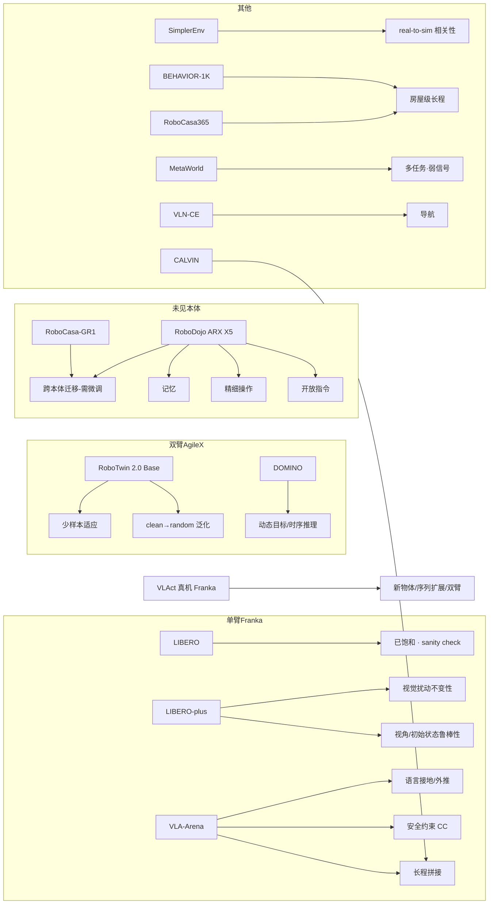

# 06 · StarVLA 支持的评测基准全景与 VLAct 评测协议

撰写日期：2026-09-04。来源标注约定：
- 【P】VLAct 论文 arXiv 2608.27550（`awesome_starvla/papers/en/2608.27550_VLAct.pdf`），页码为 PDF 页码，Tab./Fig. 为论文编号。
- 【R】StarVLA 代码库 `starVLA_code/` 下的相对路径（README、脚本、yaml）。
- 【W】官方论文 / 官网 / 榜单，给出 URL。
- 无出处的数字不写；"—"表示该项在可查来源中没有给出。

## 0. 范围

StarVLA 在 `examples/simBenchmarks/` 下接入 13 个仿真基准（LIBERO、LIBERO-plus、RoboTwin 2.0、DOMINO、VLA-Arena、RoboDojo、RoboCasa-GR1 tabletop、RoboCasa365、SimplerEnv、BEHAVIOR-1K、CALVIN、MetaWorld MT50、VLN-CE），在 `examples/realRobots/` 下提供 5 套真机/真机数据流程（Franka、RoboChallenge table30v2、EgoVLA、Realman RM-75、Unitree G1 WholeBody）。主 README 的 "Broad Benchmark Integration" 勾选了 SimplerEnv、LIBERO、LIBERO-plus、Robocasa-GR1、Robocasa365、RoboTwin 2.0、DOMINO、BEHAVIOR、Calvin、RoboDojo 十项，SO101 与 RLBench 未勾选【R: README.md L135-146】。

VLAct 论文在 LIBERO-Plus、VLA-Arena、RoboTwin 2.0、DOMINO、RoboCasa-GR1、RoboDojo 六个仿真基准和 Franka Research 3 真机上报告结果【P §4 p.8-11, App. B p.20-21】。SimplerEnv、BEHAVIOR、CALVIN、MetaWorld、VLN-CE、RoboCasa365 没有 VLAct 数字。

## 1. 总览表

| 基准 | 本体 / 仿真器 | 任务数 | 评测集大小（StarVLA 默认 → 官方） | 指标 | 扰动 / 泛化维度 | 训练数据规模 | StarVLA | VLAct | 官方链接 |
|---|---|---|---|---|---|---|---|---|---|
| LIBERO | Franka Panda / robosuite-MuJoCo【W】 | 130（4 suites；评测常用 Spatial/Object/Goal/10 各 10 任务）【W】 | 10 任务 × 50 episodes / suite【R: LIBERO/README】 | success rate | 空间 / 物体 / 目标 / 长程 四类分布偏移【W】 | 50 demos/任务【W】 | 支持（训练+评测） | 未报告（仅作 LIBERO-Plus 的训练集） | github.com/Lifelong-Robot-Learning/LIBERO |
| LIBERO-plus | 同 LIBERO | 10,030 个测试任务实例，仅测试【W】 | 每实例 1 次 rollout（`num_trials_per_task=1`）【R: LIBERO-plus/eval_files/eval_libero.sh】 | success rate（7 维 + Total） | Camera / Robot / Language / Light / Background / Noise / Layout【W】 | 训练只用标准 LIBERO；官方另有 20K+ 增广轨迹【W】 | 支持（零样本评测） | 82.6【P Tab.1 p.8】 | github.com/sylvestf/LIBERO-plus |
| RoboTwin 2.0 | Aloha-AgileX 双臂（另支持 5 本体）/ SAPIEN【W】 | 50 双臂任务【W】 | 100 episodes/任务 × clean 与 randomized 两套【W】 | success rate（Easy/Hard；榜单按 (c2c+c2r)/2）【W】 | clutter / lighting / background / tabletop height / language 五轴域随机化【W】 | Base 50 clean/任务（2,500）；Data Scaling 再加 500 randomized/任务（25,000）【P Tab.2 p.9】 | 支持 | Base 80.5/41.5；Data Scaling 92.5/90.8【P Tab.2】 | robotwin-platform.github.io |
| DOMINO | 5 本体（franka-panda, ur5-wsg, aloha-agilex, ARX-X5, piper）/ SAPIEN，基于 RoboTwin 2.0【W】 | 35 动态任务【W】 | 100 episodes/任务【W】 | SR + Manipulation Score（MS）【W】 | 运动 Level 1/2/3、动力学系数 α、clean/randomized【W】 | 117K 轨迹【W】 | 支持 | 18.50 SR / 34.20 MS【P Tab.5 p.21】 | github.com/H-EmbodVis/DOMINO |
| VLA-Arena | Franka / robosuite-MuJoCo【W】 | 170 任务，11 suites，4 域【W】 | StarVLA 每 level 5 任务 × 10 episodes【R: VLA-Arena/README】；官方 30 episodes（10 × 3 seeds）【W】 | SR + Cumulative Cost（Safety 域）【W】 | L0→L1→L2 结构难度；W0-W4 语言扰动；V0-V4 视觉扰动【W】 | 只在 L0 微调；VLA-Arena-L0 S/M/L = 10/30/50 轨迹/任务【W】 | 支持 | 54.8【P Tab.4 p.21】 | vla-arena.github.io |
| RoboDojo | ARX X5 双臂 / Isaac Sim（真机另有 ARX X5, Piper, Piper X）【W】 | 42 仿真任务（Gen 12 / Memory 6 / Long-H 8 / Precision 8 / Open 8）+ 18 真机【W】 | 50 episodes/任务 → 2,100；官方榜单要求 3 seeds【W】 | score（部分进度）/ success rate【W】 | Gen 拆 25 standard + 25 random；Memory / Precision / Long-Horizon / Open 各成维度【W】 | 3,500 轨迹 / 35 任务（Open 不给训练数据）【W】 | 支持（经 XPolicyLab） | 10.66 分 / 7.60% SR，35 个策略中 SR 第 6【P Tab.3 p.11】 | robodojo-benchmark.com |
| RoboCasa-GR1 tabletop | Fourier GR-1 人形（ArmsAndWaist + Fourier hands）/ robocasa 分支【W】 | 24 任务【W】 | 50 rollouts/任务【R: Robocasa_tabletop/README】 | success rate | 6 个 PnP-to-容器-关闭 + 18 个 "PnP Novel From X To Y" 新物体任务【R】 | 1000 demos/任务（GR00T Teleop Sim）【W】 | 支持 | 54.0（20% 数据 49.5）【P Fig.5(d) p.12】 | github.com/robocasa/robocasa-gr1-tabletop-tasks |
| RoboCasa365 | Franka Panda + Omron 移动底盘 / robocasa（MuJoCo）【W】 | 365（65 atomic + 300 composite）【W】 | 官方 50 rollouts/任务；StarVLA 示例默认 5【R: Robocasa_365/README】 | success rate | Atomic-Seen / Composite-Seen / Composite-Unseen 三 split【W】 | 300 任务 × 100 人类示教 = 30K【W】 | 支持（仅 walk-through） | 未报告 | robocasa.ai |
| SimplerEnv | WidowX（BridgeV2）与 Google Robot / SAPIEN-ManiSkill【W】 | WidowX 4 任务 + Google Robot 若干【W】 | WidowX 常用 24 trials/任务【W】 | success rate | Visual Matching vs Variant Aggregation【W】 | Bridge + Fractal（OXE）【R: docs/model_zoo.md】 | 支持 | 未报告 | github.com/simpler-env/SimplerEnv |
| BEHAVIOR-1K | Galaxea R1 Pro 轮式人形 / OmniGibson（Isaac Sim）【W】 | 2025 Challenge 50 项全流程家务任务【W】 | 官方 10 episodes/任务【W】 | Q-score（BDDL 目标谓词部分完成）+ 效率指标【W】 | 长程、导航+双臂、房屋级场景【W】 | 10,000 示教 / 1,200+ h【W】 | 支持（README 标 "Under construction"） | 未报告 | behavior.stanford.edu |
| CALVIN | Franka Panda / PyBullet【W】 | 34 子任务，4 环境 A-D【W】 | LH-MTLC 1000 条 5 步指令链【W】 | 每步 SR + Avg. Len（0-5）【W】 | ABCD→D / ABC→D / D→D 环境泛化【W】 | ~24 h 无结构 play 数据【W】 | 支持（D→D） | 未报告 | calvin.cs.uni-freiburg.de |
| MetaWorld MT50 | Sawyer 单臂 / MuJoCo（Meta-World）【W】 | 50 任务，4 难度桶（28/11/6/5）【R: MetaWorld/README】 | 10 episodes/任务，max 400 步【R】 | success rate（桶均值再平均）【R】 | 无显式扰动维度 | MT50 LeRobot 数据集【R】 | 支持 | 未报告 | github.com/Farama-Foundation/Metaworld |
| VLN-CE | Habitat 连续环境（导航）【W】 | R2R-CE / RxR-CE【W】 | val-unseen split【W】 | NE / OS / SR / SPL / nDTW【W】 | 未见场景【W】 | NaVILA-Dataset R2R/RxR【R: VLN-CE/README】 | 支持（VLM-only 服务） | 未报告 | github.com/LiuRicky/StarVLA-VLN-CE-Evaluation |
| 真机 Franka | Franka（Research 3 / Panda），7D 或 14D 动作【R: realRobots/Franka/README】 | 用户自定 | VLAct：10 rollouts/任务【P App. J.2 p.32】 | success rate；长程按步计分【P J.3 p.33】 | ID / OOD 物体替换、序列扩展【P §4.3 p.10】 | VLAct：单臂 50、双臂 100 demos/任务【P J.2】 | 支持（部署示例） | 单臂 ID 92.5%、双臂 72.0%【P §4.3】 | — |

## 2. 逐基准小节

### 2.1 LIBERO

- 定位：单臂 Franka 桌面操作的"标准答案"基准，最初为终身学习设计，现在是 VLA 微调的默认试金石【W: papers.neurips.cc LIBERO 2023】。
- 任务构成：130 个语言条件任务，四个 suite：LIBERO-Spatial / Object / Goal 各 10 任务，LIBERO-100 拆成 LIBERO-90（预训练）和 LIBERO-10（长程评测）；每任务 50 条人类遥操作示教【W: github.com/Lifelong-Robot-Learning/LIBERO】。
- 评测协议（StarVLA）：一个策略同时训 4 个 suite，每个 suite 10 任务 × 50 episodes = 500 trials【R: examples/simBenchmarks/LIBERO/README.md】；`NUM_TRIALS_PER_TASK` 默认 50【R: LIBERO/eval_files/eval_libero.sh】；每 suite 最大步数 spatial 220 / object 280 / goal 300 / libero_10 520，图像 224×224【R: LIBERO/eval_files/eval_libero.py L79-87；LIBERO-plus 版同值】。成功判定用 LIBERO 自带的 `done` 信号；初始状态取 `task_suite.get_task_init_states`。
- 代表性数字【R: LIBERO/README 表】：StarVLA-OFT(Qwen3-VL) Spatial 97.8 / Object 98.6 / Goal 96.2 / Long 93.8 / Avg 96.6，30K steps、9.54 epochs；StarVLA-π(Qwen3-VL) 95.7；OpenVLA-OFT 97.1（175K steps、223 epochs）；π0 94.1；π0-FAST 85.5；GR00T-N1.5 86.5。
- 入口：服务端 `LIBERO/eval_files/run_policy_server.sh`；仿真端 `LIBERO/eval_files/eval_libero.sh`（需 `LIBERO_HOME`）；训练 `LIBERO/train_files/run_libero_train.sh`（80K steps、16/GPU）与 `starvla_cotrain_libero.yaml`（`action_dim 7`、`action_horizon 8`、`max_train_steps 100000`）；数据 `data_preparation.sh` 拉取 IPEC-COMMUNITY 的 `*_no_noops_1.0.0_lerobot` 四个子集。已发布的 `Qwen3-VL-PI-LIBERO-4in1` 需 `USE_CANONICAL_FORWARD=false` 兼容 PR #373 之前的 LayerwiseFM 语义【R: LIBERO/README】。
- 已知问题：VLAct 论文直接称其为 "saturated standard LIBERO setting"【P §4.1 p.8】；LIBERO-plus 论文发现模型对语言扰动几乎不敏感，"tend to ignore language instructions completely"【W: arxiv.org/abs/2510.13626 Abstract】；README 表中 StarVLA 30K steps 与 OpenVLA-OFT 175K steps 并排比较，训练预算不对齐。

### 2.2 LIBERO-plus

- 定位：LIBERO 的鲁棒性放大版，回答"高 LIBERO 分数是否等于真能力"。
- 任务构成：从 LIBERO 40 个评测任务出发，7 个扰动维度各生成 500 实例 → 14,000 候选，剔除所有模型都能解的实例后得到 10,030 个测试任务；维度分布 Camera 1599 / Robot 1550 / Language 1537 / Light 1142 / Background 1076 / Noise 1601 / Layout 1525，21 个子维度，并按 4 个代表模型的表现分成 L1-L5 难度【W: arxiv.org/html/2510.13626 App. C】。
- 评测协议：只在标准 LIBERO 上训练，零样本迁移【R: LIBERO-plus/README；P Tab.1 caption p.8】。StarVLA 脚本对四个 suite 各起一个进程，`num_trials_per_task=1`（每个任务实例即一次 rollout），共用 9883 端口【R: LIBERO-plus/eval_files/eval_libero.sh】；README 提醒 10,030 任务全跑"extremely long"，提供 `parallel_eval/` 集群脚本【R: LIBERO-plus/README】。
- 代表性数字：StarVLA Qwen3-VL-PI Total 77.0（Camera 64.3 / Robot 57.2）、Qwen3-VL-OFT 75.0、Qwen2.5-VL-OFT 67.2、Qwen2.5-VL-GR00T 66.4、Qwen2.5-VL-FAST 48.9；对照 OpenVLA-OFT 69.6、π0 53.6、π0-FAST 61.6、ABot-M0 80.5【R: LIBERO-plus/README 表】。VLAct（OFT 头）Total 82.6，Camera 73.9 / Robot 68.4 / Lang 81.5 / Light 96.7 / Bg 96.7 / Noise 86.0 / Layout 83.3，比同骨干 Qwen3VL-OFT 高 7.6，比 ABot-M0 高 2.1【P Tab.1 p.8】。VLAct 加 20K RealOmin UMI 轨迹预训练后 83.7【P Tab.11 p.28】。
- 入口：`LIBERO-plus/eval_files/run_policy_server.sh` + `eval_libero.sh`（`MUJOCO_GL=osmesa`），`aggregate_results.py` 汇总。训练无独立 `train_files`，直接复用 LIBERO 的 checkpoint【R: LIBERO-plus/README】。
- 已知问题：Camera 与 Robot 初始状态是所有模型最弱的两维（OpenVLA-OFT 从 97.1 掉到 59.7 / 37.2）【W: 2510.13626 Tab.1】；Language 维度分数高并不代表语言理解好，而是模型忽略语言；VLAct 在 Language 维（81.5）反而低于 Qwen3VL-OFT（87.0）【P Tab.1】。

### 2.3 RoboTwin 2.0

- 定位：双臂 AgileX 操作 + 强域随机化的大规模仿真基准与数据生成器；VLAct 以它作为双臂主基准【P §4.2 p.9】。
- 任务构成：50 个双臂协作任务，5 种本体，100K+ 预采轨迹，RoboTwin-OD 资产库 731 物体 / 147 类；域随机化五轴：clutter、lighting、background、tabletop height、language【W: robotwin-platform.github.io；arxiv.org/abs/2506.18088】。动作 14 维关节【W: huggingface.co/docs/lerobot/main/en/robotwin】。
- 评测协议：官方榜单固定训练数据为 50 demo_clean × 50 任务（2,500 条，Aloha-AgileX），每任务 100 trials，分别在 demo_clean（Easy/c2c）与 demo_randomized（Hard/c2r）下评测，默认按 (c2c+c2r)/2 排名，上榜要求公开代码 + 权重 + 技术报告【W: robotwin-platform.github.io/leaderboard】。StarVLA 侧 `deploy_policy.yml` 设 `instruction_type: unseen`、`action_mode: abs`、`normalization_mode: min_max`【R: Robotwin/eval_files/deploy_policy.yml】；需给第三方 RoboTwin 的 `script/eval_policy.py` 打 `--policy_ckpt_path` 补丁【R: Robotwin/README】。
- 代表性数字（Base，50 clean/任务）：StarVLA-OFT Easy 50.38（表中 open_microwave、put_bottles_dustbin 两项为 "--"，实为 48 任务均值）；论文基线 RDT 34.50/13.72、Pi0 46.42/16.34、DP3 55.24/4.96【R: Robotwin/README 第二张表】。VLAct Base：OFT 80.5 clean / 41.5 random，GR00T 76.0/22.9，PI 77.0/23.7，同库 Qwen3VL-OFT 61.7/10.5；π0 46.4/16.4，X-VLA 70.0/39.0【P Tab.2 p.9】。
- 代表性数字（Data Scaling，50 clean + 500 randomized/任务）：StarVLA-OFT 88.18/88.32（`Qwen3-VL-OFT-RoboTwin2-All`）；Motus 88.66/87.02、lingbot-vla w/ depth 88.56/86.68、π0.5 82.74/76.76、X-VLA 72.80/72.84【R: Robotwin/README 第一张表】。VLAct-OFT 92.5/90.8，VLAct-PI 93.0/88.8；HoloBrain-0-QW 91.9/92.3，Fast-WAM 91.9/91.8，Being-H0.7 90.2/89.6，InternVLA-A1 89.4/89.6，Lingbot-VLA 88.6/86.7【P Tab.2】。
- 入口：`Robotwin/eval_files/start_eval.sh -m demo_clean|demo_randomized -n <name> -c <ckpt> all`，自动多 GPU 调度、流式打印 `[RESULT]`；底层 `eval.sh` 与 `run_policy_server.sh`；训练 `run_robotwin_train.sh`（Qwen3-VL-4B、`robotwin_all_50`、150K steps、4/GPU）与 `starvla_cotrain_robotwin_abs.yaml`（`action_dim 14`、`action_horizon 50`）【R】。
- 已知问题：(1) Base 基线不一致——StarVLA README 的 OFT Easy 50.38 与 VLAct 论文同名基线 61.7 相差 11 点，说明 checkpoint/步数不同；(2) Data Scaling 的 500 条 randomized 示教就是按 demo_randomized 分布采的，"Random" 评测不再是分布外，StarVLA-OFT Easy/Hard 差距只有 0.14【R: Robotwin/README】；(3) 论文明确写 "Training compute, optimization schedules, and checkpoint-selection procedures may nevertheless differ across methods"【P §4.2 p.9】；(4) VLAct 预训练用了 InternData-A1 与 RoboCoin 的 AgileX 数据【P App. H p.28】，评测本体不是未见本体。

### 2.4 DOMINO

- 定位：动态操作基准——目标在动、场景随时间变，专门考察单帧 VLA 缺失的时空推理【W: arxiv.org/abs/2603.15620】。
- 任务构成：35 个动态任务，两类（dynamic interception / dynamic tracking），5 种本体，117K 专家轨迹，clean 与 randomized 两套；运动复杂度 Level 1（匀速）/ Level 2（多项式曲线）/ Level 3（分段随机突变）；动力学系数 α 表示目标最大速度（m/s），α=0 即静态，记作 DOMINO@α【W: 2603.15620 §2.3】。基于 RoboTwin 2.0 + SAPIEN，静态对照任务直接取 RoboTwin 2.0 同名任务【W: 2603.15620 App. A.1】。
- 评测协议：每任务 100 episodes；目标移出相机视野即判失败；抓取后目标停止自主运动；lift 类任务要求高度超阈值【W: 2603.15620 附录 Evaluation Details】。指标 SR 与 MS = Route Completion × 惩罚系数（目标出界/出视野 ×0.5，碰撞杂物 ×0.8），成功 episode RC=100【W；R: DOMINO/README "Metrics"】。
- 代表性数字（35 任务单策略，clean dynamic，α=0.1）：StarVLA-OFT 10.86 SR / 30.49 MS，StarVLA-GR00T 6.10/28.60，StarVLA-FAST 5.74/20.66，StarVLA-Adapter 4.40/24.31；PUMA 17.20/34.97，π0.5 9.63/26.17，OpenVLA-OFT 9.06/24.06，π0 8.17/23.96【R: DOMINO/README 表】。VLAct-OFT 18.50 SR / 34.20 MS，比 Qwen3VL-OFT 高 7.64 SR / 3.71 MS【P Tab.5 p.21】。
- 入口：`DOMINO/eval_files/start_eval.sh -m demo_clean_dynamic|demo_random_dynamic -n <run> -c <ckpt> all`；`deploy_policy.yml` 中 `history_k`（默认 0）、`history_mode: flow|frames|none` 控制历史帧输入，`history_flow_utils.py` 算光流【R】；训练 `run_domino_train.sh`（`data_mix` 可选 domino_clean / domino_random / domino / domino_cotrain，150K steps）【R: DOMINO/README】。
- 已知问题：所有 VLA 的 SR 都在 20% 以下；StarVLA 桥接虽暴露历史接口但默认关闭，报告的 StarVLA/VLAct 数字都是单帧策略；PUMA 的优势来自历史光流 + world queries【W】，与骨干无关，属于架构变量。

### 2.5 VLA-Arena

- 定位：PKU-Alignment 的能力边界基准，用 L0→L2 分级 + 安全代价把"过拟合 L0"暴露出来【W: arxiv.org/abs/2512.22539】。
- 任务构成：170 任务、11 suites、4 域：Safety 5 suites（static_obstacles、cautious_grasp、hazard_avoidance、state_preservation、dynamic_obstacles）、Distractor 2 suites 30 任务、Extrapolation 3 suites 45 任务、Long Horizon 1 suite 20 任务【W: github.com/PKU-Alignment/VLA-Arena；R: VLA-Arena/eval_files/eval_vla_arena.sh TASK_SUITES】。每 suite 三个难度 L0/L1/L2；正交的 W0-W4 语言扰动与 V0-V4 视觉扰动；任务用 CBDDL 定义【W】。
- 评测协议：只在 L0 微调，评 L1/L2 泛化；官方数据集 VLA-Arena-L0 S/M/L = 10/30/50 轨迹/任务，官方结果为 30 episodes（10 × 3 seeds）【W: 2512.22539 §Evaluation】。StarVLA 每 level 5 任务 × 10 episodes = 50 trials【R: VLA-Arena/README】；脚本默认 `NUM_TRIALS=10`、`SEED=7`、`init_state_offset_random=true`，视觉扰动与 `apply_safety_constraint` 默认关闭【R: eval_vla_arena.sh L28-47】。Safety 域同时输出 SR 与 Cumulative Cost（CC）。
- 代表性数字：StarVLA 的 6 个模型按 suite × level 列在 `eval_results.png`，例如 Qwen3-VL-OFT StaticObstacles SR L0 0.84 / L1 0.14 / L2 0.08，LongHorizon L0 0.98 / L1 0.03 / L2 0.0；Qwen2.5-VL-GR00T CautiousGrasp L1 的 CC 高达 116.1【R: VLA-Arena/eval_results.png】。VLAct（L0/L1/L2 平均、按 11 suite 官方加权）Safety 63.2 / Distractor 64.0 / Extrap. 36.9 / Long-H 50.0 / Avg 54.8；同骨干 Qwen3-VL-OFT 33.4、Qwen3-VL-π 34.1；π0.5 44.3、π0 42.3、OpenVLA-OFT 39.9、UniVLA 38.7、GR00T-N1.6 27.8、SmolVLA 16.3【P Tab.4 p.21】。
- 入口：`VLA-Arena/eval_files/run_parallel_eval.sh -c <ckpt> --vla-arena-env <uv env>`（11 suite 自动分 GPU）；单 suite 用 `uv run --project ... eval_vla_arena.sh --suites ... --levels "0 1 2"`；训练 `run_vla_arena_train.sh`（默认 Qwen2.5-VL-3B、`vla_arena_L0_L`、80K steps）；`data_preparation.sh` 拉 `VLA-Arena/VLA_Arena_L0_L_lerobot_openpi`【R】。
- 已知问题：L1/L2 普遍崩塌（论文称 "memorization over generalization"）【W】；VLAct 的 54.8 是 L0/L1/L2 三级平均，L0 分数拉高总分；StarVLA 默认 10 episodes/任务、单 seed，与官方 30 episodes 不一致；README 的结果只有图片，无可解析表格。

### 2.6 RoboDojo

- 定位：sim + real 统一基准，官方云端评测、隐藏布局验证，是目前唯一有"第三方跑分"性质的 VLA 榜单【W: arxiv.org/abs/2607.04434】。
- 任务构成：42 个 ARX X5 双臂仿真任务（两臂基座相距 0.6 m，Isaac Sim / Isaac Lab，基于 MagicSim），分 Generalization 12 / Memory 6 / Long-Horizon 8 / Precision 8 / Open 8；18 个真机任务覆盖 ARX X5、Piper、Piper X【W: 2607.04434 §3, §4】。训练集 3,500 条 / 35 任务（1,859,602 帧，25 Hz，20.66 h），Open 维度无训练数据，另有 100 条域随机化 DLC 轨迹【W: 2607.04434 Tab.10】。
- 评测协议：每任务 50 episodes → 2,100；Generalization 拆 25 standard + 25 random；总分是 5 个维度的均值而非 42 任务均值；报 score（部分进度）和 success rate；官方 verified 榜单要求 3 个随机种子、通过隐藏布局验证、通过 XPolicyLab 公开 checkpoint 与训练/部署代码【W: 2607.04434 §5, App.】。真机 18 任务 × 10 trials，三名评审双盲打分【W】。
- 代表性数字：StarVLA 发布的三个 Qwen3-VL-4B recipe（SR / score）：QwenPI_v3 6.19 / 9.60（Gen 4.17/7.28、Precision 14.00/19.06、Long-H 10.00/17.84、Memory 2.00/2.32、Open 0.75/0.88），QwenOFT 4.86/8.01，QwenGR00T 3.81/7.35【R: RoboDojo/README】。官方榜单 2026-08-24 快照（score / SR）：DM0.5 24.90/19.34，GalaxeaVLA G0.5 20.23/14.88，Xiaomi-Robotics-1 20.07/13.93，Hy-Embodied-0.5-VLA 13.07/8.80，Spatial Forcing 12.38/8.04，π0.5 11.41/6.91，InternVLA-A1.5 11.15/7.14，VLAct 10.66/7.60（score 第 8、SR 第 6，共 35 策略），X-VLA 10.13/6.52，X-WAM 7.69/3.83，StarVLA-α 6.40/3.24，LingBot-VLA 5.50/2.96，ABot-M0 3.67/1.73【P Tab.3 p.11】。VLAct 各维（score/SR）：Gen-Std 16.33/12.00、Gen-Rand 2.74/1.00、Precision 20.62/15.25、Long-H 20.12/13.67、Memory 0.66/0.56、Open 2.37/2.25【P Tab.3】。
- 入口：`RoboDojo/eval_files/start_eval.sh <oft|groot|pi_v3> <task> <seed> <policy_gpu> <sim_gpu> <starvla_env> <robodojo_env> [episodes|native]`，全部委托给 `$ROBODOJO_PATH/XPolicyLab/policy/starVLA/scripts/eval_hf_robodojo.sh`（分支 `fix/starvla-hf-robodojo-eval`）【R: RoboDojo/eval_files/start_eval.sh】；训练 `run_robodojo_train.sh` + 三个 yaml（h50、q99；OFT 100K / GR00T 130K / PI 100K steps 发布）；观测 head + 双腕 224×224，14D 绝对关节，预测 50 步执行 16 步【R: RoboDojo/README】。
- 已知问题：Memory 维极低——VLAct 0.66 分 / 0.56%，StarVLA 三个 recipe 1.67-3.33%，榜首 DM0.5 为 47.74/47.44，其余多数低于 15%【P Tab.3；W: 2607.04434 Finding 5】；Open 维几乎全零；官方明确"leaderboard does not normalize for training compute"【P p.11】；StarVLA README 指出高分对手都从机器人策略 checkpoint 初始化、部分加历史帧（Hy-Embodied 6 帧 × 20 步间隔）或 VGGT 对齐（Spatial Forcing），这些变量未被隔离【R: RoboDojo/README "Observed gaps"】。

### 2.7 RoboCasa-GR1 Tabletop

- 定位：NVIDIA 为 GR00T N1 系列发布的人形（Fourier GR-1）桌面操作基准，是 VLAct 的"未见本体迁移"主实验【P §4.4 p.10】。
- 任务构成：24 个任务，全部为 pick-and-place：6 个 "PnP X To 容器 Close"（Bottle→Cabinet、Can→Drawer、Cup→Drawer、Milk→Microwave、Potato→Microwave、Wine→Cabinet）+ 18 个 "PnP Novel From {Cuttingboard, Placemat, Plate, Tray} To {Basket, Bowl, Pan, Pot, Plate, ...}" 新物体任务；本体 `GR1ArmsAndWaistFourierHands`；GR00T Teleop Sim 数据集每任务 1000 条示教【W: github.com/robocasa/robocasa-gr1-tabletop-tasks；R: Robocasa_tabletop/README 表】。
- 评测协议：单模型训 24 任务，每任务 50 rollouts；StarVLA 脚本 `max_episode_steps 720`、`n_action_steps 12`、`n_envs 1`；OFT checkpoint 需 `--args.no_send_state`（否则 state 被离散化拼进 prompt，见 issue #355），GR00T checkpoint 保留 state【R: Robocasa_tabletop/README】。
- 代表性数字：StarVLA-OFT-Qwen3 Avg 48.8，StarVLA-GR00T-Qwen3 47.8，StarVLA-π-Qwen3 43.9，StarVLA-FAST-Qwen3 39.0；GR00T-N1.6 47.6【R: Robocasa_tabletop/README 表】。VLAct-OFT 全量数据 54.0，10% 数据 41.42，20% 数据 49.5，50% 数据 51.0；对照 Qwen3VL-OFT 48.8、GR00T-N1.6 47.6、π0.5 37.0【P Fig.5(d) p.12；§4.4 p.10】。GR-1 在 VLAct 预训练中未出现【P §4.4】。
- 入口：服务端 `deployment/model_server/server_policy.py --ckpt_path ... --port 5678 --use_bf16`；仿真端 `Robocasa_tabletop/eval_files/simulation_env.py`；批量 `batch_eval_args.sh`；训练 `run_robocasa.sh`（`fourier_gr1_unified_1000`、100K steps、8/GPU、lr 3e-5），发布 checkpoint 为 `steps_90000`【R】。
- 已知问题：并行环境数会显著改变 SR（Isaac-GR00T issue #260 报告 n_envs=5 时 0.52、n_envs=50 时 0.00）【W: github.com/NVIDIA/Isaac-GR00T/issues/260】；24 任务全是 PnP，能力覆盖窄；"数据比例曲线"只有 VLAct 一条，基线没有同样的 10%/20%/50% 点。

### 2.8 RoboCasa365

- 定位：RoboCasa 的 365 任务扩展版（ICLR 2026），面向移动操作与终身学习【W: robocasa.ai；arxiv.org/abs/2603.04356】。
- 任务构成：365 任务 = 65 atomic + 300 composite，220 个需要移动操作；2,500 个厨房场景；本体 Franka Panda + Omron 移动底盘；预训练数据 300 任务 × 100 人类示教 = 30K，另有 1,600+ h 合成数据【W】。
- 评测协议：官方在 50 个 target 任务（Atomic-Seen / Composite-Seen / Composite-Unseen）上每任务 50 rollouts，atomic `max_episode_steps=500`、composite 1000+【W: robocasa.ai/docs benchmarking；R: Robocasa_365/README §5】。
- StarVLA 现状：只有一个 100-step walk-through——下载 OpenDrawer（target/human）单任务 LeRobot v2.1 数据，Qwen3VL-OFT 训 100 步，2 个 episode 成功 0/2【R: Robocasa_365/README §3-5】。状态 16 维（base_position 3 + base_rotation 4 + eef_pos_rel 3 + eef_rot_rel 4 + gripper 2），动作 12 维（eef_pos 3 + eef_rot 3 + gripper 1 + base_motion 4 + control_mode 1），单相机 `robot0_agentview_left` 256→224【R】。
- 入口：`Robocasa_365/eval_files/run_eval.sh server|client`（默认 5 rollouts，需 `N_EPISODES=50` 对齐榜单）；训练 `run_robocasa365.sh` + `starvla_qwenoft_robocasa365.yaml`（`action_dim 12`、`action_horizon 16`）；数据注册 `train_files/data_registry/data_config.py`【R】。
- 已知问题：README 写 "atomic ~24 / composite ~341"，与官方 65/300 不一致【R vs W】；无任何有效基线数字；VLAct 未评。

### 2.9 SimplerEnv

- 定位：real-to-sim 评测——用仿真复刻 Google Robot 与 WidowX BridgeV2 的真机场景，验证与真机排名相关【W: arxiv.org/abs/2405.05941】。
- 任务构成：WidowX 4 任务（spoon on towel、carrot on plate、stack green on yellow cube、eggplant in basket）+ Google Robot 的 pick coke can / move near / open-close drawer / place in drawer 等；两种协议 Visual Matching（贴真图背景）与 Variant Aggregation（随机化场景取均值），论文推荐 Visual Matching【W: github.com/simpler-env/SimplerEnv】。WidowX 通常 24 trials/任务【W: arxiv.org/html/2507.05116v5】。
- 评测协议（StarVLA）：`start_simpler_env.sh <ckpt>` 自动跑 WidowX 全部任务；服务端 `run_policy_server.sh`；`model2simpler_interface.py` 含 `adaptive_ensemble.py` 动作集成【R: SimplerEnv/README、eval_files】。
- 代表性数字（WidowX 均值）：Qwen3VL-PI_v3-Bridge-RT-1 69.8，Qwen3VL-GR00T-Bridge-RT-1 65.3，Qwen3VL-OFT-Bridge-RT-1 42.7；Qwen2.5 系列 GR00T 63.6 / PI 62.5 / FAST 58.6 / OFT 41.8；仅用 Bridge 训练的 QWen-GR00T-Bridge 71.4【R: docs/model_zoo.md】。
- 训练：Bridge（`bridge_orig_lerobot`）+ Fractal（`fractal20220817_data_lerobot`），`data_mix: bridge_rt_1`，配置 `starvla_cotrain_oxe.yaml`【R: SimplerEnv/README】。
- 已知问题：4 个任务 × 24 trials 方差大；A100 上 Vulkan 缺失报错【R: SimplerEnv/README】；VLAct 未评（其预训练数据 DROID/MolmoAct 为 Franka，与 WidowX 无关）。

### 2.10 BEHAVIOR-1K（2025 Challenge 子集）

- 定位：房屋级长程家务任务，导航 + 双臂 + 高层规划，OmniGibson（Isaac Sim）【W: behavior.stanford.edu/challenge】。
- 任务构成：2025 Challenge 选 50 个全流程任务，本体 Galaxea R1 Pro 轮式人形，10,000 条遥操作示教（1,200+ h，每任务 200 条）；单条任务平均 6.6 分钟【W: behavior.stanford.edu；arxiv.org/abs/2512.06951】。动作 23 维（base 3 + torso 4 + 左臂 7 + 左夹爪 1 + 右臂 7 + 右夹爪 1）【R: Behavior/README】。
- 评测协议：主指标 Q-score = 满足的 BDDL 目标谓词比例（部分成功计分），每任务 10 episodes，另有仿真时间 / 导航距离 / 手部位移等效率指标【W】。
- 代表性数字：2025 榜单第一 Robot Learning Collective Q-score 0.2605（公开验证）/ 0.2599（隐藏测试），full success 0.112/0.124；NVIDIA Comet 0.1830/0.2514；"StarVLA" 条目排第 14，榜单对该行只显示两列数值 0.0000 / 0.0019（页面未标注这两列对应公开验证还是隐藏测试）【W: behavior.stanford.edu/challenge/leaderboard.html】。StarVLA README 无自报数字。
- 入口：`Behavior/start_parallel_eval.sh`（需 `star_vla_python`、`sim_python`、`TASKS_JSONL_PATH`、`BEHAVIOR_ASSET_PATH`）；调试用 `start_server.sh` + `start_client.sh`；`start_parallel_eval_per_task.sh` 逐任务分配实例防 OOM；观测 wrapper 用 RGBLowResWrapper（224×224 RGB）【R: Behavior/README】。
- 已知问题：README 首行 "Under construction"；不能在无 RT core 的 A100/H100 上跑（Segfault / 低分辩率，见 BEHAVIOR-1K issue #1872、#1875）【R】；评测极慢；StarVLA 在该榜单接近零分。

### 2.11 CALVIN

- 定位：语言条件长程操作的经典基准，考察连续 5 条指令的技能拼接【W: calvin.cs.uni-freiburg.de】。
- 任务构成：34 个子任务，4 个环境 A/B/C/D（同桌面几何、不同纹理与摆放），Franka Panda（PyBullet），~24 h 无结构 play 数据，20K 语言标注【W: arxiv.org/abs/2112.03227】。
- 评测协议：LH-MTLC——1000 条唯一的 5 步指令链，每步成功才进入下一步，每链前机器人复位；指标为第 1-5 步的累计成功率与 Avg. Len（0-5）【W】。StarVLA 评的是 D→D split（`task_D_D`），用 `eval_sequences.json` 固定链【R: calvin/README】。
- 代表性数字（D→D，Avg. Len）：qwengr00t(qwen2.5-vl-3B-instruct-action) 3.786（步 1-5：92.5 / 83.9 / 74.4 / 67.9 / 59.9%），qwengr00t(qwen3-vl-4B-instruct-action) 3.757，qwenpi(qwen2.5-vl-3B) 3.576；StarVLA 自训的 PI0.5* 3.885、PI0* 2.954【R: calvin/README 表】。
- 入口：`calvin/eval_files/run_policy_server.sh` + `eval_calvin.sh`（需改 `eval_calvin.py` 中 `dataset_path`、`calvin_config_path`、`eval_sequences_path`）；训练 `run_calvin_train.sh`，数据需先按 RoboTron-Mani 转 LeRobot，mixture 名 `calvin_task_D_D`【R: calvin/README】。发布 checkpoint `StarVLA-QwenGR00T_..._calvin_D_D` Avg. Len 3.786【R: docs/model_zoo.md】。
- 已知问题：训练用 LeRobot 格式、评测用原始 CALVIN 格式，两套数据【R】；只报 D→D，没有 ABC→D 的零样本环境泛化；由 UNT 团队贡献，"Other experimental results will be released soon"【R】；官方榜 ABCD→D 上 MoDE 已到 4.39、FLOWER 4.5 左右【W: calvin.cs.uni-freiburg.de】，接近饱和。

### 2.12 MetaWorld MT50

- 定位：Sawyer 单臂 50 任务的多任务基准（Meta-World，CoRL 2020），在 StarVLA 中主要作为 LA4VLA（Language-Action 预训练）的验证场【R: MetaWorld/README §4】。
- 任务构成：50 任务，按难度分 easy 28 / medium 11 / hard 6 / very_hard 5；动作 4 维（xyz + gripper），单相机 corner2，预处理 ROT180 + center_crop(2/3) + resize 224【R: MetaWorld/README §2】。
- 评测协议：每任务 10 episodes，max 400 步，seed 4042，共 500 episodes；Overall SR = 四个难度桶 SR 的均值（不是 50 任务均值）【R: MetaWorld/README §3-4】。
- 代表性数字（QwenPI_v3 on Qwen2.5-VL-3B，steps_60000）：`la_finetune`（LA4VLA 预训练骨干）easy 0.846 / medium 0.673 / hard 0.517 / very_hard 0.800 / Overall 0.709；`baseline_finetune` 0.857 / 0.600 / 0.467 / 0.440 / 0.591【R: MetaWorld/README 表】。
- 入口：`MetaWorld/eval_files/run_policy_server.sh`（`CKPT`、`PORT`、`GPU_ID`）与 `eval_metaworld.sh`（`EPISODES_PER_TASK`），或直接 `eval_metaworld.py --args.levels easy,medium,hard,very_hard`；训练配置 `starvla_qwenpiv3_metaworld_mt50.yaml`【R】。
- 已知问题：桶均值让 5 个 very_hard 任务权重等于 28 个 easy 任务，la_finetune 的总分优势主要来自 very_hard（0.800 vs 0.440）；10 episodes/任务分辨率为 10%；Sawyer 4D 动作与 VLA 常用的 7D/14D 空间差异大，迁移意义有限。

### 2.13 VLN-CE

- 定位：视觉语言导航（非操作），Habitat 连续环境；StarVLA 在这里只提供 VLM 文本动作服务与训练脚本【R: VLN-CE/README】。
- 任务构成：R2R-CE 与 RxR-CE，val-unseen split；指标 NE、OS、SR、SPL、nDTW【W: arxiv.org/abs/2412.04453 NaVILA §III-A】。
- 评测协议：`run_qwenvl_vlm_server.sh <ckpt>` 起 QwenVL 服务（默认端口 6694、`MAX_NEW_TOKENS=128`、`GPU_IDS=all` 每卡一服务），仿真侧由独立仓库 StarVLA-VLN-CE-Evaluation 负责【R: VLN-CE/README】。
- 训练：`train_starvln.py`，数据为 NaVILA-Dataset 的 R2R/RxR 转 QwenVL 对话 JSON（`annotation_processing.py`），注册在 `starVLA/dataloader/qwenvl_llavajson/qwen_data_config.py`【R】。示例模型 `Ricky06662/StarVLA-VLNCE-Qwen3VL-4B`。
- 已知问题：README 没有任何评测数字；与操作基准的 WebSocket `{image, lang} → normalized_actions` 协议不同，这里返回文本。

### 2.14 真机与真机数据流程（`examples/realRobots/`）

- Franka：单臂 7D `[x,y,z,roll,pitch,yaw,gripper]`（位姿增量 + 夹爪 ±1）或双臂 14D；服务端 `server_policy.py --port 5694 --use_bf16`；客户端 `WebsocketClientPolicy` 发 `{image: List[np.ndarray], lang}`，收 `normalized_actions [B,T,7]`；反归一化 `0.5*(a+1)*(max-min)+min`，夹爪维先按 0.5 阈值二值化；统计文件 `dataset_statistics.json` 的 key 为 `franka`（单臂）或 `new_embodiment`（双臂）；示例 `inference_single_example.py` / `inference_dual_example.py`【R: realRobots/Franka/README】。
- RoboChallenge table30v2：UR5，取 `leftjoint` 6+1 维状态、发 `leftpos` 8 维末端位姿动作，chunk (8,8)；三步流程 self-test → mock server → 正式提交（第三步标 TODO）【R: realRobots/RoboChallenge_table30v2/eval_files/README】。
- EgoVLA：VILA 骨干（SigLIP-384 + Qwen2-1.5B）双手 48 维动作，GR00T ZMQ 协议端口 5555【R: realRobots/EgoVLA/README】。
- Realman RM-75：VM4A 的 ACT / Diffusion Policy，8 维（7 关节增量 + 1 夹爪），数据不公开【R: realRobots/Realman/README】。
- Unitree G1 WholeBody：流程脚手架，推荐走 GR00T-WholeBodyControl / SONIC 路线，78D 潜动作（64 运动 token + 双手 7+7）或分组直接控制【R: realRobots/UnitreeG1_WholeBody/README】。

## 3. 评测协议的公平性

### 3.1 `examples/eval_protocol.md` 实际规定了什么

这份文件是**接口协议**，不是**统计协议**。它规定的内容只有三点【R: examples/eval_protocol.md】：
1. 架构：Sim/Real Controller（灰）↔ `PolicyClient.py` + WebSocket ↔ `PolicyServer` ↔ `Framework.predict_action`（橙），模型端与环境端解耦，各自独立 conda 环境。
2. 数据契约：客户端发 `{"image": List[np.ndarray], "lang": str}`（可加 `state`、episode id 等辅助 key），服务端返回 `normalized_actions`，客户端取 `[0]` 执行；图像必须以 `np.ndarray` 传输，PIL 在服务端还原。
3. `model2{bench}_client.py`（如 `model2libero_interface.py`、`model2robotwin_interface.py`）负责基准特定的对齐：动作集成（`adaptive_ensemble.py`）、delta→绝对关节转换、仿真器怪癖。

它**没有**规定：每任务 episode 数、seed、checkpoint 选择规则、训练步数、是否多 seed 汇报、如何报告方差。这些散落在各基准 README 与脚本默认值里，并且互不一致（见 3.4）。

### 3.2 VLAct 的"只换骨干"受控对比是怎么做的

- 论文声明：在所有 VLAct-vs-基线对比中，"the VLM backbone weights are the only thing that changes: the action head and its fresh initialization, the downstream data, the optimizer, and the fine-tuning budget are all identical"，7.6-21.4 点的提升归因于骨干【P §1 p.4】。具体做法是：持续预训练阶段用 OFT + PI + GR00T 三头共同监督、冻结视觉编码器与 LLM 下半层、混入 caption 数据、部分统一的 20 维跨本体动作布局；微调阶段丢弃预训练头与 caption 流，重新初始化任务头，全参数解冻【P §3.1 p.5, App. I.2 p.31】。
- 被隔离的成对比较（同 Qwen3-VL-4B、同 OFT 头、同数据、同预算）：LIBERO-Plus 82.6 vs 75.0【P Tab.1】；VLA-Arena 54.8 vs 33.4【P Tab.4】；RoboTwin Base 80.5/41.5 vs 61.7/10.5、Data Scaling 92.5/90.8 vs 88.2/88.3【P Tab.2】；DOMINO 18.50/34.20 vs 10.86/30.49【P Tab.5】；RoboCasa-GR1 54.0 vs 48.8【P Fig.5(d)】；真机 Qwen3VL-4B-OFT 无预训练基线【P §4.3】。这一组内部对比是可信的。
- 未被隔离的比较：与 ABot-M0、LingBot-VLA、π0.5、HoloBrain-0、Fast-WAM 等外部系统的比较，数字取自各自论文或"same-protocol re-evaluations"，论文自己写明 "Training compute, optimization schedules, and checkpoint-selection procedures may nevertheless differ across methods"【P Tab.2 caption & §4.2 p.9】；RoboDojo 榜单 "does not normalize for training compute"【P p.11】；LIBERO-Plus 基线数字直接来自 LIBERO-Plus 论文【P §4.1 p.8】。
- 预训练数据与评测本体的重叠：VLAct 预训练用 DROID + MolmoAct（Franka）、InternData-A1 + RoboCoin（AgileX）【P App. H p.28】。因此 LIBERO-Plus/VLA-Arena（Franka）与 RoboTwin/DOMINO（AgileX）都是"见过的本体"，只有 GR-1（RoboCasa）与 ARX X5（RoboDojo）是 held-out【P §4.4 p.10】。论文把两类实验分开陈述，但总览性口径（"consistently improves"）没有区分。

### 3.3 Base vs Data Scaling，clean vs random

- Base = 50 clean demos/任务（2,500 条），是 RoboTwin 官方榜单的唯一协议【W: robotwin-platform.github.io/leaderboard】。Data Scaling = 再加 500 条 demo_randomized 专家示教/任务（25,000 条）【P §4.2 p.9】。这 500 条示教就是在评测用的随机化分布（背景、杂物、桌高、光照）下采的，所以 Data Scaling 的 "Random" 列不再衡量分布外泛化：StarVLA-OFT 88.18 vs 88.32【R: Robotwin/README】，VLAct 92.5 vs 90.8【P Tab.2】，差距接近零。
- Base 设定下 clean→random 才是真正的分布偏移：VLAct 80.5→41.5（掉 39 点），Qwen3VL-OFT 61.7→10.5，π0 46.4→16.4，X-VLA 70.0→39.0【P Tab.2】。RoboDojo 的 Gen-Std→Gen-Rand 同理：VLAct 16.33→2.74，Hy-Embodied 21.98→1.57（相对掉 92.9%）【P Tab.3；W: 2607.04434 Finding 2】。
- 结论：比较两篇论文的 RoboTwin 数字前必须先对齐 Base/Data Scaling；VLAct 的 "92.5% 超过 LingBot-VLA/ABot-M0" 是 Data Scaling 口径，"80.5/41.5 最强" 是 Base 口径，两者不可互换。

### 3.4 训练预算、步数与 checkpoint 选择不统一（StarVLA 内部）

| 基准 | StarVLA 训练步数 / 批量 | 发布 checkpoint | 评测 episode 数 | seeds | 出处 |
|---|---|---|---|---|---|
| LIBERO | 30K steps（README 表）；脚本 80K，yaml 100K | Qwen3-VL-PI-LIBERO-4in1 `steps_100000` | 50/任务 | 1 | 【R: LIBERO/README、run_libero_train.sh、starvla_cotrain_libero.yaml】 |
| LIBERO-plus | 复用 LIBERO checkpoint | 同上 | 1/任务实例（10,030） | 1 | 【R: LIBERO-plus/eval_libero.sh】 |
| RoboTwin | 150K steps，4/GPU | Qwen3-VL-OFT-RoboTwin2 / -All | 100/任务 | `-s 0` 默认 | 【R: run_robotwin_train.sh、start_eval.sh】 |
| DOMINO | 150K steps，4/GPU | — | 100/任务 | 1 | 【R: run_domino_train.sh；W】 |
| VLA-Arena | 80K steps，16/GPU，Qwen2.5-VL-3B 默认 | — | 10/任务（官方 30） | seed 7 | 【R: run_vla_arena_train.sh、eval_vla_arena.sh】 |
| RoboDojo | OFT 100K / GR00T 130K / PI 100K，16/GPU | 三个 HF checkpoint | 50/任务 | 1（官方要求 3） | 【R: RoboDojo/README】 |
| RoboCasa-GR1 | 100K steps，8/GPU，lr 3e-5 | `steps_90000` | 50/任务 | 1 | 【R: run_robocasa.sh、README】 |
| MetaWorld | — | `steps_60000` | 10/任务 | 4042 | 【R: MetaWorld/README】 |
| VLAct 真机 | 50k steps，8×H800 | — | 10/任务 | 固定 10 个初始配置 | 【P §4.3 p.10、App. J.2 p.32】 |

三点观察：(1) 同一个 RoboDojo 表里三个头的发布步数不同（100K / 130K / 100K），checkpoint 显然是按验证表现挑的；(2) LIBERO README 把 30K steps 的 StarVLA 与 175K steps 的 OpenVLA-OFT 并排；(3) 除 VLAct 真机固定初始状态外，所有仿真结果都是单 seed、无方差，而 RoboDojo 官方与 VLA-Arena 官方都要求 3 seeds。

## 4. 真机评测

### 4.1 VLAct 的 Franka Research 3 设置【P §4.3 p.10；App. J p.32-34】

- 硬件：桌面固定 Franka Research 3 7-DoF（单臂任务 1 台，双臂任务 2 台）；外部 Intel RealSense D435 一台做第三人称视角，每臂一台腕部 D405；所有图像 resize 到 224×224【P J.1 p.32】。
- 数据：GELLO 遥操作采集，采集时随机化物体初始位置与机械臂初始构型；11 个任务套件；单臂任务 50 条示教/任务，双臂 100 条/任务【P J.2 p.32；Fig.10 p.32】。
- 训练：单臂任务一个模型、双臂任务一个模型，各 50k steps、8×H800；VLAct 与 Qwen3VL-4B-OFT 基线用完全相同的示教、动作头、优化器与预算【P §4.3 p.10；J.2】。
- 评测：每任务 10 次 rollout，两个模型共用同一组 10 个固定的机器人/物体初始配置；单臂短程与双臂任务按 0/1 计成功；单臂长程按完成步数计分，例如 table cleaning 三个独立步骤各 0.33【P J.2-J.3 p.32-33】。
- 任务与结果（VLAct vs 基线）【P §4.3 p.10、J.3 p.33、Fig.5 p.12】：
  - 单臂短程 ID：carrot-from-pot 100 vs 100、button pressing 100 vs 90、cube stacking 90 vs 60、pen-in-cup 80 vs 60，平均 92.5% vs 77.5%。
  - 短程 OOD：novel object from pot（egg/pepper/garlic）90.0 vs 73.3；novel object in cup（cube/egg）90.0 vs 65.0。
  - 单臂长程：table cleaning 加权 86.6 vs 73.3；scoop beans 80.0 vs 33.3（基线常跳过舀豆直接倒空勺）。
  - 长程 OOD：extended（加玩具鸡）82.5 vs 47.5；full substitution（cube、toy chicken、pepper 全换）83.3 vs 46.6。
  - 双臂协调：unplugging 80 vs 60、breakfast preparation 90 vs 70、banana handover-place 70 vs 30（论文正文未单列，由 72.0/44.0 的双臂均值与其余四项反推）、fold pants 70 vs 40、fold towel 50 vs 20，平均 72.0% vs 44.0%。VLAct 预训练只有单臂 Franka 与 AgileX 数据，双臂 Franka 是新组合【P §4.3】。
- 局限：10 rollouts/任务的分辩率是 10 个百分点；只与一个自家基线比；没有第三方复现；"weighted score" 的单臂长程结果与 0/1 成功率混在同一张图里【P Fig.5】。

### 4.2 StarVLA `examples/realRobots` 的部署流程【R: realRobots/Franka/README】

1. 数据：真机数据转 LeRobot 2.1（`franka2lerobot/README.md`），写 `meta/modality.json`，在 `train_files/data_registry/` 或 `starVLA/dataloader/gr00t_lerobot/data_config.py` 注册，mixture 在 `mixtures.py`；`python starVLA/dataloader/lerobot_datasets.py --config_yaml ...` 验证 dataloader。
2. 模型：yaml 里设 `action_dim 7`（单臂）/ `14`（双臂）、`state_dim`；`python starVLA/model/framework/VLM4A/QwenOFT.py --config_yaml ...` 做前向冒烟测试；训练脚本 `run_franka_train_single.sh` / `run_franka_train_dual.sh`。
3. 服务：`bash examples/realRobots/Franka/eval_files/run_policy_server.sh`（`server_policy.py --ckpt_path ... --port 5694 --use_bf16`）。
4. 客户端：`WebsocketClientPolicy(host, port)`；采多视角 `(H,W,3) uint8 RGB`（视角数须与训练一致，例如 wrist + base 两张）；`predict_action({"examples":[{"image": images, "lang": prompt}]})`；取 `result["data"]["normalized_actions"][0]` 得 `[T, action_dim]` chunk；用 `dataset_statistics.json` 反归一化（clip 到 [-1,1]、夹爪按 0.5 二值化为 ±1、线性映射 min-max）；逐步 `env.step(action)`，`env.step` 内部同时处理位姿增量与夹爪（阈值 ±0.9）。
5. 换机器人只需实现：图像采集、`env.step`、`env.reset`、匹配的 `dataset_statistics.json`；Policy Server、WebSocket、反归一化、请求格式不动。
6. 与 VLAct 真机的对应：VLAct 的相机（外部 + 腕部）、224×224、GELLO 示教、7D/14D 动作与这份 README 的约定一致；VLAct 论文没有给出评测脚本，`examples/realRobots/Franka` 里也没有 rollout 计分或固定初始配置的工具，这一步仍是人工流程。

## 5. 基准选择建议：面向"VLA 持续预训练 / 表示学习"的研究

### 5.1 推荐组合（按优先级）

1. **LIBERO-plus（零样本鲁棒性，主指标）**。理由：训练集固定为标准 LIBERO（4 suites × 10 任务 × 50 demos），任何提升只能来自骨干带来的迁移；10,030 个实例使单次评测的统计噪声远小于 50 episodes/任务 的 LIBERO；7 个维度能区分"视觉-空间表示"（Camera、Robot、Layout）与"外观不变性"（Light、Background、Noise）。VLAct 最大提升正好落在 Camera / Robot / Noise / Layout【P §4.1 p.8】。成本：单臂 MuJoCo，可并行；StarVLA 有现成脚本【R: LIBERO-plus/eval_files】。
2. **RoboTwin 2.0 Base 设定（少样本 + clean→random）**。理由：50 clean/任务 的低数据量让预训练表示的价值放大（VLAct 61.7→80.5），random 列直接量化分布外泛化（10.5→41.5）【P Tab.2】；有官方榜单与 100 episodes/任务 的标准协议【W】。必须同时报 clean 与 random，并注明 Base；Data Scaling 只作为"更多下游数据是否仍受益"的补充曲线。
3. **RoboCasa-GR1 数据比例曲线（未见本体的样本效率）**。理由：GR-1 人形与 Franka/AgileX 形态、动作空间都不同，是检验"表示是否跨本体可迁移"的最干净设定；10%/20%/50%/100% 曲线比单点更能说明样本效率【P Fig.5(d)】。注意基线也要跑同样的比例点（VLAct 论文没有），并固定 `n_envs`【W: Isaac-GR00T issue #260】。
4. **VLA-Arena（L0→L1/L2 外推 + 安全代价）**。理由：只在 L0 微调、评 L1/L2 的设计与"预训练表示能否支撑结构外推"的问题一致；Long-Horizon 与 Safety 是 VLAct 相对 π0.5 提升最大的两维（+21.0、+11.7）【P App. B.1 p.20】；CC 提供 SR 之外的第二个轴。缺点：StarVLA 默认 10 episodes/任务、单 seed，需改为官方 30【W】。
5. **RoboDojo（第三方裁判 + 能力维度诊断）**。理由：唯一带隐藏布局验证、官方云端评测、五维拆分的榜单【W: 2607.04434】；Memory / Precision / Open 三维给出其他基准没有的诊断信号。缺点：绝对分数低（榜首 SR 19.34%，VLAct 7.60%【P Tab.3】），单 seed 差异可能淹没在噪声里；官方要求 3 seeds；Isaac Sim 评测慢。适合作为最终报告而非日常迭代。

### 5.2 不建议作为主基准的

- LIBERO 标准版：StarVLA 各头 95-97【R: LIBERO/README】，头部差距在 1 点以内，已无区分度；且 LIBERO-plus 证明高分不等于语言理解【W: 2510.13626】。可保留为 LIBERO-plus 的训练集与 sanity check。
- SimplerEnv WidowX：4 任务 × 24 trials，单次评测方差大；StarVLA 不同头 41.8-71.4 的跨度【R: docs/model_zoo.md】更多反映动作头与集成策略而非骨干。
- MetaWorld MT50：Sawyer 4D 动作、10 episodes/任务、桶均值指标；对 VLA 骨干研究的信号弱。
- CALVIN D→D：Avg. Len 3.5-3.9【R: calvin/README】，官方 ABCD→D 已到 4.4 左右【W】；若用它，应改评 ABC→D 零样本环境泛化。
- BEHAVIOR-1K：评测成本极高、需要 RT core GPU、StarVLA 目前接近零分【W: 榜单第 14，显示值最高 0.0019】；不适合作迭代基准。

### 5.3 报告协议建议（针对持续预训练论文）

- 固定下游预算：同步数、同 batch、同 lr、同 checkpoint 选择规则（例如固定最后一个 checkpoint，或在独立验证任务上选），并写进表格 caption；VLAct 做到了"同预算"，但没有说明 checkpoint 规则。
- 至少 3 seeds 报均值 ± 标准差（RoboDojo、VLA-Arena 官方均如此）；StarVLA 现有脚本全部单 seed。
- 区分"见过的本体"与"held-out 本体"两组结论；预训练混合数据里出现过的本体（VLAct 的 Franka、AgileX）不能用于宣称跨本体迁移。
- RoboTwin 同时给 Base 与 Data Scaling，clean 与 random 四个数，不用单一 "92.5%" 概括。
- 补充表示层诊断：VLAct 的 Fig.2 / Tab.8 / Tab.9（头间迁移、decoder lock-in）【P p.4, p.26】是比 SR 更贴近"表示质量"的指标，值得作为标准附表。

### 5.4 目前没有好基准的维度

- **Memory（非马尔可夫决策）**：只有 RoboDojo 的 6 个 Memory 任务，除 DM0.5（47.74）外几乎全部低于 15%，VLAct 0.56% SR【P Tab.3】；没有基准能控制"需要记住多久之前的信息"这一变量，也没有为 history-length 消融设计的协议。RoboDojo 论文引用的 RMBench 专注该维度，但 StarVLA 未接入【W: 2607.04434 §3】。 **补注（2026-09）**：StarVLA 生态内现已有 [RoboTwin-MeM](09_eventvla.md)（EventVLA 提出，建在 RoboTwin 2.0 上的 8 个双臂任务，每个任务以"必须记住的关键帧数 n=1–5"参数化，每回合 430–1544 步）与其复现的 RMBench；在 RoboTwin-MeM 上无记忆的 QwenOFT 为 3.8%，EventVLA 为 75.2%，是目前唯一能把"要记多少"当自变量的评测。
- **Long-horizon**：CALVIN 链已接近饱和；VLA-Arena long_horizon 在 L1 即崩到 0.03【R: eval_results.png】；RoboDojo Long-Horizon 榜首 SR 也只有 32.25%【P Tab.3】；BEHAVIOR 的 Q-score 上限 0.26 且评测极慢【W】。缺一个"中等长度、可快速评测、有分步计分"的基准；VLAct 真机的按步计分【P J.3】是这种协议的雏形，但只有 2 个任务。
- **跨本体零样本**：所有现有基准都要求在目标本体上微调（RoboCasa-GR1、RoboDojo 均如此）；RoboTwin 2.0 与 DOMINO 各有 5 种本体的数据【W】，但榜单固定 AgileX，没有"训 A 本体、测 B 本体"的官方 split。
- **动态场景**：只有 DOMINO；且 StarVLA 与 VLAct 报告的都是不带历史的单帧策略【R: DOMINO/deploy_policy.yml `history_k: 0`】。
- **真机可复现性**：RoboDojo-RealEval（18 任务、三评审双盲、10 trials）与 RoboChallenge 是仅有的第三方真机评测；StarVLA 的 RoboChallenge 接入尚在 mock 阶段【R: RoboChallenge_table30v2/eval_files/README】。

## 6. 附：基准 → 考察能力 映射

| 能力 | 主要基准（维度） | 次要基准 | 备注 |
|---|---|---|---|
| 视觉扰动不变性（光照 / 背景 / 噪声） | LIBERO-plus（Light / Background / Noise）；RoboTwin 2.0 random（clutter、lighting、background、桌高） | RoboDojo Gen-Rand；VLA-Arena V0-V4 | LIBERO-plus 上模型对 Light/Background 相对稳健，对 Noise 差异大【W: 2510.13626 Finding 2】 |
| 视角 / 本体初始状态鲁棒性 | LIBERO-plus（Camera / Robot） | — | 所有模型最弱的两维【W】 |
| 布局 / 干扰物 | LIBERO-plus Layout；VLA-Arena Distractor；RoboDojo Gen（最多 25 个杂物）【W: 2607.04434 §3】 | RoboTwin random clutter | — |
| 语言接地 | VLA-Arena（W0-W4；去指令后掉 52-64%）【W: 2512.22539 §Comparison with LIBERO】；RoboDojo Open | LIBERO-plus Language | LIBERO 去指令仅掉 28%【W】，不能测语言 |
| 少样本适应 | RoboTwin Base（50 demos/任务）；RoboCasa-GR1 数据比例 | VLA-Arena S/M/L 数据集 | — |
| 未见本体迁移（需微调） | RoboCasa-GR1（GR-1）；RoboDojo（ARX X5） | — | 无零样本本体迁移基准 |
| 双臂协调 | RoboTwin 2.0；RoboDojo；DOMINO 双臂任务 | VLAct 真机双臂 5 任务【P §4.3】 | — |
| 精细操作 | RoboDojo Precision（8 任务） | RoboTwin hanging_mug、click_bell 等低分任务【R: Robotwin/README】 | — |
| 长程 / 技能拼接 | CALVIN 5 步链；RoboDojo Long-Horizon；VLA-Arena long_horizon；BEHAVIOR 50 任务 | VLAct 真机 table cleaning / scoop beans（按步计分） | 见 5.4 |
| 记忆 / 部分可观测 | RoboDojo Memory（6 任务） | — | 见 5.4 |
| 动态目标 / 时序推理 | DOMINO（SR + MS，Level 1-3，α） | VLA-Arena dynamic_obstacles / dynamic_distractors | — |
| 安全约束 | VLA-Arena Safety（SR + CC） | DOMINO MS 的碰撞 / 出界惩罚 | — |
| 移动操作 / 房屋级 | RoboCasa365；BEHAVIOR-1K | VLN-CE（纯导航） | StarVLA 均无有效基线 |
| 真机部署 | VLAct Franka（10 rollouts）；RoboDojo-RealEval；RoboChallenge | — | — |

